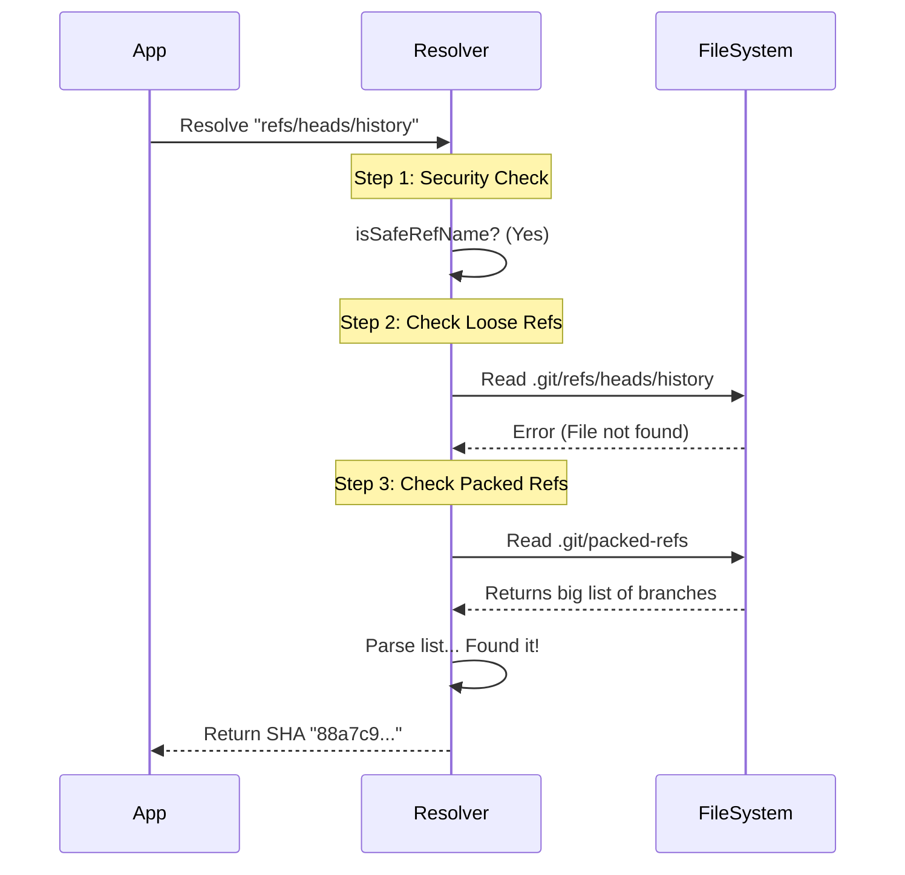

# Chapter 3: Reference Resolution & Validation

Welcome back! 

In [Chapter 2: Reactive Git State Watching](02_reactive_git_state_watching.md), we built a "Lazy Baker" system. We learned how to watch files so our application knows *when* something changes (like switching a branch).

But knowing the branch name (e.g., `main`) is only half the battle. To actually see the code, Git needs a **Commit SHA** (like `a1b2c3d...`).

Human names (`main`) are for people. 
SHA hashes (`a1b2c3d...`) are for computers.

This chapter is about the **Translator** that sits between them.

---

## The Central Use Case: The Library Catalog

Imagine you walk into a library and ask for "The Great Gatsby."
The librarian doesn't just walk blindly into the stacks. They need a **Call Number** (a specific ID, like `813.52 FITZ`).

In Git:
*   **The Book Title:** The Branch Name (e.g., `refs/heads/feature-login`).
*   **The Call Number:** The Commit SHA (e.g., `e4d909...`).

**The Problem:**
Git stores these "Call Numbers" in two very different places to save space. If we only look in one place, we might tell the user the branch doesn't exist when it actually does.

We need a robust system that checks both locations and ensures the "Book Title" isn't actually a trick to steal our library keys (Security).

---

## Concept 1: Loose References (The New Arrivals Shelf)

When you create a new branch or commit, Git stores the SHA in a simple text file. These are called **Loose Refs**.

They live inside `.git/refs/`.
For example, the branch `main` is located at `.git/refs/heads/main`.

If you open that file, it contains exactly one line:
```text
aa22cc44dd66... (40 characters)
```

**How we read it:**
We simply try to read the file matching the branch name.

```typescript
// fs/promises assumed
async function checkLooseRef(gitDir: string, ref: string) {
  try {
    // Construct path: .git + refs/heads/main
    const path = join(gitDir, ref)
    
    // Read the file
    const content = await readFile(path, 'utf-8')
    
    // Return the SHA (remove whitespace)
    return content.trim()
  } catch {
    return null // File not found
  }
}
```

This is fast and easy. But what if the file isn't there?

---

## Concept 2: Packed References (The Main Archive)

If you have 1,000 branches, having 1,000 small files makes the filesystem slow.

Periodically, Git runs a "Garbage Collection" command (`git gc`). It takes all those loose files, combines them into **one single list**, and deletes the individual files.

This list is called `packed-refs`. It lives at `.git/packed-refs`.

It looks like this:
```text
# pack-refs with: peeled fully-peeled sorted 
9f0c2a... refs/remotes/origin/main
e4d1b0... refs/tags/v1.0.0
88a7c9... refs/heads/old-feature
```

**The Logic:**
If we can't find a loose file, we **must** scan this list.

```typescript
async function checkPackedRefs(gitDir: string, ref: string) {
  try {
    const packed = await readFile(join(gitDir, 'packed-refs'), 'utf-8')
    
    // Look through every line
    for (const line of packed.split('\n')) {
      // If the line contains our reference name...
      if (line.includes(ref)) {
        // Return the first part (The SHA)
        return line.split(' ')[0] 
      }
    }
  } catch { /* No packed file exists */ }
  return null
}
```

---

## Concept 3: Security Validation (The Bouncer)

Since we are reading files based on strings, we have a security risk.

Imagine a malicious user creates a branch named `../../passwords.txt`.
If we blindly join paths:
`join('.git/refs/heads', '../../passwords.txt')`

We might accidentally read sensitive files outside the Git folder! This is called **Path Traversal**.

We need a "Bouncer" function to check the ID before letting it in.

```typescript
export function isSafeRefName(name: string): boolean {
  // 1. No '..' allowed (Traversal)
  if (name.includes('..')) return false
  
  // 2. No weird characters (Shell injection risks)
  // Only allow letters, numbers, slash, dot, underscore, hyphen
  return /^[a-zA-Z0-9/._-]+$/.test(name)
}
```

We run this check *before* we touch the hard drive.

---

## Internal Implementation Walkthrough

Let's visualize the flow when our App asks: **"What is the SHA for `refs/heads/history`?"**



### The Code: `resolveRef`

Now let's look at the real implementation in `gitFilesystem.ts`. It combines everything we just discussed.

#### 1. The Main Resolver
This function orchestrates the search. Notice it checks "Loose" first, then falls back to "Packed".

```typescript
export async function resolveRef(gitDir: string, ref: string): Promise<string | null> {
  // 1. Try finding a loose file first
  const result = await resolveRefInDir(gitDir, ref)
  if (result) {
    return result
  }

  // 2. If using Worktrees, check the common shared directory
  const commonDir = await getCommonDir(gitDir)
  if (commonDir && commonDir !== gitDir) {
    return resolveRefInDir(commonDir, ref)
  }

  return null
}
```

#### 2. The File Reader
This helper function handles the logic of reading the file and parsing the packed list if needed.

```typescript
async function resolveRefInDir(dir: string, ref: string): Promise<string | null> {
  // A. Try Loose File
  try {
    const content = (await readFile(join(dir, ref), 'utf-8')).trim()
    // Validation: Ensure content is a valid SHA
    if (isValidGitSha(content)) return content
  } catch {
    // File missing, proceed to B
  }

  // B. Try Packed Refs
  try {
    const packed = await readFile(join(dir, 'packed-refs'), 'utf-8')
    // Parse the packed-refs file format
    for (const line of packed.split('\n')) {
      // Skip comments (#) and tags (^)
      if (line.startsWith('#') || line.startsWith('^')) continue
      
      const [sha, name] = line.split(' ')
      if (name === ref) return sha
    }
  } catch { /* Ignore missing packed-refs */ }
  
  return null
}
```

> **Why `getCommonDir`?** 
> Just like we discussed in [Chapter 1](01_filesystem_based_git_internals.md), if you use **Git Worktrees**, multiple project folders share one `.git` history. The `packed-refs` file usually lives in the "main" folder, not the worktree folder. We handle this complexity so the user doesn't have to.

---

## Deep Dive: Handling "Redirects" (Symrefs)

Sometimes, a reference file doesn't contain a SHA. It contains a pointer to *another* reference.

For example, `HEAD` usually contains:
`ref: refs/heads/main`

This is a **Symbolic Reference (Symref)**. It's like a forwarding address.

Our code handles this recursion automatically.

```typescript
// Inside resolveRefInDir logic...
const content = await readFile(join(dir, ref), 'utf-8')

if (content.startsWith('ref:')) {
  const target = content.slice('ref:'.length).trim()
  
  // Security check on the target name
  if (!isSafeRefName(target)) return null
  
  // RECURSION: Call resolveRef again with the new name
  return resolveRef(dir, target)
}
```

If `HEAD` points to `main`, and `main` points to `a1b2c`, calling `resolveRef('HEAD')` will follow the chain all the way to `a1b2c`.

---

## Conclusion

We have built a powerful **Reference Resolver**.

1.  It searches **Loose Files** (recent branches).
2.  It falls back to **Packed Refs** (archived branches).
3.  It validates inputs to prevent **Security Attacks**.
4.  It follows **Symrefs** (redirects).

We can now look at the `.git` folder and instantly translate any branch name into a precise Commit ID.

However, a Git repository isn't just about files and commits. It also has user settings (like your email address and remote URLs). These are stored in a special configuration format.

In the next chapter, we will build a parser to read these settings without using the `git config` command.

[Next Chapter: Git Configuration Parsing](04_git_configuration_parsing.md)

---

Generated by [Code IQ](https://github.com/adityasoni99/Code-IQ)