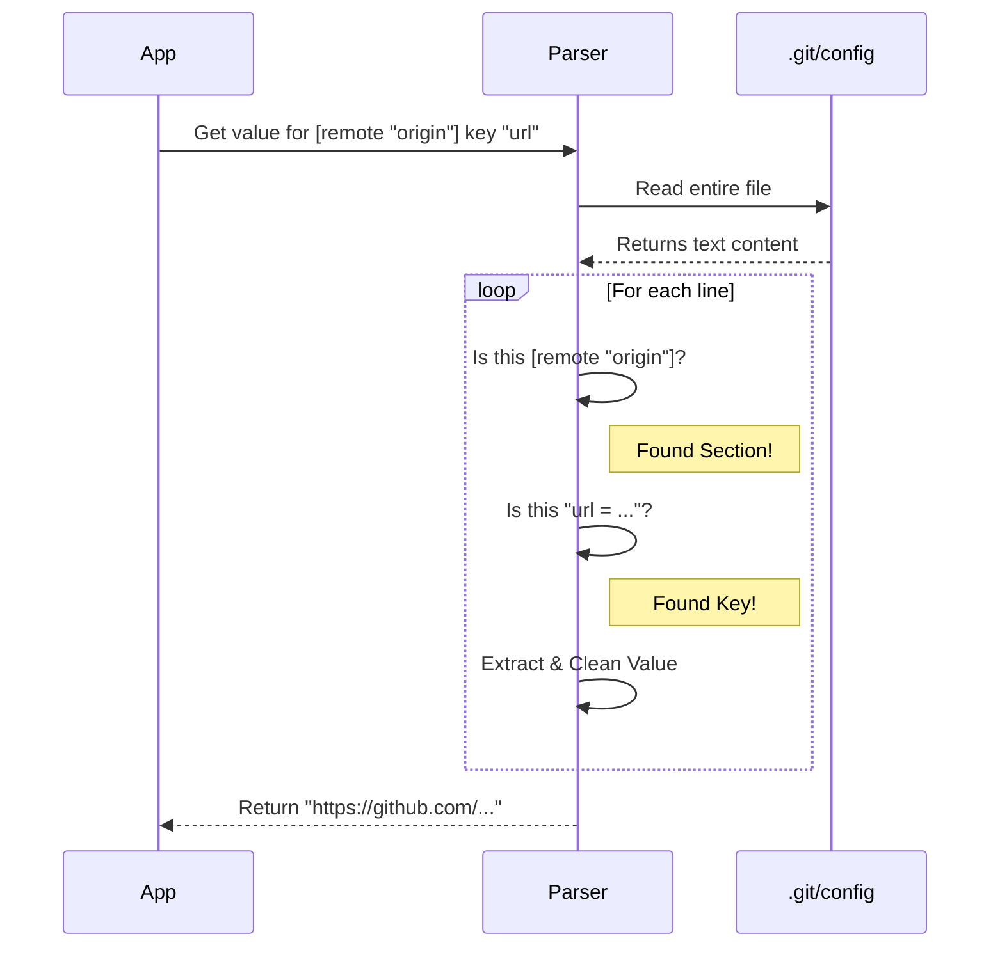

# Chapter 4: Git Configuration Parsing

Welcome back!

In [Chapter 3: Reference Resolution & Validation](03_reference_resolution___validation.md), we learned how to translate human-readable branch names (like `main`) into the specific Commit SHAs that computers understand. We built a system to navigate the history of the repository.

But a Git repository is more than just history. It has **Settings**.

*   What is your email address?
*   What is the default text editor?
*   **Most Importantly:** What is the URL of the remote server (GitHub/GitLab) so we can push our code?

This chapter is about reading these settings directly from the `.git/config` file.

---

## The Central Use Case: The "Open on GitHub" Button

Imagine you are building a coding tool. You want to add a simple button: **"View file on GitHub"**.

To construct that link, you need the repository's URL (e.g., `https://github.com/my-org/my-project`).

**The Slow Way:**
Run `git config --get remote.origin.url`.
This launches a heavy process just to read one line of text.

**The Fast Way (Our Way):**
Git stores these settings in a simple text file at `.git/config`. We will write a lightweight parser to read this "diary" of settings directly.

---

## Concept 1: The INI File Format

The `.git/config` file uses a format very similar to **INI files**. It is a list of **Sections**, **Keys**, and **Values**.

It looks like this:

```ini
[core]
    editor = code
    ignorecase = true

[remote "origin"]
    url = https://github.com/me/repo.git
    fetch = +refs/heads/*:refs/remotes/origin/*
```

To find the URL, we need to find:
1.  **Section:** `remote`
2.  **Subsection:** `"origin"` (Note the quotes!)
3.  **Key:** `url`

It looks easy to read, but there is a catch. Git allows weird spacing, comments, and quotes. We need a parser that understands these rules.

---

## Concept 2: Sections and Subsections

In the example above, `[core]` is a simple section.
But `[remote "origin"]` is a section with a **subsection**.

**The Rules:**
1.  **Section Names** (`remote`) are **case-insensitive**. `[REMOTE "origin"]` is valid.
2.  **Subsection Names** (`"origin"`) are **case-sensitive** and must be quoted.

Our parser needs to look at a line, see if it starts with `[`, and then figure out if it matches the section we are looking for.

```typescript
// Simplified logic to match a header like [remote "origin"]
function isTargetHeader(line: string, targetSec: string, targetSub: string) {
  const normalized = line.toLowerCase().trim()
  
  // Does it look like [remote "origin"]?
  // We check if it includes our target section and subsection
  return normalized.includes(`[${targetSec} "${targetSub}"]`)
}
```

---

## Concept 3: Keys, Values, and "The Dialect"

Once we find the right section, we look for the **Key**.

```ini
    url = https://github.com/me/repo.git
```

We split the line by the `=` sign.
*   **Left side:** Key (`url`)
*   **Right side:** Value (`https://...`)

**The tricky part (Escaping):**
Sometimes, values contain special characters.
`path = "C:\\Program Files\\Git"`

Git uses backslashes (`\`) to "escape" characters. If we just read the text, we get two backslashes. We need to translate `\\` into a single `\` so the computer understands the path.

---

## Internal Implementation Walkthrough

Let's visualize how our **Config Parser** works when we ask for the value of `remote.origin.url`.



### The Code: Parsing the Config

We will implement a function `parseGitConfigValue`.

#### Step 1: Reading and Looping
We read the file and iterate line by line. We use a flag `inSection` to know if we are currently inside the correct header.

```typescript
import { readFile } from 'fs/promises'
import { join } from 'path'

export async function parseGitConfigValue(
  gitDir: string, 
  section: string, 
  subsection: string, 
  key: string
) {
  const config = await readFile(join(gitDir, 'config'), 'utf-8')
  let inSection = false // Are we in the right group?

  for (const line of config.split('\n')) {
    const trimmed = line.trim()
    
    // Check if this line is a Section Header
    if (trimmed.startsWith('[')) {
      // Helper function to check [remote "origin"]
      inSection = matchesSectionHeader(trimmed, section, subsection)
      continue
    }

    // If we are in the right section, look for the key
    if (inSection) {
      // Parse "key = value"
      const result = parseKeyValue(trimmed)
      if (result && result.key === key) {
        return result.value
      }
    }
  }
  return null // Not found
}
```

#### Step 2: Parsing the Key-Value Pair
This helper breaks a line like `url = https://...` into two parts.

```typescript
function parseKeyValue(line: string) {
  // Find the position of the first '='
  const eqIndex = line.indexOf('=')
  
  // If no equals sign, it's not a valid setting
  if (eqIndex === -1) return null

  // Extract Key and Value
  const key = line.slice(0, eqIndex).trim()
  const rawValue = line.slice(eqIndex + 1).trim()
  
  return { key, value: rawValue }
}
```

#### Step 3: Handling Quotes (The Translator)
If a value is wrapped in quotes, we need to remove them. This is a simplified version of the logic found in `gitConfigParser.ts`.

```typescript
// Example input: "C:\\Program Files"
function cleanValue(val: string) {
  // If it starts and ends with quotes, strip them
  if (val.startsWith('"') && val.endsWith('"')) {
    val = val.slice(1, -1)
  }
  
  // Handle escape sequences (simplified)
  // Turn double backslash into single backslash
  return val.replace(/\\\\/g, '\\')
}
```

---

## Why this matters

By combining the concepts from the previous chapters:

1.  We find `.git` ([Chapter 1](01_filesystem_based_git_internals.md)).
2.  We watch it for changes ([Chapter 2](02_reactive_git_state_watching.md)).
3.  We resolve the current commit ([Chapter 3](03_reference_resolution___validation.md)).
4.  **Now:** We read the configuration to find the remote URL.

We can now fully answer the question: **"Where is this project hosted?"** without ever asking the Git command line tool.

---

## Conclusion

We have successfully built a translator for the Git configuration dialect. We can read user preferences, remote URLs, and core settings directly from the filesystem.

But there is one more critical piece of the puzzle.

Sometimes, we want to know **what Git is ignoring**. Files like `node_modules`, `.env`, or build artifacts should not be tracked. These rules are hidden in `.gitignore` files.

To build a complete Git tool, we need to respect these rules so we don't accidentally track secret passwords or massive compiled files.

In the next chapter, we will build a matcher for Ignore Rules.

[Next Chapter: Ignore Rule Management](05_ignore_rule_management.md)

---

Generated by [Code IQ](https://github.com/adityasoni99/Code-IQ)