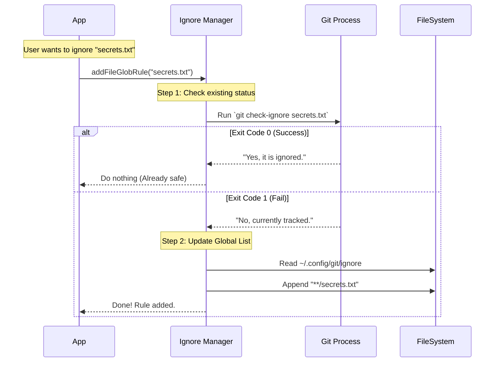

# Chapter 5: Ignore Rule Management

Welcome to the final chapter of our series!

In [Chapter 4: Git Configuration Parsing](04_git_configuration_parsing.md), we built a translator to read the user's settings, like their email and remote URLs. We learned how to read the "Diary" of the repository.

But not everything in your project folder belongs in the repository.

*   **Build Artifacts:** `dist/` or `build/` folders (generated code).
*   **Dependencies:** `node_modules/` (thousands of files we didn't write).
*   **Secrets:** `.env` files (passwords and API keys).
*   **System Junk:** `.DS_Store` or `Thumbs.db`.

If we tried to track all of these, our repository would be massive, slow, and potentially insecure.

This chapter is about **The Bouncer**. We need a system that stands at the door and checks every file against a "Blacklist" (the Ignore Rules) before letting it in.

---

## The Central Use Case: The "Clean" Status

Imagine you are building a Git GUI. You run your tool on a brand new Node.js project.

**Without Ignore Management:**
The status list shows **15,402 files** changed (mostly inside `node_modules`). The user is overwhelmed.

**With Ignore Management:**
The status list shows **3 files** changed (`index.js`, `package.json`, `README.md`). The tool automatically hides the noise.

We need a utility that answers one simple question: **"Should I ignore this file?"**

---

## Concept 1: The Complexity of "Ignoring"

You might think, "I'll just read the `.gitignore` file!"

It is not that simple. Git decides to ignore a file based on a hierarchy of rules:
1.  **Local:** A `.gitignore` in the *current* folder.
2.  **Parent:** A `.gitignore` in the *root* folder.
3.  **Personal:** A `.git/info/exclude` file (just for you).
4.  **Global:** A `~/.config/git/ignore` file (for all your projects).

If we tried to write our own parser for all of this (like we did for Config in Chapter 4), we would likely make mistakes. The logic is too complex.

**The Pragmatic Solution:**
For this specific task, we break our "Pure Filesystem" rule. instead of reading the files, we ask Git itself. We use the command `git check-ignore`.

It's the only way to be 100% sure we match Git's behavior exactly.

---

## Concept 2: The Global Gatekeeper

Sometimes, you want to ban a file from *every* project you ever work on.

For example, if you are a Mac user, the operating system creates hidden `.DS_Store` files everywhere. You don't want to add `.DS_Store` to every single project's `.gitignore` manually.

You can add it to your **Global Gitignore** file. This file usually lives at:
`~/.config/git/ignore` (or `%USERPROFILE%/.config/git/ignore` on Windows).

Our tool needs the ability to:
1.  Find this file.
2.  Add new rules to it automatically.

---

## Internal Implementation Walkthrough

Let's visualize how we decide to add a new rule, like ignoring `secret-token.txt`.

We don't want to add duplicate rules. So, first we check if it is *already* ignored. If not, we append it to the global file.



### The Code: Checking Status

Here is how we implement the check. We use `execFile` to run a subprocess. This is the "Bouncer" checking the ID card.

```typescript
// Imports assumed (execFileNoThrowWithCwd)

export async function isPathGitignored(
  filePath: string,
  cwd: string,
): Promise<boolean> {
  // Ask Git: "Is this file on your list?"
  const { code } = await execFileNoThrowWithCwd(
    'git',
    ['check-ignore', filePath], // The command
    { cwd },
  )

  // Exit Code 0 means "Yes, it is ignored"
  // Exit Code 1 means "No, it is not ignored"
  return code === 0
}
```

### The Code: Adding a Global Rule

Now, let's look at how we modify the global list. This function is robust—it handles creating the folder if it doesn't exist.

#### Step 1: Pre-flight Checks
Before writing to the disk, we ensure we aren't doing unnecessary work.

```typescript
export async function addFileGlobRuleToGitignore(
  filename: string,
  cwd: string = getCwd(),
): Promise<void> {
  // 1. Construct a "Glob" pattern (matches folder depths)
  const gitignoreEntry = `**/${filename}`

  // 2. Check if it is ALREADY ignored
  if (await isPathGitignored(filename, cwd)) {
    return // It's already blocked. Stop here.
  }
  
  // Proceed to add it...
}
```

> **What is `**`?**
> `**/node_modules` is a "Glob" pattern. It means "ignore `node_modules` in the root, or inside `src/`, or inside `lib/utils/`... anywhere!"

#### Step 2: Modifying the Global File
If the file wasn't ignored, we locate the global config and update it.

```typescript
// Inside addFileGlobRuleToGitignore...

  const globalPath = getGlobalGitignorePath() // e.g. ~/.config/git/ignore
  
  // 3. Ensure the folder exists (e.g. ~/.config/git/)
  await mkdir(dirname(globalPath), { recursive: true })

  try {
    // 4. Append the new rule to the file
    await appendFile(globalPath, `\n${gitignoreEntry}\n`)
  } catch (e) {
    // If file doesn't exist, create it from scratch
    await writeFile(globalPath, `${gitignoreEntry}\n`, 'utf-8')
  }
```

---

## Why this is different from previous chapters

In [Chapter 1: Filesystem-Based Git Internals](01_filesystem_based_git_internals.md), we prided ourselves on **not** spawning processes. We read `.git/HEAD` directly for speed.

Why did we change our strategy here?

**Complexity vs. Performance:**
*   Reading `HEAD` is simple: Read 1 file.
*   Resolving `gitignore` is hard: Read 5+ files, merge them, handle negation (`!important.txt`), and handle wildcards (`*.log`).

Sometimes, a good engineer knows when to reinvent the wheel (for speed) and when to use the existing wheel (for correctness). Because ignore rules are critical for security (preventing leaked secrets), we rely on Git's internal engine to be safe.

---

## Conclusion of the Series

Congratulations! You have completed the Git Internals Tutorial.

Let's review our journey:
1.  **[Chapter 1](01_filesystem_based_git_internals.md):** We learned to find the `.git` folder and read `HEAD` to know where we are.
2.  **[Chapter 2](02_reactive_git_state_watching.md):** We built a reactive watcher to update our UI instantly when branches change.
3.  **[Chapter 3](03_reference_resolution___validation.md):** We learned to translate branch names into Commit SHAs using loose and packed refs.
4.  **[Chapter 4](04_git_configuration_parsing.md):** We parsed the config file to find remote URLs and user settings.
5.  **[Chapter 5](05_ignore_rule_management.md):** We built a Bouncer to manage ignored files and keep our repository clean.

You now possess the foundational knowledge to build high-performance Git tools, status bars, or even your own Git client. You know how to look under the hood and manipulate the engine directly.

Happy coding!

---

Generated by [Code IQ](https://github.com/adityasoni99/Code-IQ)