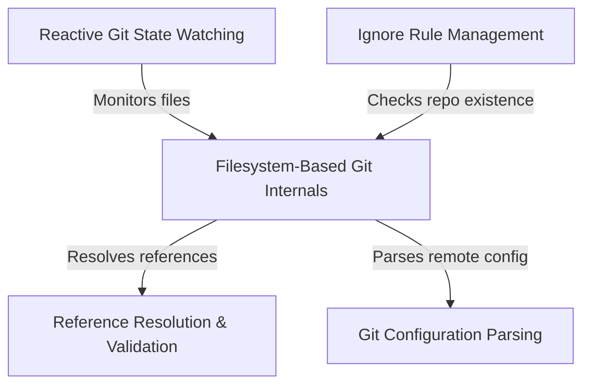

# Tutorial: git

This project implements a high-performance, **filesystem-based** interface for reading and monitoring Git repository state directly, bypassing the overhead of standard CLI commands. It features a **reactive watching system** that efficiently updates cached data upon detecting file changes, alongside specialized tools for **parsing configurations**, **resolving references** (like translating branch names to SHAs), and managing **ignore rules**.

## Chapters

1. [Filesystem-Based Git Internals](01_filesystem_based_git_internals.md)
2. [Reactive Git State Watching](02_reactive_git_state_watching.md)
3. [Reference Resolution & Validation](03_reference_resolution___validation.md)
4. [Git Configuration Parsing](04_git_configuration_parsing.md)
5. [Ignore Rule Management](05_ignore_rule_management.md)

---

Generated by [Code IQ](https://github.com/adityasoni99/Code-IQ)