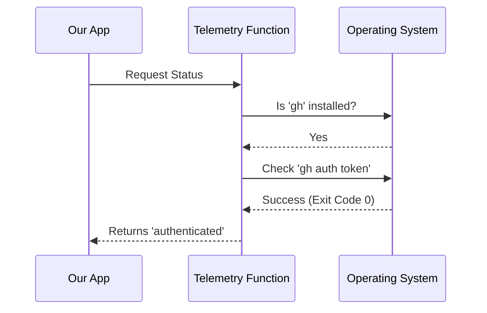

# Chapter 1: Telemetry Data Source

Welcome to the first chapter of our tutorial! In this project, we are building a set of tools to interact with GitHub. Before we start running complex commands, we need a way to understand the environment our code is running in.

## Motivation: The Car Dashboard

Imagine you are a car mechanic. Before you start taking apart an engine, you look at the dashboard. You check the sensors: Is there gas in the tank? Is the "Check Engine" light on?

We need a similar "sensor" for our application. We want to collect **Telemetry Data**. This isn't about spying on the user; it's about understanding the health of their setup.

**The Use Case:**
We want to know two simple things about our user's computer:
1.  Do they have the GitHub CLI tool (`gh`) installed?
2.  If they do, are they logged in?

If we know this, we can track how many of our users are successfully setting up their environment.

## How to Use It

We have created a helper function called `getGhAuthStatus`. You don't need to pass it any complicated data; you just ask it for the status, and it returns a simple string.

Here is how you would use it in your code:

```typescript
import { getGhAuthStatus } from './ghAuthStatus'

async function checkHealth() {
  // Ask the sensor for the status
  const status = await getGhAuthStatus()

  console.log(`User status: ${status}`)
}
```

### What to Expect (Output)
The function returns one of three specific text strings (we call these **types**):

1.  `'not_installed'`: The user doesn't even have the GitHub tool.
2.  `'not_authenticated'`: The tool is there, but they aren't logged in.
3.  `'authenticated'`: Everything is ready to go!

## Internal Implementation: How It Works

So, what is happening under the hood? It acts like a security guard performing a two-step check.

### The Logic Flow

1.  **Check Availability:** First, it looks for the program file on the computer.
2.  **Check Credentials:** If the file exists, it asks the program if it has a valid security token.
3.  **Report:** It summarizes the findings into a single word.

Here is a diagram showing the conversation between our code and the system:



### Code Deep Dive

Let's look at the actual code in `ghAuthStatus.ts`. We will break it down into small pieces.

#### Part 1: Checking Installation
First, we need to see if the tool exists. To do this, we use a helper utility called `which`.

*(Note: We will learn how to build the `which` utility in [Tool Availability Check](03_tool_availability_check.md))*

```typescript
import { which } from '../which.js'

export async function getGhAuthStatus() {
  // Check if 'gh' is in the system path
  const ghPath = await which('gh')

  // If path is empty, the tool is missing
  if (!ghPath) {
    return 'not_installed'
  }
  // ... continued below
```
**Explanation:** If `ghPath` comes back empty, we stop immediately. There is no point checking for a login if the software isn't there!

#### Part 2: Checking Authentication
If the tool is installed, we run a command to check the login token. We use a library called `execa` to run this command safely.

*(Note: We will explore safe command running in [Secure Subprocess Execution](04_secure_subprocess_execution.md))*

```typescript
import { execa } from 'execa'

  // ... inside getGhAuthStatus ...
  
  // Run 'gh auth token' to check login validity
  const { exitCode } = await execa('gh', ['auth', 'token'], {
    stdout: 'ignore', // Don't show the actual token!
    stderr: 'ignore', // Don't show errors
    reject: false,    // Don't crash if it fails
  })
```
**Explanation:**
*   We run `gh auth token`. This command specifically looks at local configuration files. It does **not** make a slow network request to GitHub servers. This makes our telemetry sensor very fast.
*   We set `stdout: 'ignore'`. This is a security feature. We only care *if* the command worked (the `exitCode`), we don't want to accidentally read or log the user's secret password (token).

#### Part 3: Determining the Result
Finally, we translate the computer code (exit code) into a human-readable status.

```typescript
  // Exit code 0 means success (logged in)
  // Anything else means not logged in
  return exitCode === 0 ? 'authenticated' : 'not_authenticated'
}
```

## Summary

In this chapter, we built a **Telemetry Data Source**. It acts like a car's dashboard sensor, quickly telling us if the GitHub CLI is installed and configured correctly without exposing sensitive user data or slowing down the application.

We touched on a few concepts that are so important they have their own chapters!
*   How do we know if a tool is installed? We'll see that in [Tool Availability Check](03_tool_availability_check.md).
*   How do we run commands securely? We'll learn that in [Secure Subprocess Execution](04_secure_subprocess_execution.md).

But first, let's look deeper into what defines the "Authenticated" state and how we manage GitHub-specific logic.

[Next Chapter: GitHub Authentication State](02_github_authentication_state.md)

---

Generated by [Code IQ](https://github.com/adityasoni99/Code-IQ)