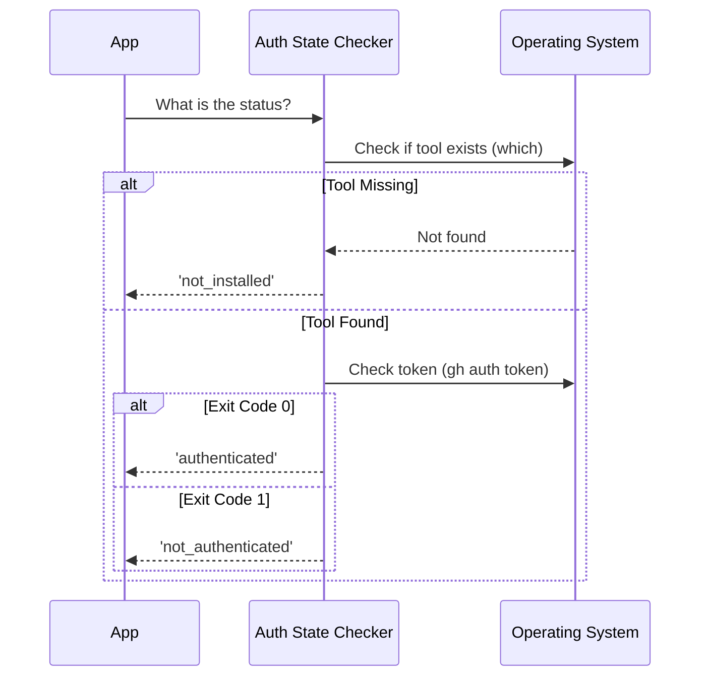

# Chapter 2: GitHub Authentication State

In the previous chapter, [Telemetry Data Source](01_telemetry_data_source.md), we learned how to gather "sensor data" about our user's environment. We used a function called `getGhAuthStatus` to print a health check to the console.

In this chapter, we will slow down and look specifically at **what** that function returns. We will define the "Authentication State" as a strict contract that helps our application make decisions safely.

## Motivation: The Travel Checkpoint

Imagine you are running a travel agency. Before you book a flight for a customer, you need to verify their documents. You can't just ask "Can you travel?" because the answer depends on specific details.

You need to categorize the customer into one of three distinct groups:
1.  **No Passport:** They don't have the document at all. They cannot travel.
2.  **Passport, No Visa:** They have the document, but it's not stamped or valid for entry. They cannot travel yet.
3.  **Valid Passport:** They have the document and the stamp. They are ready to go.

**The Use Case:**
In our code, we want to run GitHub commands (like creating a pull request). But before we try, we must categorize the user:
*   Do they have the GitHub CLI tool installed? (**The Passport**)
*   Are they logged in? (**The Visa/Stamp**)

If we don't check this state first, our application will crash or show confusing errors when we try to run commands.

## Key Concept: The Union Type

To make our code safe, we don't just return random text. We define a "Union Type". This is a fancy way of saying: "The status must be exactly one of these three specific options."

Here is the definition we use in our project:

```typescript
// defined in ghAuthStatus.ts

export type GhAuthStatus =
  | 'authenticated'      // Ready to go!
  | 'not_authenticated'  // Tool exists, but not logged in
  | 'not_installed'      // Tool is missing entirely
```

**Explanation:** By defining this type, TypeScript (our programming language) will warn us if we make a typo or forget to handle one of these states.

## How to Use It

When you ask for the authentication state, you can use the result to decide what to show the user.

```typescript
import { getGhAuthStatus } from './ghAuthStatus'

async function startApp() {
  const status = await getGhAuthStatus()

  if (status === 'not_installed') {
    console.log("Please install GitHub CLI first.")
    return // Stop here
  }
  
  // ... continued below
```

If the user has the tool, we check if they are logged in:

```typescript
  // ... continued
  
  if (status === 'not_authenticated') {
    console.log("Please run 'gh auth login' to sign in.")
    return // Stop here
  }

  console.log("Success! Running your command...")
}
```

### What happens here?
*   **Input:** We call the function (no arguments needed).
*   **Output:** We get one of our three specific strings.
*   **Result:** The app reacts intelligently. It gives specific instructions ("Install it" vs "Login") instead of a generic error.

## Internal Implementation: Under the Hood

How do we determine which of the three states the user is in? It works like a decision tree.

### The Decision Logic
1.  **Search:** Look for the `gh` tool on the computer.
    *   *If missing:* Result is `'not_installed'`.
2.  **Verify:** If found, check the security token.
    *   *If invalid:* Result is `'not_authenticated'`.
    *   *If valid:* Result is `'authenticated'`.

Here is a diagram of the decision process:



### Code Deep Dive

Let's look at the implementation in `ghAuthStatus.ts`. We combine two powerful checks.

#### Step 1: The Existence Check
First, we check if the user has the "Passport" (the tool). We rely on a helper called `which`.

*(We will learn how to build `which` in [Tool Availability Check](03_tool_availability_check.md))*

```typescript
import { which } from '../which.js'

export async function getGhAuthStatus(): Promise<GhAuthStatus> {
  // 1. Check if the tool exists in the system
  const ghPath = await which('gh')

  // If path is null/empty, we stop immediately
  if (!ghPath) {
    return 'not_installed'
  }
  // ... continued
```

#### Step 2: The Speed Trick (Auth Check)
If the tool is installed, we need to see if the user is logged in.

**Important Detail:** We run `gh auth token` instead of `gh auth status`.
*   `gh auth status` connects to the internet (GitHub servers) to verify the login. This is **slow**.
*   `gh auth token` only looks at the secret file on your computer. This is **fast** and offline-friendly.

We run this command safely using `execa`.
*(We will learn about safe commands in [Secure Subprocess Execution](04_secure_subprocess_execution.md))*

```typescript
import { execa } from 'execa'

  // ... continued inside getGhAuthStatus
  
  // 2. Check local config for a valid token
  const { exitCode } = await execa('gh', ['auth', 'token'], {
    stdout: 'ignore', // Security: Don't read the actual secret!
    reject: false,    // Don't crash if the command fails
    timeout: 5000     // Give up after 5 seconds
  })

  // Exit Code 0 means "Success" (Token found)
  return exitCode === 0 ? 'authenticated' : 'not_authenticated'
}
```

**Explanation:**
1.  **`stdout: 'ignore'`**: We strictly ignore the output. The command prints the user's secret password (token). We don't want to see it, log it, or touch it. We only care if the command *succeeded* (Exit Code 0).
2.  **`timeout: 5000`**: If the computer is acting weird, we don't want to freeze the app forever.

## Summary

In this chapter, we defined the **GitHub Authentication State**. We turned a complex environment check into three simple options:
1.  `not_installed`
2.  `not_authenticated`
3.  `authenticated`

We also learned a performance trick: Checking for a local token is much faster than pinging a server to check login status.

However, our code relied on a helper function called `which` to find the tool. How does that actually work? Does it search every folder on the hard drive?

Let's find out in the next chapter.

[Next Chapter: Tool Availability Check](03_tool_availability_check.md)

---

Generated by [Code IQ](https://github.com/adityasoni99/Code-IQ)