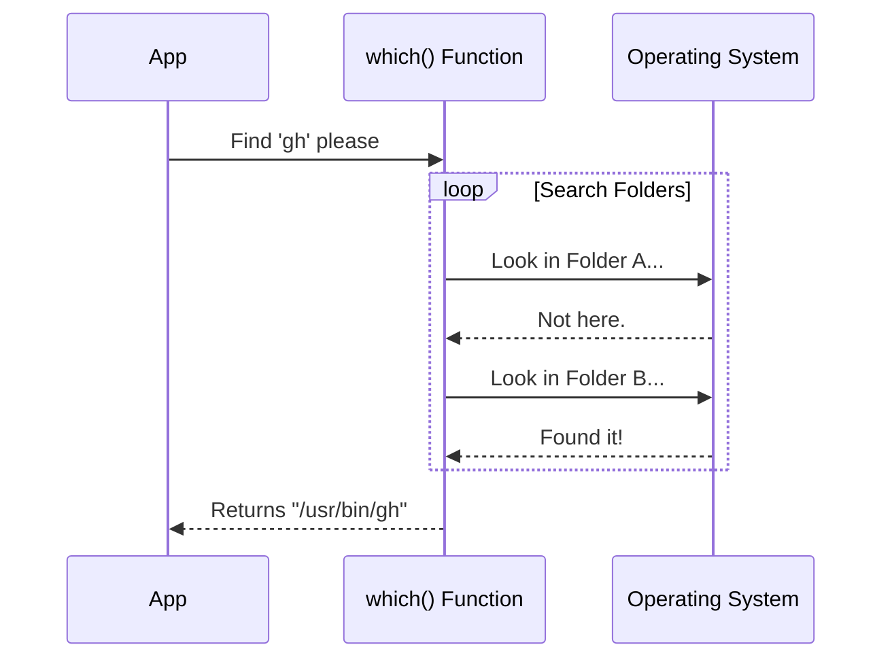

# Chapter 3: Tool Availability Check

In the previous chapter, [GitHub Authentication State](02_github_authentication_state.md), we built a smart check that told us if a user was "Authenticated", "Not Authenticated", or "Not Installed".

To determine if the user was "Not Installed", we relied on a helper function called `which`. In this chapter, we are going to look inside that function. We will learn how to verify that a tool exists on the computer before we try to pick it up and use it.

## Motivation: The Empty Toolbox

Imagine you are a carpenter. You are about to fix a table, and you need a wrench.

If you blindly reach your hand into your toolbox without looking, and the wrench isn't there, you might grab the wrong thing or just grasp at thin air. It's confusing and inefficient.

The smart way is to **look** first.
1.  Open the toolbox.
2.  Scan for the wrench.
3.  **If it's there**, grab it.
4.  **If it's not**, stop and go buy one.

**The Use Case:**
In our code, we want to run the GitHub command line tool (`gh`). But we can't assume every user has installed it. If we try to run a command that doesn't exist, our program will crash with an ugly error message.

We need a function that answers one simple question: *"Where is the 'gh' program hidden on this computer?"*

## How to Use It

We use a function named `which`. This name is a nod to a classic Unix command that asks "Which folder is this program in?"

You pass it the name of the tool you want, and it returns the location (path) or `null` if it's missing.

```typescript
import { which } from './which'

async function findTool() {
  // Ask: Where is 'gh'?
  const path = await which('gh')

  if (path) {
    console.log(`Found it at: ${path}`)
  } else {
    console.log("Tool not found.")
  }
}
```

### What to Expect (Output)

*   **Success:** It returns a string like `/usr/local/bin/gh` (on Mac/Linux) or `C:\Program Files\GitHub CLI\gh.exe` (on Windows).
*   **Failure:** It returns `null`. This allows our code to handle the missing tool gracefully (like showing a polite "Please install this" message) instead of crashing.

## Internal Implementation: How It Works

How does the computer actually find programs? It uses a concept called the **PATH**.

Think of the **PATH** as a list of folders that the computer has memorized. When you ask for `gh`, the computer checks the first folder in the list. If it's not there, it checks the second, and so on.

### The Search Process

Here is a diagram showing how our `which` function searches for the tool:



### Code Deep Dive

Let's look at `which.ts`.

To make this efficient, we rely on the capabilities of our runtime environment (like Bun or Node). These environments have built-in ways to scan the system PATH, so we don't have to write complex loops ourselves.

Here is the wrapper implementation:

```typescript
// which.ts
import { which as runtimeWhich } from 'bun'

/**
 * Locates an executable in the system PATH.
 * Returns the absolute path string, or null if not found.
 */
export async function which(toolName: string) {
  // We use the runtime's native helper for speed
  const path = await runtimeWhich(toolName)

  // Return the path (or null)
  return path
}
```

**Explanation:**
1.  **`import ... from 'bun'`**: We are using the Bun runtime here because it performs this check natively. It looks at the system's environment variables for us.
2.  **`await runtimeWhich(toolName)`**: This operation scans the hard drive. Even though it is fast, it involves the file system, so we `await` it to ensure we don't freeze the app.
3.  **Return value**: If the tool is installed, `path` is a string. If not, it is `null`.

### Why create a wrapper?

You might ask, "Why not just use `Bun.which` directly in our other files?"

We create this wrapper file (`which.ts`) for **portability**.
*   If we switch our project from Bun to Node.js later, we only have to change the code in *this one file*.
*   The rest of our application (like the [Telemetry Data Source](01_telemetry_data_source.md)) doesn't care *how* we find the file, only that we found it.

## Summary

In this chapter, we learned about the **Tool Availability Check**.
*   We solved the "Empty Toolbox" problem by checking for a tool before using it.
*   We understood that the computer looks through a list of folders (the PATH) to find programs.
*   We wrote a simple wrapper function to perform this search safely.

Now that we have confirmed the tool exists (Chapter 3) and checked the user's ID (Chapter 2), we are finally ready to run commands! But running external commands can be dangerous if done incorrectly.

In the next chapter, we will learn how to run these commands without creating security holes.

[Next Chapter: Secure Subprocess Execution](04_secure_subprocess_execution.md)

---

Generated by [Code IQ](https://github.com/adityasoni99/Code-IQ)