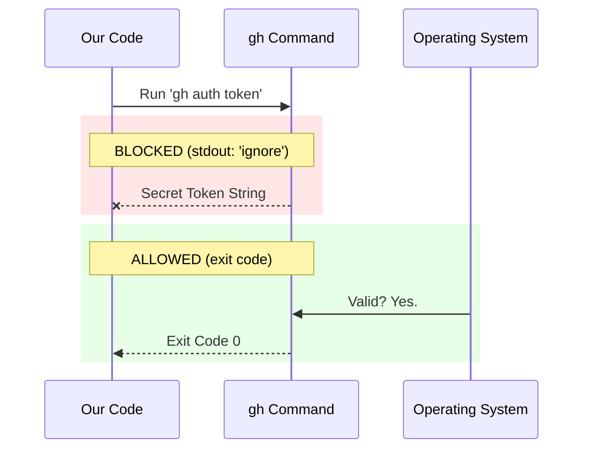

# Chapter 4: Secure Subprocess Execution

Welcome to Chapter 4! In the previous chapter, [Tool Availability Check](03_tool_availability_check.md), we learned how to find the GitHub CLI tool (`gh`) on the user's computer.

Now that we have found the tool, we need to run it. But we must be careful. We are about to handle the user's authentication token—a secret password. In this chapter, we will learn how to verify this password without ever looking at it, ensuring it never leaks into our logs.

## Motivation: The Silent Nod

Imagine you are a security guard at a bank vault. A person approaches and says they know the combination.

You have two ways to verify this:
1.  **The Loud Way:** You ask them to shout the combination code out loud. You check it against your list. This works, but everyone in the lobby now knows the code. **This is insecure.**
2.  **The Silent Way:** You point to the keypad and say, "Type it in." You don't watch their fingers. You just wait for the light on the door to turn green.

**The Use Case:**
We want to verify if the user is logged into GitHub. The command to do this is `gh auth token`.
*   Normally, this command prints the secret token to the screen (Standard Output).
*   If our application reads that text, it might accidentally save it to a debug log or error report.

We need the **Silent Way**. We want the computer to run the command but **ignore the text** and only look for the "Green Light" (Success) or "Red Light" (Failure).

## Key Concept: Exit Codes vs. Standard Output

To understand secure execution, we need to separate two things a computer program produces:

1.  **Standard Output (`stdout`):** The text the program "speaks." (e.g., `ghp_SecretToken123`). This is dangerous for us.
2.  **Exit Code:** A simple number the program returns when it finishes.
    *   `0`: Success (The green light).
    *   `1` (or higher): Failure (The red light).

**Our Strategy:** We will gag the "mouth" of the program so it can't speak the token, but we will watch the "exit code" to see if it worked.

## How to Use It

We use a library called `execa` to run commands. It allows us to configure exactly what happens to the output.

Here is the basic pattern for running a command securely:

```typescript
import { execa } from 'execa'

async function checkLogin() {
  // Run the command, but ignore the text output
  const result = await execa('gh', ['auth', 'token'], {
    stdout: 'ignore', // <--- THE SECURITY FEATURE
    reject: false     // Don't crash on failure
  })

  // Only check the exit code
  if (result.exitCode === 0) {
    console.log("Verified!")
  }
}
```

### What to Expect
*   **Input:** We run the command `gh auth token`.
*   **Action:** The computer checks the token internally.
*   **Output:** The variable `result.stdout` will be `undefined` or empty. The actual token never enters our application's memory variable.
*   **Result:** We simply know `true` (it worked) or `false` (it didn't).

## Internal Implementation: How It Works

Let's visualize the difference between a standard execution and our secure execution.

### The Security Flow

In a normal execution, data flows from the System to the App. In our secure execution, we cut that wire.



### Code Deep Dive

Let's look at the actual code we wrote in `ghAuthStatus.ts` (first introduced in [Telemetry Data Source](01_telemetry_data_source.md)). We will break down the options object line-by-line.

```typescript
// ghAuthStatus.ts

// ... imports ...

export async function getGhAuthStatus() {
  // ... previous checks ...

  // Securely run the command
  const { exitCode } = await execa('gh', ['auth', 'token'], {
    stdout: 'ignore', // 1. Security: Don't read the token
    stderr: 'ignore', // 2. Cleanliness: Don't read errors
    timeout: 5000,    // 3. Safety: Stop after 5 seconds
    reject: false,    // 4. Control: Don't throw an exception
  })

  return exitCode === 0 ? 'authenticated' : 'not_authenticated'
}
```

**Explanation of Options:**

1.  **`stdout: 'ignore'`**: This is the most important line. It tells Node.js to detach the output stream. The subprocess writes the token to "nowhere." Even if we wanted to log it, we couldn't.
2.  **`stderr: 'ignore'`**: If the command fails (e.g., "Token not found"), it usually prints an error message. We ignore this too because we don't need the details, we just need the status.
3.  **`timeout: 5000`**: If the `gh` tool freezes, we don't want our app to hang forever. We kill the process after 5 seconds.
4.  **`reject: false`**: Normally, `execa` throws a scary error (exception) if the command fails. We set this to `false` because "not being logged in" isn't a program crash for us; it's just a valid state we want to handle gracefully.

## Summary

In this chapter, we mastered **Secure Subprocess Execution**.

We learned:
*   The difference between **Output** (text) and **Exit Codes** (status).
*   How to "gag" a subprocess to prevent it from leaking sensitive data like passwords or tokens.
*   How to use `execa` options to create a safe, crash-resistant check.

We have now verified the tool exists ([Tool Availability Check](03_tool_availability_check.md)) and verified the user is logged in safely.

However, there is one final detail. Why did we use `gh auth token` specifically, instead of `gh auth status`? It turns out, where the verification happens (Local vs. Network) matters a lot for speed and reliability.

Let's explore this in the final chapter.

[Next Chapter: Local-Only Verification](05_local_only_verification.md)

---

Generated by [Code IQ](https://github.com/adityasoni99/Code-IQ)