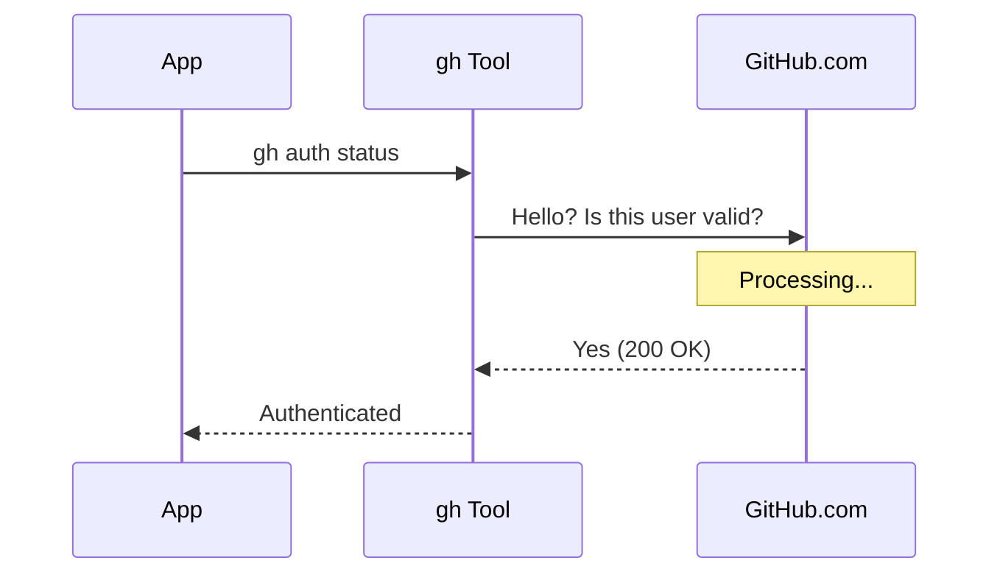
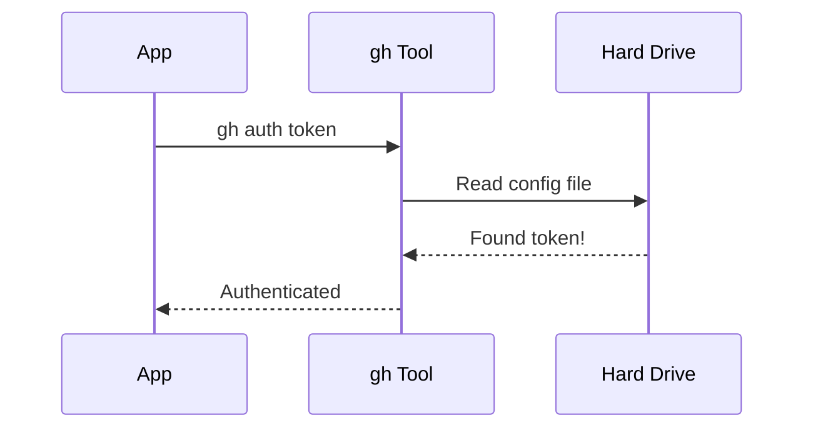

# Chapter 5: Local-Only Verification

Welcome to the final chapter of our telemetry module!

In the previous chapter, [Secure Subprocess Execution](04_secure_subprocess_execution.md), we learned how to run the GitHub command line tool securely without leaking user passwords.

Now, we have one final decision to make: **Which command should we run?**

We have two options to check if a user is logged in. One is slow and depends on the internet. The other is instant and works offline. In this chapter, we will learn why choosing the "Local-Only" option is critical for a fast, responsive application.

## Motivation: The House Key Analogy

Imagine you are standing in front of your house. You want to know: *"Can I get inside?"*

You have two ways to find out:

1.  **The Locksmith Method (Network Request):**
    You call a locksmith service. You wait on hold. They look up your address in a database. They verify you are the owner. Then they tell you via phone, "Yes, you have access."
    *   *Pros:* Very thorough.
    *   *Cons:* Takes time. Fails if your phone has no signal. Fails if the locksmith is closed.

2.  **The Pocket Check (Local Verification):**
    You reach into your pocket. Do you feel a key?
    *   *Pros:* Instant. Works even if phone lines are down.
    *   *Cons:* None for this specific purpose.

**The Use Case:**
When our application starts, we want to know if the user is logged into GitHub so we can enable certain features.
*   If we verify with GitHub's servers every time, the user has to wait 1-2 seconds just to start the app.
*   If the user is on an airplane (offline), our app might freeze or crash.

We want the **Pocket Check**. We want to verify the user has a "Key" (Token) on their computer without calling the "Locksmith" (GitHub Servers).

## Key Concept: Latency and Failure Points

To make our software feel professional, we need to minimize two things:

1.  **Latency:** The delay between asking a question and getting an answer. Network calls always add latency. Reading a file on the hard drive is effectively instant.
2.  **Failure Points:** Things that can go wrong. A network request can fail because of bad Wi-Fi, DNS issues, or GitHub being down. A local file check almost never fails.

## How to Use It

The GitHub CLI (`gh`) gives us two commands that look similar but act very differently.

### The Bad Choice: `gh auth status`
This command is the "Locksmith." It connects to `api.github.com` to verify your session.
*   *Time:* ~500ms - 2000ms.
*   *Requirement:* Internet access.

### The Good Choice: `gh auth token`
This command is the "Pocket Check." It only looks at the configuration files stored on your hard drive to see if a token exists.
*   *Time:* ~10ms - 50ms.
*   *Requirement:* None (Works offline).

In our code, we simply choose the right arguments.

```typescript
// Ideally, we prefer the command that stays local
const command = 'gh'
const args = ['auth', 'token'] // <--- This is the local check

// AVOID this for simple checks:
// const args = ['auth', 'status'] 
```

## Internal Implementation: Under the Hood

Let's visualize the journey our data takes with both approaches.

### The Network Way (Slow)
This involves a round-trip across the world.



### The Local-Only Way (Fast)
This never leaves the user's computer.



### Code Deep Dive

Let's look at our final `ghAuthStatus.ts` file one last time. We are combining everything we learned in this tutorial.

1.  **Telemetry Data Source** (Chapter 1): The goal of the function.
2.  **Authentication State** (Chapter 2): The return type.
3.  **Tool Availability** (Chapter 3): The `which` check.
4.  **Secure Execution** (Chapter 4): The `stdout: ignore`.
5.  **Local Verification** (Chapter 5): The `['auth', 'token']` arguments.

```typescript
// ghAuthStatus.ts
import { execa } from 'execa'
import { which } from '../which.js' // From Chapter 3

export async function getGhAuthStatus() {
  // 1. Check if tool exists (Chapter 3)
  const ghPath = await which('gh')
  if (!ghPath) return 'not_installed'

  // 2. Local-Only Verification (Chapter 5)
  // We use 'token' instead of 'status' for speed
  const { exitCode } = await execa('gh', ['auth', 'token'], {
    stdout: 'ignore', // Security (Chapter 4)
    stderr: 'ignore', 
    reject: false,
  })

  // 3. Return State (Chapter 2)
  return exitCode === 0 ? 'authenticated' : 'not_authenticated'
}
```

**Explanation:**
By specifically choosing `['auth', 'token']`, we ensure that `execa` finishes almost instantly. The `gh` tool simply opens a text file in the user's home folder, sees the text string, and exits with code `0`. We don't care *what* the token is, only that the computer *has* one.

## Summary

In this final chapter, we optimized our telemetry system.
*   We learned the difference between **Network Verification** and **Local Verification**.
*   We chose `gh auth token` to ensure our app works offline and starts up instantly.
*   We completed our robust, secure, and user-friendly health check system.

**Congratulations!** You have completed the module.

You have built a sophisticated system that:
1.  Detects the user's environment.
2.  Types the results strictly.
3.  Handles missing tools gracefully.
4.  Protects user secrets.
5.  Optimizes for performance.

You are now ready to start building features that use these checks to interact with GitHub safely!

---

Generated by [Code IQ](https://github.com/adityasoni99/Code-IQ)