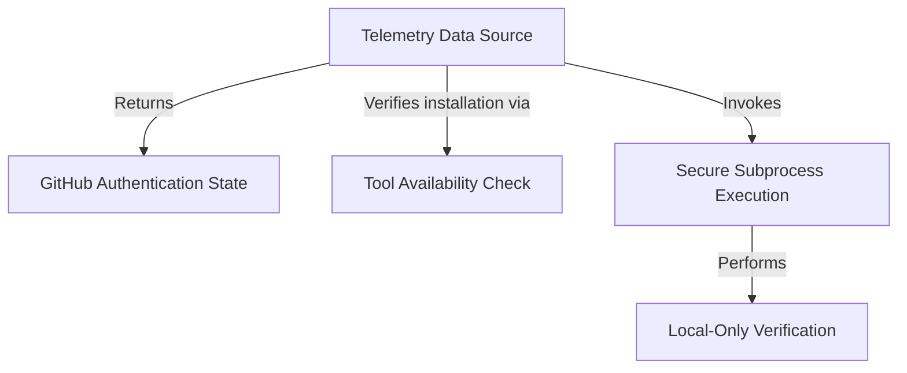

# Tutorial: github

This project utility acts as a **diagnostic tool** to determine the current state of the GitHub CLI (`gh`) on a user's machine without exposing sensitive data. It checks if the tool is *installed* and if the user is *authenticated* using local configuration files only, gathering this information to support **telemetry** and analytics.

## Chapters

1. [Telemetry Data Source](01_telemetry_data_source.md)
2. [GitHub Authentication State](02_github_authentication_state.md)
3. [Tool Availability Check](03_tool_availability_check.md)
4. [Secure Subprocess Execution](04_secure_subprocess_execution.md)
5. [Local-Only Verification](05_local_only_verification.md)

---

Generated by [Code IQ](https://github.com/adityasoni99/Code-IQ)