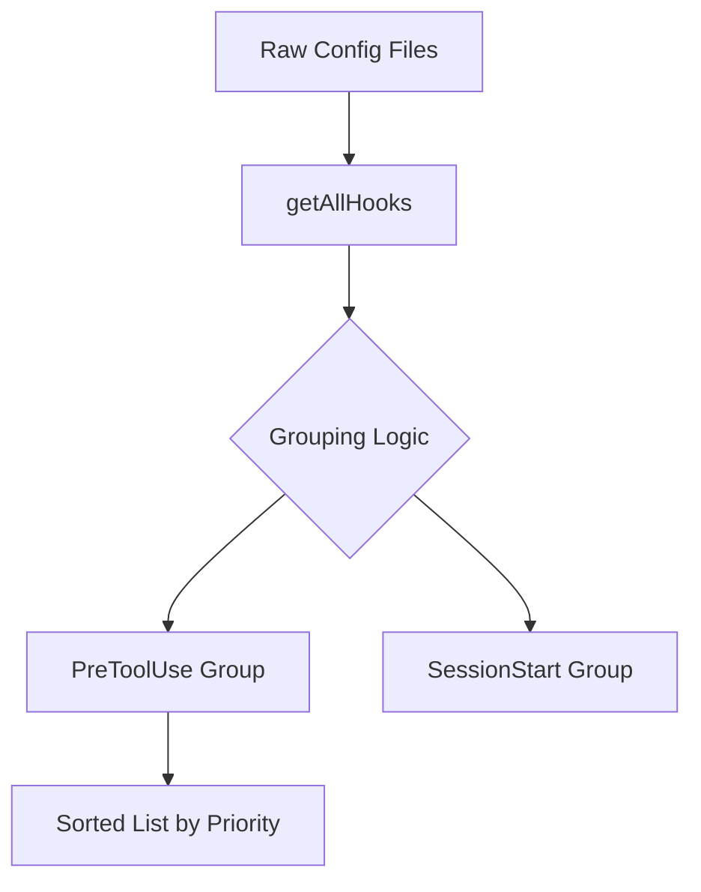
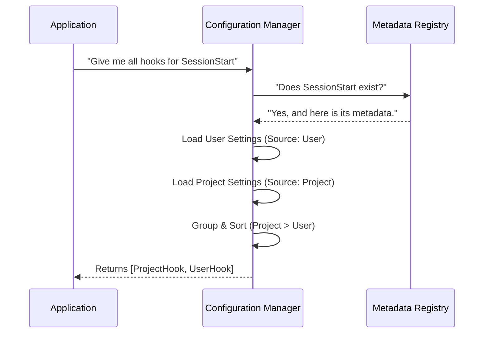

# Chapter 1: Hook Configuration & Metadata

Welcome to the **Hooks** project! 

Imagine you have a smart assistant (let's call him Claude). Usually, Claude waits for your commands. But what if you want Claude to *automatically* do things in the background? For example:
*   "Every time I run a test, clear the screen first."
*   "If I try to commit code, check for secrets."
*   "When I start a new session, print a welcome message."

To make this happen, we need a **Rulebook**. This rulebook defines exactly **when** Claude should pause to listen (Events) and **what** information is available at that moment (Metadata).

In this chapter, we will build the foundation of this system: the **Configuration & Metadata** layer.

## The Problem: Organizing Chaos

Without a structured configuration system, our application wouldn't know which events exist or how to handle them. We need a central place to answer three questions:
1.  **Events:** What triggers exist? (e.g., `PreToolUse`, `SessionStart`)
2.  **Metadata:** What data do we get when an event triggers? (e.g., "Which tool is running?")
3.  **Sources:** Where do the user's rules live? (Global settings? Project settings?)

## Concept 1: The Event Metadata

The system needs a "Dictionary" of all possible events. We don't just list the names; we also describe what they do and how to filter them.

In `hooksConfigManager.ts`, we define this dictionary. This is the source of truth for the entire system.

### Defining an Event
Let's look at how we define the `PreToolUse` event. This event fires right before Claude uses a tool (like running a terminal command).

```typescript
// From hooksConfigManager.ts
export const getHookEventMetadata = memoize(
  function (toolNames: string[]) { // We accept toolNames to help with filtering
    return {
      PreToolUse: {
        summary: 'Before tool execution',
        description: 'Input is JSON of tool arguments...',
        matcherMetadata: {
          fieldToMatch: 'tool_name', // We filter based on the tool's name
          values: toolNames,
        },
      },
      // ... other events like SessionStart, FileChanged, etc.
    }
  }
)
```

**What just happened?**
*   **`PreToolUse`**: The unique name of the event.
*   **`matcherMetadata`**: This is crucial. It tells the system *how* users can filter this event. Here, users can write a hook specifically for `git` or `npm` by matching the `tool_name`.

### Why Metadata Matters
Metadata allows the UI to show helpful tooltips and ensures the system knows what "arguments" to pass to the hook script. For example, `SessionStart` has different metadata than `FileChanged`.

```typescript
// Example: SessionStart Metadata
SessionStart: {
  summary: 'When a new session is started',
  matcherMetadata: {
    fieldToMatch: 'source', // Filter by: startup, resume, clear...
    values: ['startup', 'resume', 'clear', 'compact'],
  },
}
```

## Concept 2: Aggregating Rules (The Configuration)

Now that the system knows *what* events exist, it needs to load the user's specific rules. 

Users might define hooks in different places:
1.  **User Settings:** Global rules for all projects.
2.  **Project Settings:** Specific rules for the current repository.
3.  **Session Hooks:** Temporary rules just for now.

We need to gather all these rules into one big list.

### Loading All Hooks
We use a function called `getAllHooks` in `hooksSettings.ts`. It acts like a vacuum cleaner, sucking up configuration from every possible source.

```typescript
// From hooksSettings.ts
export function getAllHooks(appState: AppState): IndividualHookConfig[] {
  const hooks: IndividualHookConfig[] = []
  
  // 1. Check User, Project, and Local settings files
  const sources = ['userSettings', 'projectSettings', 'localSettings']
  
  for (const source of sources) {
     // ... logic to read JSON files and push to 'hooks' array
  }

  // 2. Add temporary session hooks (in-memory)
  const sessionHooks = getSessionHooks(appState, getSessionId())
  // ... merge session hooks
  
  return hooks
}
```

### Grouping and Sorting
Simply having a raw list isn't enough. If a user defines a global rule for `PreToolUse` and a project rule for `PreToolUse`, which one runs first? 

We organize them using `groupHooksByEventAndMatcher`.



## Internal Implementation: How it Works

Let's look under the hood at how the system organizes these hooks when the application starts up or configuration changes.

### Step 1: Grouping by Event
The system iterates through every loaded hook and buckets them by their Event name (e.g., putting all `SessionStart` hooks together).

```typescript
// From hooksConfigManager.ts
export function groupHooksByEventAndMatcher(appState: AppState, toolNames: string[]) {
  // 1. Initialize empty buckets for every known event
  const grouped = { 
    PreToolUse: {}, 
    SessionStart: {}, 
    // ... all other events
  }

  // 2. Fill buckets with user configuration
  getAllHooks(appState).forEach(hook => {
    const eventGroup = grouped[hook.event]
    
    // Use the matcher (e.g., "git") as a sub-key
    const matcherKey = hook.matcher || '' 
    
    if (!eventGroup[matcherKey]) {
      eventGroup[matcherKey] = []
    }
    eventGroup[matcherKey].push(hook)
  })

  return grouped
}
```

### Step 2: Sorting by Priority
When multiple hooks exist for the same event, priority matters. We generally trust **Project Settings** over **User Settings** because project rules are more specific.

We use a helper called `sortMatchersByPriority`.

```typescript
// From hooksSettings.ts
export function sortMatchersByPriority(matchers, hooksMap, event) {
  return [...matchers].sort((a, b) => {
    // Logic: 
    // 1. Look up where the hook came from (Source)
    // 2. Assign a number (Project = 1, User = 0)
    // 3. Sort so higher priority runs first
    // 4. If equal, sort alphabetically
  })
}
```

## Putting It All Together: A Scenario

Let's say a user has the following configuration:
*   **User Settings:** Run `echo "Hello"` on `SessionStart`.
*   **Project Settings:** Run `echo "Project Loaded"` on `SessionStart`.

Here is the flow of data:



## Summary

In this chapter, we learned:
1.  **Metadata** acts as the dictionary, defining what `PreToolUse` or `SessionStart` actually means and what data they provide.
2.  **Configuration** comes from multiple sources (User, Project, Session).
3.  **Grouping & Sorting** ensures that when an event fires, we have an organized, prioritized list of instructions ready to go.

This creates the "Rulebook." But a rulebook is useless if nobody reads it! 

In the next chapter, we will learn how the system takes this prioritized list and actually runs the commands using **[Execution Strategies](02_execution_strategies.md)**.

---

Generated by [Code IQ](https://github.com/adityasoni99/Code-IQ)