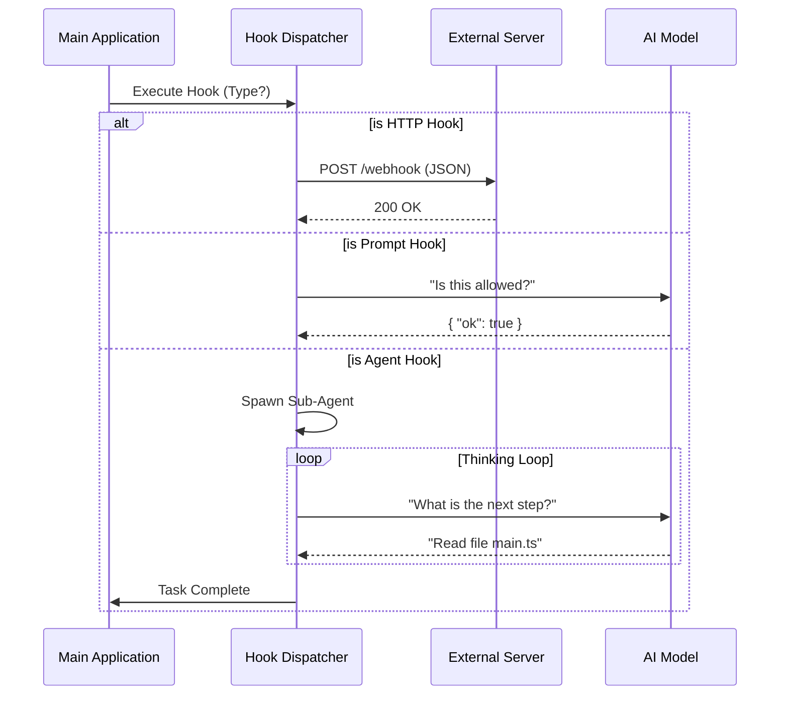

# Chapter 2: Execution Strategies

Welcome back! In [Chapter 1: Hook Configuration & Metadata](01_hook_configuration___metadata.md), we built our "Rulebook." We created a prioritized list of rules (Hooks) that define **when** to act (e.g., `PreToolUse`) and **what** metadata is available.

But having a rule like *"Check for secrets before committing"* is only half the battle. The system still needs to actually *perform* the check.

Does it send a web request? Does it ask an AI for an opinion? Does it launch a mini-bot to fix the code?

In this chapter, we explore **Execution Strategies**—the engines that power your hooks.

## The Motivation: Different Jobs require Different Tools

Imagine you are a manager. You have three types of tasks:
1.  **The Quick Decision:** You need a "Yes/No" on a permission slip. You don't need a meeting; you just need a signature.
2.  **The Notification:** You need to mail a package to another office. You don't need to go there yourself; you just hand it to a courier.
3.  **The Project:** You need to research a topic and write a report. This requires a smart worker to sit down, think, use tools, and iterate.

The **Hooks** system mirrors this with three specific execution strategies: **Prompt Hooks**, **HTTP Hooks**, and **Agent Hooks**.

---

## Strategy 1: Prompt Hooks (The Decider)

**Best for:** Fast decisions, safety checks, and boolean logic.

A Prompt Hook doesn't browse the web or edit files. It simply takes the context (like a terminal command you are about to run), sends it to a fast, lightweight AI model (like Claude Haiku), and asks: *"Should I allow this?"*

### How it works
The system forces the AI to reply in a strict JSON format: `{"ok": true}` or `{"ok": false, "reason": "..."}`.

```typescript
// Example: execPromptHook.ts (Simplified)

// 1. Prepare the question for the AI
const userMessage = createUserMessage({ 
  content: `User wants to run: ${command}. Is this safe?` 
});

// 2. Ask a small, fast model (non-streaming for speed)
const response = await queryModelWithoutStreaming({
  messages: [userMessage],
  systemPrompt: "Return JSON: { ok: boolean, reason?: string }",
  // We force JSON mode to ensure the code can read the answer
  options: { outputFormat: { type: 'json_schema' } } 
});
```

**Why is this cool?**
It effectively gives you an "AI Firewall." You can write natural language rules like "Prevent the user from deleting production databases," and the Prompt Hook acts as the guard.

---

## Strategy 2: HTTP Hooks (The Messenger)

**Best for:** Logging, analytics, and triggering external pipelines (CI/CD).

Sometimes logic shouldn't live inside the assistant at all. You might want to send data to a corporate logging server or trigger a deployment workflow in Jenkins/GitHub Actions.

### How it works
This strategy acts like a standard "Webhook." It takes the event data, packages it as JSON, and `POST`s it to a URL you define.

```typescript
// Example: execHttpHook.ts (Simplified)

// 1. Check if the URL is in the "Safe List" (Security First!)
if (!isUrlAllowed(hook.url)) {
  return { error: "Blocked by allowlist" };
}

// 2. Send the data (using standard HTTP libraries)
const response = await axios.post(hook.url, jsonInput, {
  headers: { 
    // We can even inject secure environment variables here
    'Authorization': `Bearer ${process.env.MY_SECRET_TOKEN}` 
  },
  timeout: 60000 // Don't wait forever
});
```

**Note on Security:** Notice step 1? We don't just send data anywhere. We'll cover how we prevent data leaks in [Chapter 6: Security & SSRF Protection](06_security___ssrf_protection.md).

---

## Strategy 3: Agent Hooks (The Worker)

**Best for:** Complex tasks, fixing code, validation, and multi-step logic.

This is the most powerful strategy. An **Agent Hook** spawns a "Sub-Agent." This isn't just a single LLM call; it's a mini-Claude that can use tools, read files, run terminal commands, and think step-by-step.

**Use Case:** *"After I finish a coding task, run the test suite. If it fails, read the errors and fix the code automatically."*

### How it works
The system creates a sandbox for this new agent. It gives the agent a specific goal (the hook prompt) and a limited set of tools.

```typescript
// Example: execAgentHook.ts (Simplified)

// 1. Create a new "Sub-Agent" Context
// We disallow "Plan Mode" tools to prevent the hook from going rogue
const subAgentContext = {
  ...originalContext,
  agentId: `hook-agent-${randomUUID()}`, // Unique ID
  tools: allowedTools // Only safe tools (read file, etc.)
};

// 2. Run the Agent Loop (Think -> Act -> Repeat)
for await (const message of query({
  messages: [goalMessage], // e.g., "Verify the tests pass"
  toolUseContext: subAgentContext,
  systemPrompt: "You are verifying a condition..."
})) {
  // The loop continues until the agent calls a "Structured Output" tool
  // to signal it has finished its job.
}
```

This loop allows the hook to function autonomously. It acts like a recursive call to the main application logic, but scoped to a specific task.

---

## Internal Implementation: The Dispatcher

How does the system know which strategy to use? When an event fires (from [Chapter 1](01_hook_configuration___metadata.md)), the system looks at the hook configuration object.

Here is the flow of execution:



### The Return Value: `HookResult`
Regardless of the strategy used, all execution functions return a standardized `HookResult` object. This ensures the rest of the application doesn't care *how* the hook ran, only *what* the result was.

```typescript
type HookResult = {
  hook: HookConfig;        // The original rule
  outcome: 'success' | 'blocking' | 'cancelled';
  message?: string;        // Optional output message
  blockingError?: {        // If the hook said "STOP!"
    reason: string;
  };
}
```

## Summary

In this chapter, we learned:
1.  **Prompt Hooks** use a fast, "Brain-only" check for decision making.
2.  **HTTP Hooks** use web requests to talk to the outside world.
3.  **Agent Hooks** spawn capable sub-agents to perform multi-step work.

We now have the rules (Chapter 1) and the engines to run them (Chapter 2). However, running hooks takes time. If we have 10 hooks, we don't want the user interface to freeze while they run!

In the next chapter, we will learn how to handle these executions in the background using the **[Asynchronous Registry & Event Bus](03_asynchronous_registry___event_bus.md)**.

---

Generated by [Code IQ](https://github.com/adityasoni99/Code-IQ)