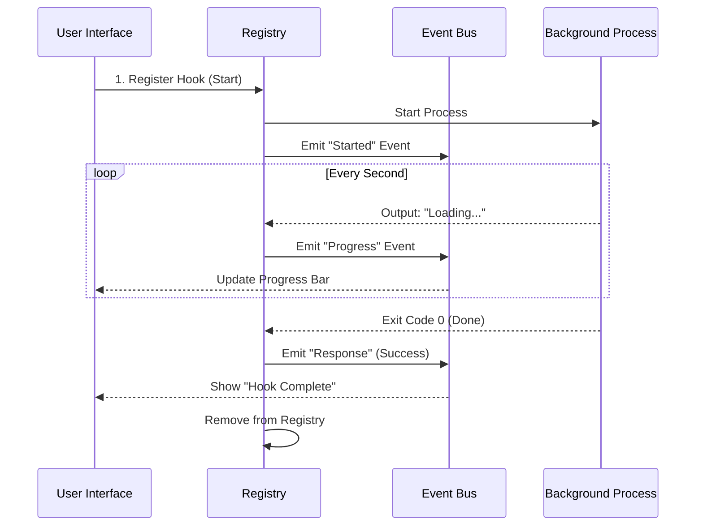

# Chapter 3: Asynchronous Registry & Event Bus

Welcome to Chapter 3! 

In [Chapter 2: Execution Strategies](02_execution_strategies.md), we built the engines that run our hooks—Prompt, HTTP, and Agent hooks. We learned how to execute a command like checking for secrets or asking an AI for permission.

However, there is a major problem with the approach we've seen so far.

**The Problem:** Imagine you have a hook that runs a large test suite (taking 5 minutes) every time you save a file. If the system waits for that test to finish before letting you type again, the application feels "frozen."

**The Solution:** We need to run these tasks in the **background**. We need a system that acts like a "Download Manager" for your hooks. It should:
1.  Start the task.
2.  Let you keep working.
3.  Tap you on the shoulder when the task is done.

In this chapter, we will build the **Asynchronous Registry** (to track tasks) and the **Event Bus** (to broadcast updates).

---

## The Concept: The Kitchen Order System

Think of the application as a busy restaurant.
*   **The UI (User Interface):** This is the waiter. They take your order and want to get back to you immediately.
*   **The Hook:** This is the meal being cooked.
*   **The Registry:** This is the ticket rail in the kitchen. It holds all the active orders.
*   **The Event Bus:** This is the bell the chef rings when an order is ready or when they need to shout "Order up!"

We are building the ticket rail and the bell.

---

## Part 1: The Registry (Tracking Tasks)

The **Registry** is simply a list (or a Map) that lives in the computer's memory. It remembers every hook that is currently running in the background.

We define this in `AsyncHookRegistry.ts`.

### Storing a "Pending" Hook
When a hook starts, we create a "ticket" for it. We call this `PendingAsyncHook`. It stores the Process ID (PID), when it started, and the command running.

```typescript
// From AsyncHookRegistry.ts

// The global list of running hooks
const pendingHooks = new Map<string, PendingAsyncHook>()

// What a "ticket" looks like
export type PendingAsyncHook = {
  processId: string
  hookName: string
  startTime: number
  // The actual running command (e.g., the shell process)
  shellCommand: ShellCommand 
}
```

### Adding to the Registry
When the system decides to run a hook asynchronously (in the background), it calls `registerPendingAsyncHook`. This function puts the "ticket" on the rail.

```typescript
// From AsyncHookRegistry.ts
export function registerPendingAsyncHook(params) {
  // 1. Add to our global map
  pendingHooks.set(params.processId, {
    processId: params.processId,
    hookName: params.hookName,
    startTime: Date.now(),
    shellCommand: params.shellCommand,
    // ... other metadata
  })
}
```

**Explanation:**
This function takes the running process (which we started in the previous chapter) and saves it. Now, even if the user moves to a different screen, the system hasn't forgotten about the background process.

---

## Part 2: The Event Bus (Broadcasting Updates)

Now that the hook is running in the background, we need a way to tell the user what's happening. Is it still running? Did it fail? Did it print a log message?

We use an **Event Bus** in `hookEvents.ts`. This allows the hook to "broadcast" messages without knowing who is listening.

### Types of Events
We care about three main lifecycle moments:
1.  **Started:** "I have begun working."
2.  **Progress:** "Here is a line of output (stdout)."
3.  **Response:** "I am finished (Success/Failure)."

### Broadcasting Progress
Imagine the hook is running `npm install`. It prints lines of text. We want to show this to the user in real-time.

```typescript
// From hookEvents.ts
export function emitHookProgress(data) {
  // If we have a listener (like the UI), tell them!
  if (eventHandler) {
    eventHandler({
      type: 'progress',
      hookId: data.hookId,
      stdout: data.stdout
    })
  }
}
```

**Explanation:**
This function is a "Fire and Forget" mechanism. The hook system shouts "Progress Update!", and if the UI is listening, it displays it. If not, the system keeps running anyway.

---

## Putting It Together: The Workflow

Let's look at how the Registry and Event Bus work together when a hook runs.



---

## Internal Implementation: How do we know it's done?

You might be wondering: *How does the Registry know when the background command finishes?*

In `AsyncHookRegistry.ts`, we don't just sit and wait (blocking). Instead, we periodically check the status of our "tickets."

### The Polling Loop
We have a function called `checkForAsyncHookResponses`. Think of this as the Head Chef walking down the line of tickets to see which dishes are ready.

```typescript
// From AsyncHookRegistry.ts (Simplified)
export async function checkForAsyncHookResponses() {
  const finishedHooks = []

  // Iterate over every running hook
  for (const hook of pendingHooks.values()) {
    
    // Check if the shell command is done
    if (hook.shellCommand.status === 'completed') {
      finishedHooks.push(hook)
    }
  }

  return finishedHooks
}
```

**Why do we do this?**
This approach allows a single "Check" function to manage 1, 10, or 100 background hooks at once. It captures their final output (`stdout`) and prepares them to be sent back to the user.

### Finalizing the Hook
Once a hook is detected as "completed," we need to clean up. We call `finalizeHook`.

```typescript
// From AsyncHookRegistry.ts (Simplified)
async function finalizeHook(hook, exitCode, outcome) {
  // 1. Stop checking for progress updates
  hook.stopProgressInterval()
  
  // 2. Broadcast the final result to the world
  emitHookResponse({
    hookId: hook.hookId,
    outcome: outcome, // 'success' or 'error'
    output: "Process finished successfully"
  })
}
```

**Explanation:**
This is the "Order Up!" moment. It stops the background monitoring, cleans up memory, and tells the Event Bus that the job is 100% complete.

---

## Advanced: Monitoring Output Logs

Sometimes, a user wants to see the logs *while* the command runs (like a spinning loading bar). To do this, when we register a hook, we start a small timer specifically for that hook.

```typescript
// From AsyncHookRegistry.ts (Simplified)

// Inside registerPendingAsyncHook...
const stopInterval = startHookProgressInterval({
  hookId,
  // Every 1 second, run this function:
  getOutput: async () => {
    // Read the current output buffer from the shell command
    return hook.shellCommand.getStdout()
  }
})
```

This creates a dedicated mini-loop for every hook that constantly funnels text from the invisible background process to the visible Event Bus.

---

## Summary

In this chapter, we solved the "Freezing UI" problem.

1.  **Registry:** We created a place to store "tickets" for background processes so we don't lose track of them.
2.  **Event Bus:** We created a broadcasting system to send "Started," "Progress," and "Finished" alerts to the UI.
3.  **Polling:** We learned how to periodically check our registry to clean up finished tasks.

We now have a system that can configure rules (Chapter 1), execute them (Chapter 2), and manage them in the background (Chapter 3).

But what happens when the user closes the application? Or when they switch projects? We need to manage the **Lifecycle** of these hooks to ensure we don't leave messy processes running forever.

In the next chapter, we will learn about the **[Session-Scoped Lifecycle](04_session_scoped_lifecycle.md)**.

---

Generated by [Code IQ](https://github.com/adityasoni99/Code-IQ)