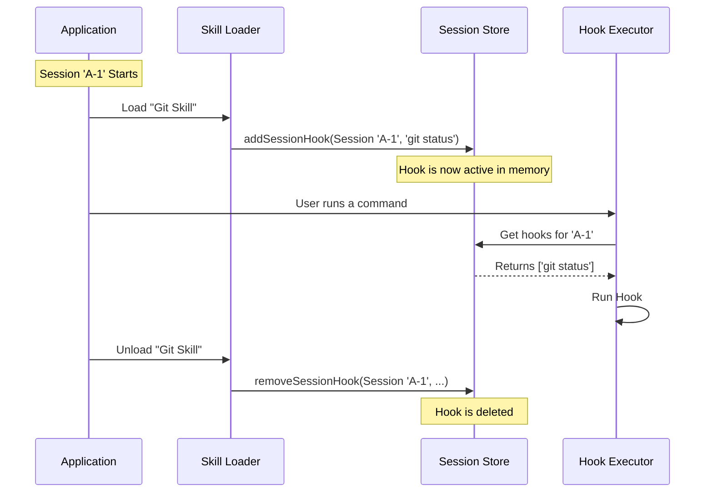

# Chapter 4: Session-Scoped Lifecycle

Welcome to Chapter 4!

In [Chapter 3: Asynchronous Registry & Event Bus](03_asynchronous_registry___event_bus.md), we learned how to run hooks in the background without freezing the application. We built a system to track tasks and broadcast their progress.

But we have a lingering question: **How long should a rule last?**

In [Chapter 1](01_hook_configuration___metadata.md), we wrote rules in `settings.json` files. These are **permanent**. If you add a rule to "Check spelling," it will check spelling forever, in every project, until you manually delete it.

But what if you only want a rule to exist for **5 minutes**? Or just while you are using a specific "Coding Agent"?

In this chapter, we introduce the **Session-Scoped Lifecycle**. Think of these as **Sticky Notes**. You attach them to your workspace for a specific task, and when the task is done, the cleanup crew throws them away.

---

## The Motivation: Context is King

Imagine you have a "Skill" (a plugin) called **The Git Expert**.
*   **Goal:** Help you manage version control.
*   **Desired Behavior:** Whenever you run a command, it should automatically run `git status` to see what changed.

If you put this rule in your *global* settings, it would run `git status` even when you are just writing a poem or editing a config file. That's annoying!

We need a way to say: *"Apply this rule ONLY while 'The Git Expert' skill is active."*

---

## Concept 1: In-Memory Storage

Unlike permanent hooks, Session Hooks are never written to a file. They live entirely in the computer's memory (RAM).

We store them in a `Map`. A Map is like a temporary locker room. Each active Session gets a locker.

```typescript
// From sessionHooks.ts (Simplified)

// The key is the Session ID. The value is the list of hooks.
export type SessionHooksState = Map<string, SessionStore>

export type SessionStore = {
  hooks: {
    // Grouped by event (e.g., "PreToolUse")
    [event in HookEvent]?: SessionHookMatcher[]
  }
}
```

When a session starts, we fill the locker. When the session ends, we empty it.

---

## Concept 2: Adding a Session Hook

To create a temporary hook, we don't edit a JSON file. Instead, code (like an Agent or a Skill) calls a function `addSessionHook`.

Let's say we want to add a hook that prints "Be careful!" every time we run a command, but **only for this session**.

```typescript
// Example usage of addSessionHook

addSessionHook(
  setAppState,       // Tool to update state
  'session-123',     // The Session ID (The Locker Number)
  'PreToolUse',      // When to run?
  'rm',              // Filter: Only for 'rm' command
  {                  // The Hook Command
    type: 'command',
    command: 'echo "Be careful deleting files!"'
  }
);
```

**What happens here?**
1.  The system looks for locker `'session-123'`.
2.  It creates a "sticky note" instruction.
3.  It places it inside the `PreToolUse` folder in that locker.

Now, if the user runs `rm file.txt`, this hook will fire. But if they open a *new* window (Session 456), this hook won't exist there.

---

## Concept 3: The "Once" Hook (Self-Destruct)

Sometimes, you want a hook to run exactly one time and then disappear immediately.

**Example:** When an Agent starts, you want to run an "Initialization Script." You don't want it to run again if the Agent pauses and resumes.

We handle this using a wrapper called `onHookSuccess`.

```typescript
// From registerSkillHooks.ts (Simplified Logic)

// 1. Check if the hook is marked as "once: true"
const onHookSuccess = hook.once
  ? () => {
      // 2. If it is, create a callback to remove it immediately
      removeSessionHook(setAppState, sessionId, eventName, hook)
    }
  : undefined

// 3. Add the hook with this self-destruct instruction
addSessionHook(..., onHookSuccess)
```

This creates a hook that behaves like a message in a spy movie: *It executes its mission and then vanishes.*

---

## Internal Implementation: The Lifecycle Flow

How does the system manage these hooks automatically? Let's trace the lifecycle of a "Skill" being loaded and unloaded.



### 1. Registration (`registerSkillHooks.ts`)
When a skill loads, it reads its own configuration file (frontmatter). It loops through every event defined there and registers them into memory.

```typescript
// From registerSkillHooks.ts
export function registerSkillHooks(setAppState, sessionId, hooks) {
  // Loop through all events (PreToolUse, etc.)
  for (const eventName of HOOK_EVENTS) {
    
    // Loop through all matchers
    const matchers = hooks[eventName] || []
    
    for (const matcher of matchers) {
      // Add each hook to memory
      addSessionHook(setAppState, sessionId, eventName, matcher.matcher, hook)
    }
  }
}
```

### 2. Execution Lookup (`sessionHooks.ts`)
In [Chapter 1](01_hook_configuration___metadata.md), we saw `getAllHooks`. That function merges permanent settings *and* these session hooks.

When the executor asks for hooks, we simply retrieve them from the Map.

```typescript
// From sessionHooks.ts
export function getSessionHooks(appState, sessionId, event) {
  // 1. Open the locker for this session
  const store = appState.sessionHooks.get(sessionId)
  if (!store) return []

  // 2. Return the hooks for the specific event
  return store.hooks[event] || []
}
```

### 3. Cleanup (`clearSessionHooks`)
When a session is closed, we must ensure we don't leave "ghost hooks" eating up memory. The cleanup is brutally simple: we delete the entire entry for that session ID.

```typescript
// From sessionHooks.ts
export function clearSessionHooks(setAppState, sessionId) {
  setAppState(prev => {
    // Delete the entire key from the Map
    prev.sessionHooks.delete(sessionId)
    return prev
  })
}
```

---

## Special Case: Function Hooks

So far, all our hooks have been simple commands (strings of text). But because Session Hooks live in memory, we can do something powerful: we can store **JavaScript Functions**.

We call these `FunctionHook`.

**Why?**
Imagine you need to validate a complex JSON object. Writing a shell script to parse JSON is painful. Using a TypeScript function is easy.

```typescript
// From sessionHooks.ts
export type FunctionHook = {
  type: 'function'
  callback: (data: any) => boolean // Returns true/false
}
```

These hooks are invisible to the settings files. They are injected directly by the code of the application to enforce strict safety constraints that shouldn't be overridden by users.

---

## Summary

In this chapter, we learned:
1.  **Session Hooks** are temporary rules ("Sticky Notes") that only exist while a specific task or agent is active.
2.  They are stored in **Memory (`Map`)**, not files.
3.  **Skills** use this to inject behaviors (like "run git status") that disappear when the skill is unloaded.
4.  **Cleanup** is automatic: when the session dies, the hooks die.

We now have a fully functional hook system!
1.  We have the Rulebook ([Chapter 1](01_hook_configuration___metadata.md)).
2.  We have the Engines ([Chapter 2](02_execution_strategies.md)).
3.  We have the Background Manager ([Chapter 3](03_asynchronous_registry___event_bus.md)).
4.  We have the Lifecycle Manager (Chapter 4).

But wait... all our examples so far relied on the *Application* triggering an event (like `PreToolUse`). What if we want to trigger a hook based on something happening **outside** the application? Like a file changing on the hard drive?

In the next chapter, we will give our system eyes to see the outside world using **[Environment Watchers](05_environment_watchers.md)**.

---

Generated by [Code IQ](https://github.com/adityasoni99/Code-IQ)