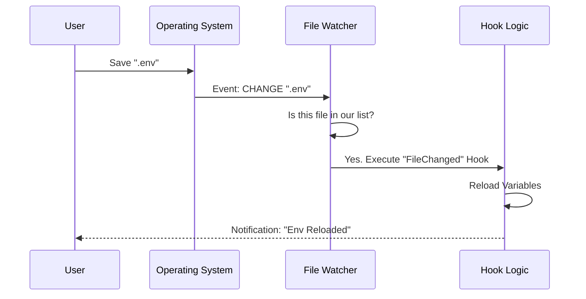

# Chapter 5: Environment Watchers

Welcome to Chapter 5!

In [Chapter 4: Session-Scoped Lifecycle](04_session_scoped_lifecycle.md), we learned how to manage temporary rules (Session Hooks) that live in the application's memory. These rules were internal triggers, reacting to things the *User* or the *Agent* did inside the app.

But what happens when things change **outside** the application?

**The Problem:** Imagine you are working on a project. You realize your API key is wrong, so you open `config.json` in a text editor and change it. You save the file.
However, your Agent is still running with the old configuration in its memory. It tries to run a command and fails. You have to restart the whole session just to load that one file change.

**The Solution:** We need **Environment Watchers**. These are like security cameras installed in your project folder. They watch for changes to files or directories and notify the Agent immediately.

In this chapter, we will build a system that reacts to the file system in real-time.

---

## The Motivation: Automatic Reloading

Let's look at the primary use case for this system.

**Scenario:** You have a file named `.env` containing secret variables.
**Goal:** Whenever you save changes to `.env`, the Agent should automatically:
1.  Detect the change.
2.  Clear the old environment variables.
3.  Reload the new values.

This makes the Agent feel "smart" and reactive, rather than static and dumb.

---

## Concept 1: Watching the Directory (`CwdChanged`)

The first thing we watch is the **Current Working Directory (CWD)**. This is the folder you are currently "standing" in.

If the user runs `cd ./src`, they have changed their environment. The rules that applied to the root folder might not apply to the `src` folder.

### How it works
The watcher acts like a GPS. When it detects the location has changed, it triggers the `CwdChanged` event.

```typescript
// Example Hook Configuration (Simplified)
{
  "event": "CwdChanged",
  "command": "ls -la", // List files when entering a new folder
}
```

This allows the system to look around and say, *"Oh, I'm in a new folder. Let me see what config files are here."*

---

## Concept 2: Watching Specific Files (`FileChanged`)

The second concept involves watching specific files within that directory. We don't want to watch *everything* (watching `node_modules` would crash the computer!). We only watch files that matter, like `.env` or `package.json`.

### Defining what to watch
In [Chapter 1: Hook Configuration & Metadata](01_hook_configuration___metadata.md), users define matchers. For file watching, the matcher is the filename.

```typescript
// Example Hook Configuration
{
  "event": "FileChanged",
  "matcher": ".env", // Only watch this file
  "command": "source .env" // Reload variables
}
```

When `.env` is saved, this hook fires. If `README.md` is saved, this hook ignores it.

---

## Internal Implementation: The Watcher System

How do we actually build this? We use a library called `chokidar`, which is very efficient at listening to Operating System events.

Let's look at the workflow when a user modifies a file.



Now, let's explore the code in `fileChangedWatcher.ts`.

### Step 1: Initialization

When the application starts, or when we change directories, we initialize the watcher. We first check the configuration to see if any hooks actually *care* about file changes.

```typescript
// From fileChangedWatcher.ts
export function initializeFileChangedWatcher(cwd: string): void {
  // 1. Get current configuration
  const config = getHooksConfigFromSnapshot()
  
  // 2. Do we have any FileChanged or CwdChanged hooks?
  const hasEnvHooks = (config?.FileChanged?.length ?? 0) > 0

  // 3. If yes, start watching relevant paths
  if (hasEnvHooks) {
    const paths = resolveWatchPaths(config) // e.g., ['.env', 'package.json']
    startWatching(paths)
  }
}
```

**Explanation:**
We don't turn the camera on unless there are rules in the rulebook. This saves battery (CPU). We calculate exactly which files to watch using `resolveWatchPaths`.

### Step 2: Starting the Camera (`chokidar`)

Once we know the paths, we tell `chokidar` to start listening.

```typescript
// From fileChangedWatcher.ts
function startWatching(paths: string[]): void {
  // Create the watcher instance
  watcher = chokidar.watch(paths, {
    persistent: true,     // Keep running
    ignoreInitial: true,  // Don't trigger on existing files, only changes
    awaitWriteFinish: true // Wait until the file is fully saved
  })

  // Attach event listeners
  watcher.on('change', path => handleFileEvent(path, 'change'))
  watcher.on('add', path => handleFileEvent(path, 'add'))
}
```

**Explanation:**
This code sets up the "ears" of the system. Notice `awaitWriteFinish`—this is important! When you save a large file, it writes in chunks. We wait until the writing stops so we don't trigger the hook 50 times in one millisecond.

### Step 3: Handling the Event

When `chokidar` detects a change, it calls `handleFileEvent`. This function is the bridge between the raw file system and our Hook Execution system from [Chapter 2](02_execution_strategies.md).

```typescript
// From fileChangedWatcher.ts
function handleFileEvent(path: string, event: string): void {
  // Execute the hooks associated with this file
  executeFileChangedHooks(path, event)
    .then(({ results }) => {
       // Check if the hook failed
       results.forEach(r => {
         if (!r.succeeded) notifyUser("Hook failed!", true)
       })
    })
    .catch(err => logError(err))
}
```

**Explanation:**
We simply pass the filename (e.g., `.env`) to `executeFileChangedHooks`. That function figures out which specific rules apply and runs them (using the Prompt, HTTP, or Agent strategies we learned earlier).

---

## Advanced Concept: Dynamic Watching

Here is a tricky problem:
1.  You have a hook that says: "If `package.json` changes, read it to find *other* config files."
2.  You edit `package.json`.
3.  The hook runs and finds a new file: `special.config.js`.
4.  **Problem:** The watcher wasn't watching `special.config.js` before. It needs to update its list!

We handle this via `updateWatchPaths`.

```typescript
// From fileChangedWatcher.ts
export function updateWatchPaths(newPaths: string[]): void {
  // Check if the list of paths is actually different
  if (arePathsSame(dynamicWatchPaths, newPaths)) return

  // Close the old watcher
  if (watcher) watcher.close()
  
  // Start a new watcher with the updated list
  startWatching(newPaths)
}
```

**Explanation:**
Hooks can return a list of *new* files they want to watch. If the list changes, we restart the security system with the new instructions. This allows the Agent to "learn" about the environment as it explores.

---

## Handling Directory Changes (`CwdChanged`)

When the user changes folders (e.g., `cd ..`), we have to do a "Hard Reset." The `.env` file in the old folder doesn't matter anymore. We need to look for the `.env` file in the *new* folder.

```typescript
// From fileChangedWatcher.ts
export async function onCwdChangedForHooks(oldCwd, newCwd): Promise<void> {
  if (oldCwd === newCwd) return

  // 1. Clear old environment variables
  await clearCwdEnvFiles()

  // 2. Run hooks for the "CwdChanged" event
  await executeCwdChangedHooks(oldCwd, newCwd)

  // 3. Restart the file watcher in the new folder
  restartWatching() 
}
```

**Explanation:**
This function cleans the slate. It ensures that we don't accidentally keep using configuration from the previous project.

---

## Summary

In this chapter, we gave our system "eyes."

1.  **CwdChanged:** The system knows when we move to a different folder and resets itself.
2.  **FileChanged:** The system watches specific files (like `.env`) defined in the configuration.
3.  **Responsiveness:** Using `chokidar`, the system reacts instantly to file saves, reloading configuration or triggering alerts without the user typing a command.

We now have a system that is:
*   **Configurable** ([Chapter 1](01_hook_configuration___metadata.md))
*   **Capable** of complex actions ([Chapter 2](02_execution_strategies.md))
*   **Non-blocking** ([Chapter 3](03_asynchronous_registry___event_bus.md))
*   **Context-aware** ([Chapter 4](04_session_scoped_lifecycle.md))
*   **Reactive** to the environment (Chapter 5)

However, with great power comes great responsibility. We have built a system that can read files, execute shell commands, and send data to the internet.

What if a malicious actor adds a hook to `package.json` that steals your SSH keys and sends them to a server?

In the final chapter, we will secure our system using **[Security & SSRF Protection](06_security___ssrf_protection.md)**.

---

Generated by [Code IQ](https://github.com/adityasoni99/Code-IQ)