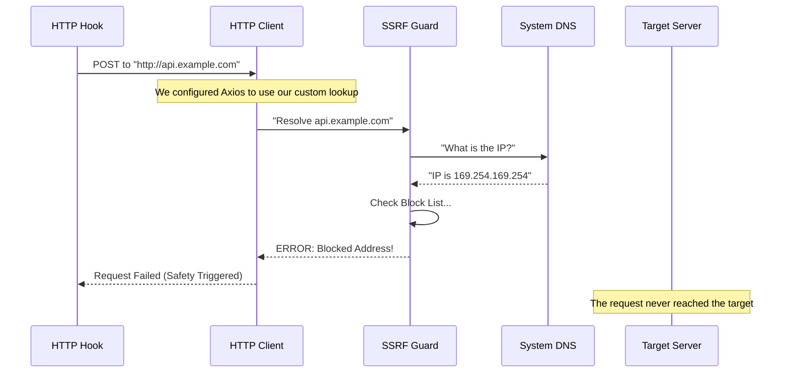

# Chapter 6: Security & SSRF Protection

Welcome to the final chapter of our **Hooks** tutorial series!

In [Chapter 5: Environment Watchers](05_environment_watchers.md), we gave our system "eyes" to react to changes in the file system. We've built a powerful automation machine that can read files, execute commands, and even send data over the internet using **HTTP Hooks** (from [Chapter 2](02_execution_strategies.md)).

But "sending data over the internet" carries a hidden risk.

**The Problem:** Imagine a malicious user (or a bad configuration file you copied from the internet) sets up a hook like this:
`"url": "http://169.254.169.254/latest/meta-data/"`

To a human, that just looks like numbers. But to a server running in the cloud (like AWS), that specific IP address returns **Secret Keys** and **Passwords** for the server itself.

If our system blindly follows orders and sends that request, it creates a vulnerability called **SSRF (Server-Side Request Forgery)**. The hook becomes a spy, mapping your internal network and stealing secrets.

**The Solution:** We need a **Network Bouncer**. This security layer checks every ID card (IP address) before letting a request leave the building.

In this chapter, we will build the **SSRF Guard**.

---

## The Motivation: The "Trojan Horse" URL

Let's say you have a hook designed to log errors to a dashboard.

```json
{
  "event": "OnError",
  "url": "http://my-dashboard.com/log"
}
```

This looks safe. But what if a hacker changes your DNS settings so `my-dashboard.com` actually points to `192.168.1.1` (your local Wi-Fi router's admin page)?

The system would try to send error logs to your router. If your router has a vulnerability, the hook just hacked your local network.

We need a system that says: *"I don't care what the URL is named. I care where it actually GOES. And you are not allowed to go to private addresses."*

---

## Concept 1: The Block List

The internet has "Public" addresses (safe to visit) and "Private" addresses (internal use only).

Our Bouncer needs a list of addresses that are **strictly forbidden**.

### The Forbidden Ranges
In `ssrfGuard.ts`, we define logic to detect these ranges:
1.  **10.0.0.0/8**: Common corporate private networks.
2.  **192.168.0.0/16**: Common home private networks.
3.  **169.254.0.0/16**: Link-local addresses (used by Cloud Providers for metadata).

### The Exception: Localhost
Usually, we block `127.0.0.1` (Localhost) because we don't want hooks accessing internal services. **However**, for a developer tool, you often run a local testing server. So, our policy explicitly **allows** localhost (`127.0.0.0/8` and `::1`).

```typescript
// From ssrfGuard.ts (Simplified Logic)
function isBlockedV4(address: string): boolean {
  const parts = address.split('.').map(Number) // e.g., "192.168.1.1" -> [192, 168, 1, 1]

  if (parts[0] === 127) return false // ALLOW: Developer's local machine
  if (parts[0] === 10) return true   // BLOCK: Corporate private network
  if (parts[0] === 192 && parts[1] === 168) return true // BLOCK: Home network
  
  // BLOCK: Cloud Metadata (The most dangerous one!)
  if (parts[0] === 169 && parts[1] === 254) return true 

  return false // Everything else is okay
}
```

**Explanation:**
This function is the checklist. If an IP matches a dangerous pattern, it returns `true` (Blocked).

---

## Concept 2: The Guarded Lookup

Here is the trickiest part of SSRF.

If you check the URL `http://evil.com`, it looks safe.
But `evil.com` might resolve to `169.254.169.254` the moment you try to connect.

We cannot rely on the *name*. We must look up the *number* (DNS Resolution), check the number against our block list, and **only then** allow the connection.

We create a custom lookup function called `ssrfGuardedLookup`.

```typescript
// From ssrfGuard.ts
export function ssrfGuardedLookup(hostname, options, callback) {
  // 1. Ask the system: "What is the IP for this hostname?"
  dnsLookup(hostname, { all: true }, (err, addresses) => {
    
    // 2. Check every IP returned
    for (const { address } of addresses) {
      if (isBlockedAddress(address)) {
        // 3. STOP! Danger detected.
        callback(new Error(`Blocked internal IP: ${address}`), '')
        return
      }
    }
    
    // 4. Safe. Proceed with connection.
    callback(null, addresses[0].address, 4)
  })
}
```

**Analogy:**
It's like checking an ID at a club.
*   **Hostname:** "I am John Doe."
*   **DNS Lookup:** The bouncer looks at the ID card. It says "John Doe, Address: The Bank Vault."
*   **SSRF Guard:** "Sorry, nobody from 'The Bank Vault' is allowed in here."

---

## Internal Implementation: The Request Flow

How do we force our HTTP hooks to use this guard? We inject it into the HTTP client (`axios`).

Here is the sequence of events when a hook runs:



### Hooking it into Axios
In `execHttpHook.ts`, we configure the request. This connects the pieces from [Chapter 2](02_execution_strategies.md) with our new security layer.

```typescript
// From execHttpHook.ts
import { ssrfGuardedLookup } from './ssrfGuard.js'

// Inside the execution function...
const response = await axios.post(hook.url, jsonInput, {
  // ... standard headers ...
  
  // THIS IS THE KEY: We swap the standard lookup for our guard
  lookup: ssrfGuardedLookup, 
  
  // Important: If we are using a Proxy, we skip this 
  // (because the proxy handles DNS, not us)
  lookup: useProxy ? undefined : ssrfGuardedLookup,
})
```

**Why the Proxy check?**
If your company uses a Proxy Server to access the internet, we send the request to the Proxy. The Proxy might be on a private IP (like `10.0.0.5`), which is fine because that's a trusted gateway. In that case, we disable the guard locally and trust the proxy.

---

## Bonus: Protecting Headers (Injection Attacks)

There is one more sneaky way attackers try to break things: **Environment Variables**.

In [Chapter 2](02_execution_strategies.md), we allowed hooks to use secrets:
`"Authorization": "Bearer ${MY_API_KEY}"`

What if `MY_API_KEY` contains this value?
`12345\nServer-Destruct-Sequence: Activate`

This is called **Header Injection**. The `\n` (newline) tricks the server into thinking a new header has started.

We sanitize this in `execHttpHook.ts`.

```typescript
// From execHttpHook.ts
function sanitizeHeaderValue(value: string): string {
  // Remove all New Lines (\r, \n) and Null bytes (\x00)
  return value.replace(/[\r\n\x00]/g, '')
}
```

This simple function ensures that a single variable stays a single line, preventing the configuration from being corrupted.

---

## Summary of the Series

Congratulations! You have completed the **Hooks** tutorial series. Let's look at the incredible system you now understand:

1.  **[Configuration](01_hook_configuration___metadata.md):** We built a Rulebook to define events and metadata.
2.  **[Execution](02_execution_strategies.md):** We built Engines (Prompt, HTTP, Agent) to perform tasks.
3.  **[Async Registry](03_asynchronous_registry___event_bus.md):** We made it run in the background without freezing the UI.
4.  **[Lifecycle](04_session_scoped_lifecycle.md):** We created temporary "Sticky Note" rules for specific sessions.
5.  **[Watchers](05_environment_watchers.md):** We gave the system eyes to see file changes.
6.  **Security (This Chapter):** We hired a Bouncer to ensure our powerful tool isn't used against us.

You now have a deep understanding of how to build a reactive, secure, and extensible automation system for AI agents.

**Happy Coding!**

---

Generated by [Code IQ](https://github.com/adityasoni99/Code-IQ)