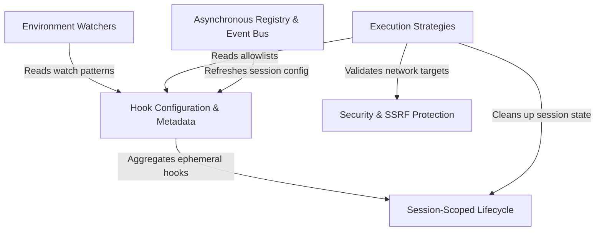

# Tutorial: hooks

This project implements a robust **event-driven hook system** for an AI agent, allowing it to react to lifecycle events such as *file changes*, *tool usage*, or *session starts*. It orchestrates a central registry of **configuration rules** that trigger various **execution strategies** (like running shell commands, HTTP requests, or sub-agents), while maintaining **security** through network validation and managing temporary **session-scoped** logic.

## Chapters

1. [Hook Configuration & Metadata](01_hook_configuration___metadata.md)
2. [Execution Strategies](02_execution_strategies.md)
3. [Asynchronous Registry & Event Bus](03_asynchronous_registry___event_bus.md)
4. [Session-Scoped Lifecycle](04_session_scoped_lifecycle.md)
5. [Environment Watchers](05_environment_watchers.md)
6. [Security & SSRF Protection](06_security___ssrf_protection.md)

---

Generated by [Code IQ](https://github.com/adityasoni99/Code-IQ)