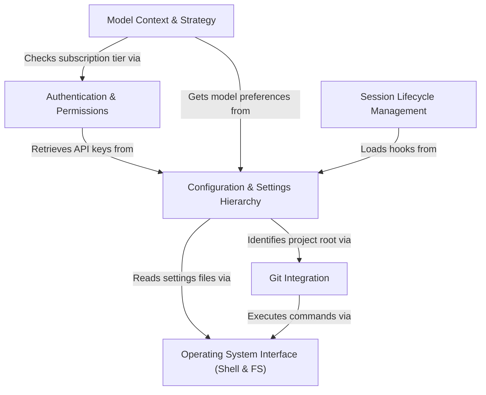

# Tutorial: utils

This project acts as the **central nervous system** for an AI agent, managing its *configuration hierarchy* and *security context* across different environments. It provides the agent with the **hands** to interact with the operating system, file system, and **Git repositories**, while orchestrating the *session lifecycle* and determining the optimal **model strategy** based on user preferences and token limits.

## Chapters

1. [Configuration & Settings Hierarchy](01_configuration___settings_hierarchy.md)
2. [Authentication & Permissions](02_authentication___permissions.md)
3. [Model Context & Strategy](03_model_context___strategy.md)
4. [Git Integration](04_git_integration.md)
5. [Operating System Interface (Shell & FS)](05_operating_system_interface__shell___fs_.md)
6. [Session Lifecycle Management](06_session_lifecycle_management.md)

---

Generated by [Code IQ](https://github.com/adityasoni99/Code-IQ)