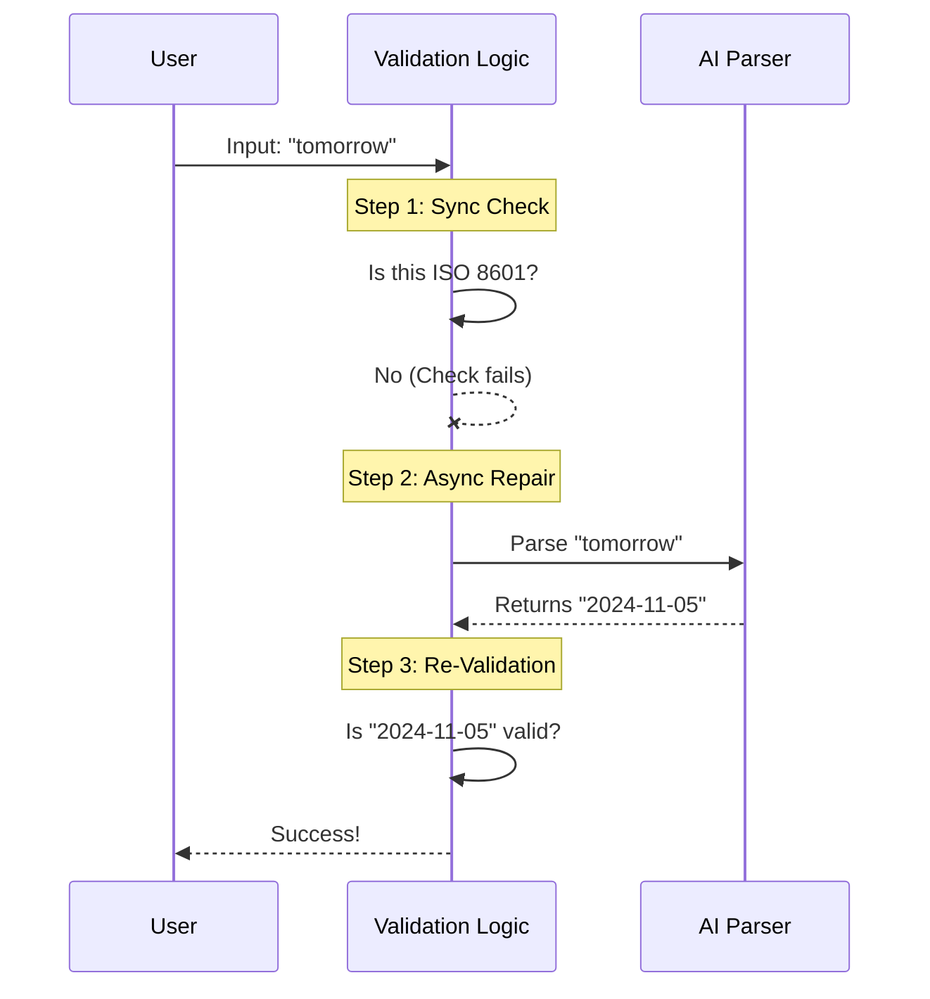

# Chapter 1: Hybrid Asynchronous Validation

Welcome to the **mcp** project tutorial! We are going to build a system that feels magical to use.

## The Motivation: Don't Be a Robot

Imagine you are building a command-line tool that asks the user for a deadline.

**The "Old" Way:**
> **System:** Please enter a date (YYYY-MM-DD).
> **User:** Tomorrow.
> **System:** ❌ ERROR: Invalid format. Expected YYYY-MM-DD.

This is frustrating. Humans don't think in ISO 8601 strings (`2024-11-05`); they think in natural language ("next Friday", "in 2 hours").

**The "Hybrid" Way:**
> **System:** Please enter a date.
> **User:** Tomorrow.
> **System:** ✅ Accepted (stored internally as `2024-11-05`).

This chapter explains the **Hybrid Asynchronous Validation** pattern that makes this possible. It combines the speed of code with the intelligence of AI.

---

## How It Works: The "Assistant" Analogy

Think of your validation system as a receptionist at a high-security building that requires a specific ID badge format.

1.  **The Fast Check (Synchronous):**
    The user walks up. If they hand over a valid ID badge (e.g., `2024-01-01`), the receptionist lets them in immediately. This is fast and costs nothing.

2.  **The Helper (Asynchronous):**
    If the user hands over a handwritten note saying "I'm with the band" (e.g., "next Friday"), the receptionist doesn't reject them yet. They call a helpful assistant (the AI) to verify the note and print a valid badge.

3.  **The Final Check:**
    If the assistant returns a valid badge, the user gets in. If the note was gibberish, *then* they are rejected.

---

## How to Use It

In our project, the main entry point is a function called `validateElicitationInputAsync`. You don't need to manually call the AI; this function handles the decision-making for you.

Here is how you might call it in your application code:

```typescript
import { validateElicitationInputAsync } from './elicitationValidation.js'

// 1. Define what we want (a date)
const mySchema = { 
  type: 'string', 
  format: 'date' 
}

// 2. We have an "AbortSignal" to cancel the request if needed
const signal = new AbortController().signal
```

Now, let's see what happens when we validate different inputs.

### Scenario A: Strict Input (Fast)

```typescript
// User provides strict format
const result = await validateElicitationInputAsync(
  "2023-12-25", 
  mySchema, 
  signal
)

console.log(result.isValid) // true
console.log(result.value)   // "2023-12-25"
```
*Explanation:* The system sees a valid date string. It approves it instantly without calling the AI.

### Scenario B: Natural Language (Smart)

```typescript
// User provides natural language
const result = await validateElicitationInputAsync(
  "tomorrow", 
  mySchema, 
  signal
)

console.log(result.isValid) // true
// The value is automatically converted!
console.log(result.value)   // "2023-12-26" (assuming today is the 25th)
```
*Explanation:* The fast check failed. The system automatically triggered the AI parser, converted "tomorrow" to a date string, and validated the result.

---

## Under the Hood: The Flow

Let's look at what happens inside `validateElicitationInputAsync`.

### The Sequence Diagram



### Implementation Walkthrough

The logic is contained in `elicitationValidation.ts`. We will look at simplified versions of the code to understand the logic.

#### Step 1: The Synchronous Attempt

First, we try to validate strictly using [Schema-Based Input Validation](02_schema_based_input_validation.md).

```typescript
// Inside validateElicitationInputAsync...

// 1. Try to validate strictly first (Fast!)
const syncResult = validateElicitationInput(stringValue, schema)

if (syncResult.isValid) {
  return syncResult // Return immediately if valid
}
```
*Explanation:* If the user types strict data, we stop here. We don't want to waste time or API costs on AI if we don't have to.

#### Step 2: Deciding to use AI

We don't send *everything* to the AI. We only send inputs that look like they *should* be dates but aren't formatted correctly.

```typescript
// 2. Check if we should attempt an AI repair
// We only do this for 'date' or 'date-time' schemas
if (isDateTimeSchema(schema) && !looksLikeISO8601(stringValue)) {
  
  // 3. Call the AI parser (See Chapter 3)
  const parseResult = await parseNaturalLanguageDateTime(
    stringValue,
    schema.format,
    signal,
  )
  // ... continued below
}
```
*Explanation:* We check `isDateTimeSchema`. If the expected type is an email or a number, we don't try to "parse" natural language (AI isn't needed to validate an email). We also check `!looksLikeISO8601` to ensure we aren't sending valid dates that just happened to fail for other reasons (like min/max constraints).

#### Step 3: Validating the AI Result

Even the AI can make mistakes or return invalid data. We must validate the *output* of the AI using the same strict rules from Step 1.

```typescript
  // ... inside the if block from above

  if (parseResult.success) {
    // 4. Validate the AI's answer strictly
    const validatedParsed = validateElicitationInput(
      parseResult.value,
      schema,
    )

    if (validatedParsed.isValid) {
      return validatedParsed // Success!
    }
  }
```
*Explanation:* If the AI returns a valid ISO string, we run it through `validateElicitationInput` one last time to ensure it meets all criteria. If it passes, we return the *converted* value.

## Why this Architecture?

1.  **Performance:** 90% of valid inputs are handled instantly (synchronously).
2.  **Resilience:** The system is "forgiving." It tries to understand the user before giving up.
3.  **Data Integrity:** The database always receives strict ISO 8601 dates, regardless of what the user typed.

## Conclusion

You have learned the pattern of **Hybrid Asynchronous Validation**. It's a "Try Fast, Then Try Smart" approach that significantly improves user experience without sacrificing data quality.

In this chapter, we relied on a helper function called `validateElicitationInput` for the strict checking. In the next chapter, we will dive into how that synchronous engine works.

[Next Chapter: Schema-Based Input Validation](02_schema_based_input_validation.md)

---

Generated by [Code IQ](https://github.com/adityasoni99/Code-IQ)