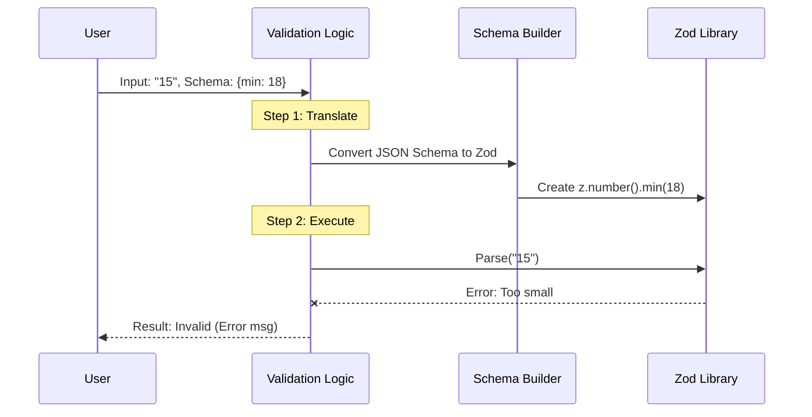

# Chapter 2: Schema-Based Input Validation

Welcome back!

In [Chapter 1: Hybrid Asynchronous Validation](01_hybrid_asynchronous_validation.md), we built a smart system that uses AI to fix messy user input. But remember the "Fast Check" we talked about? The one that happens *before* we call the AI?

That is **Schema-Based Input Validation**. It is the strict, synchronous "gatekeeper" of our system.

## The Motivation: The Square Peg in the Round Hole

Imagine you are building a registration form.
1.  You ask for **Age**. The user types "Old enough".
2.  You ask for **Email**. The user types "bob@".

If you try to save "Old enough" into a database column meant for numbers, your application might crash.

**We need a way to define rules (Schemas) and a way to enforce them (Validation).**

Writing `if` statements for every rule is tedious:
```javascript
// The hard way... don't do this!
if (typeof age !== 'number') return Error
if (age < 0) return Error
if (!email.includes('@')) return Error
// ... and so on
```

Instead, we use a **Schema** to describe the "shape" of the data, and we generate the validation logic automatically.

---

## How It Works: The Blueprint

We use a standard format to describe our data. This is called a **Schema Definition**.

### Concept 1: The Schema (The Rules)

A schema is just a JavaScript object that describes what is allowed.

**Example: An Age Rule**
```javascript
const ageSchema = {
  type: 'integer',
  minimum: 18,
  maximum: 120
}
```

**Example: An Email Rule**
```javascript
const emailSchema = {
  type: 'string',
  format: 'email'
}
```

### Concept 2: The Enforcer (Zod)

We don't write the validation logic ourselves. We use a powerful library called **Zod**.

Zod is like a strict teacher. You give it a rule (the Schema), and it grades the homework (the User Input). If the input is wrong, Zod provides a specific reason why.

---

## How to Use It

In our project, the magic happens in `validateElicitationInput`. This function takes raw text (what the user typed) and a schema, then tells you if it matches.

### Scenario A: Validating Numbers

Let's see if a user is old enough to enter.

```typescript
import { validateElicitationInput } from './elicitationValidation.js'

// 1. Define the rules
const ageSchema = { type: 'integer', minimum: 18 }

// 2. Validate valid input
const result = validateElicitationInput("25", ageSchema)
console.log(result.isValid) // true
console.log(result.value)   // 25 (Converted to number!)
```

### Scenario B: catching Errors

What happens if the user breaks the rules?

```typescript
// User is too young
const result = validateElicitationInput("10", ageSchema)

console.log(result.isValid) // false
console.log(result.error)   // "Must be an integer >= 18"
```
*Notice:* The error message was generated automatically! We didn't have to write that text string manually.

### Scenario C: Validating Formats (Emails)

```typescript
const emailSchema = { type: 'string', format: 'email' }

const result = validateElicitationInput("not-an-email", emailSchema)

console.log(result.isValid) // false
console.log(result.error)   // "Must be a valid email address..."
```

---

## Under the Hood: The Flow

How do we turn a JSON object (the schema) into code that checks data? We build it dynamically.

### The Sequence Diagram



### Implementation Walkthrough

The logic lives in `elicitationValidation.ts`. Let's break it down into bite-sized pieces.

#### 1. The Main Function

This is the entry point. It coordinates the process.

```typescript
// validateElicitationInput maps inputs to the schema
export function validateElicitationInput(
  stringValue: string,
  schema: PrimitiveSchemaDefinition,
): ValidationResult {
  // 1. dynamically build the Zod validator
  const zodSchema = getZodSchema(schema)
  
  // 2. Run the validation safely
  const parseResult = zodSchema.safeParse(stringValue)

  // 3. Return the result (Success or Failure)
  if (parseResult.success) {
    return { value: parseResult.data, isValid: true }
  }
  return { isValid: false, error: parseResult.error.message }
}
```

#### 2. The Builder (`getZodSchema`)

This is where the translation happens. We look at the schema `type` and return the corresponding Zod validator.

**Handling Strings:**
If the schema says it's an email, we tell Zod to check for emails.

```typescript
// Inside getZodSchema...
if (schema.type === 'string') {
  let stringSchema = z.string()

  // Apply specific formats if requested
  if (schema.format === 'email') {
    stringSchema = stringSchema.email({
      message: 'Must be a valid email address',
    })
  }
  return stringSchema
}
```

**Handling Numbers:**
Notice we use `z.coerce.number`. Input from a command line is *always* a string (e.g., "42"). `coerce` automatically converts the string "42" to the number `42` before checking the range.

```typescript
// Inside getZodSchema...
if (schema.type === 'number' || schema.type === 'integer') {
  // Coerce string input to number automatically
  let numberSchema = z.coerce.number()

  if (schema.minimum !== undefined) {
    // Add the minimum rule
    numberSchema = numberSchema.min(schema.minimum, {
       message: `Must be >= ${schema.minimum}`
    })
  }
  return numberSchema
}
```

#### 3. Why `safeParse`?

In many libraries, if validation fails, the program throws an exception (crashes). Zod's `safeParse` returns a simple object saying `{ success: false }` instead of crashing. This makes our application much more stable.

---

## Conclusion

**Schema-Based Input Validation** is the bedrock of data integrity.

1.  **Safety:** It prevents bad data from entering your system.
2.  **Automation:** It generates error messages and logic automatically from a simple JSON definition.
3.  **Speed:** It runs instantly, acting as the first line of defense before we try slower, smarter methods.

However, sometimes data is valid but just hard to read (like a date written as "tomorrow"). In those cases, this strict validation fails, and we need the "Hybrid" approach we saw in Chapter 1.

But how exactly does the AI handle those tricky dates?

[Next Chapter: Natural Language Date/Time Parsing](03_natural_language_date_time_parsing.md)

---

Generated by [Code IQ](https://github.com/adityasoni99/Code-IQ)