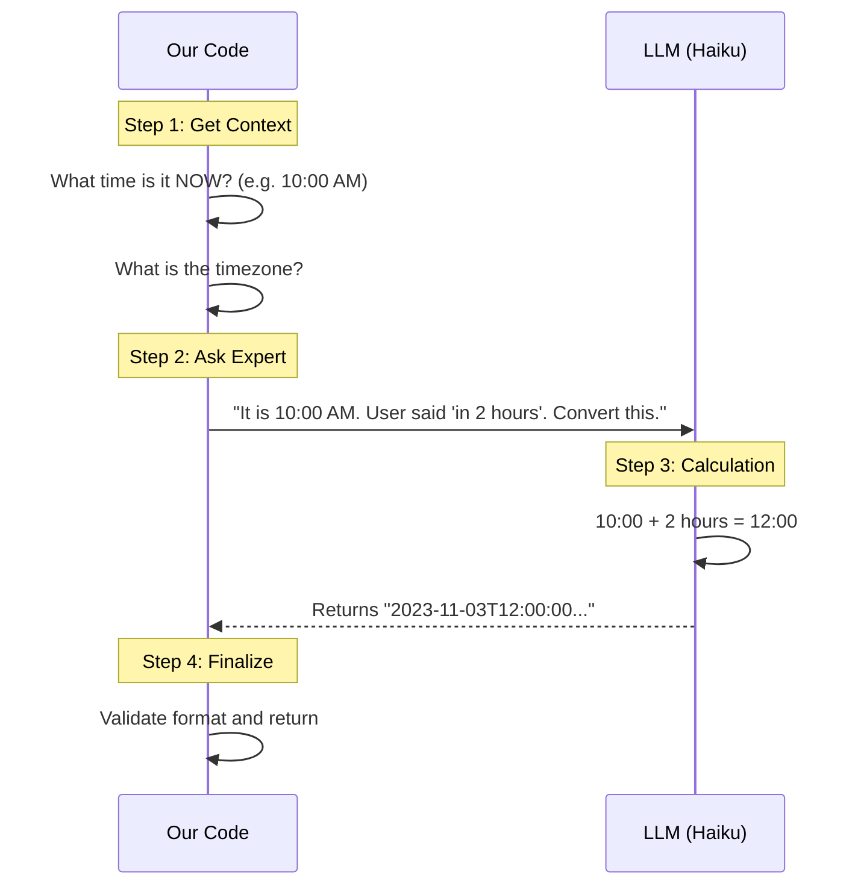

# Chapter 3: Natural Language Date/Time Parsing

Welcome back!

In [Chapter 2: Schema-Based Input Validation](02_schema_based_input_validation.md), we learned how to be strict. We built a "gatekeeper" that rejects anything that doesn't look like a perfect machine-readable format (like `2023-12-25`).

But as we discussed in [Chapter 1: Hybrid Asynchronous Validation](01_hybrid_asynchronous_validation.md), being too strict is annoying for humans.

**The goal of this chapter is to build the "Translator" that turns human speech into computer data.**

---

## The Motivation: Humans vs. Machines

Computers love **ISO 8601** format. It looks like this:
`2023-10-05T14:30:00-05:00`

Humans hate that format. We prefer **Relative Time**:
*   "Tomorrow morning"
*   "Next Friday"
*   "In 20 minutes"

If you ask a user for a deadline and they type "next week", a standard code validator will just say `Error`. To fix this, we need a system that understands **context**. "Tomorrow" means something different today than it did yesterday.

We use an LLM (Large Language Model) to act as our intelligent translator.

---

## How to Use It

The core tool for this is the function `parseNaturalLanguageDateTime`.

You don't usually call this manually (the system calls it automatically when validation fails, as seen in Chapter 1), but understanding how to use it directly helps you understand the magic.

### 1. The Setup

We need the function and an `AbortSignal` (which allows us to cancel the request if the user navigates away).

```typescript
import { parseNaturalLanguageDateTime } from './dateTimeParser.js'

// Standard setup for async requests
const signal = new AbortController().signal
```

### 2. Parsing a Date (No Time)

Let's say the user types "next friday".

```typescript
// Input: "next friday"
const result = await parseNaturalLanguageDateTime(
  "next friday",
  "date", // We only want YYYY-MM-DD
  signal
)

console.log(result.value) 
// Output: "2023-11-10" (Calculated based on today!)
```
*Explanation:* The system returned a specific date string that our strict validator from Chapter 2 will accept.

### 3. Parsing a Date and Time

Let's say the user types "in 2 hours".

```typescript
// Input: "in 2 hours"
const result = await parseNaturalLanguageDateTime(
  "in 2 hours",
  "date-time", // We want full timestamp
  signal
)

console.log(result.value)
// Output: "2023-11-03T16:30:00-05:00"
```
*Explanation:* The AI calculated the current time, added 2 hours, and formatted it perfectly including the timezone.

---

## Under the Hood: The Concept

How does the AI know when "Tomorrow" is? The AI model (Claude Haiku) doesn't have a built-in clock that matches your specific timezone.

**We have to provide the context.**

When we send the request to the AI, we don't just send "Tomorrow". We construct a detailed prompt that looks like this:

> **System:** You are a date parser.
> **User:** 
> Current time: 2023-11-03 10:00 AM
> User's Timezone: -05:00
> User Input: "in 2 hours"
> **Task:** Calculate the ISO string.

### The Sequence Diagram



---

## Under the Hood: The Implementation

Let's look at `dateTimeParser.ts` to see how we build this context.

### Step 1: Capturing "Now"

Before we talk to the AI, we must establish the ground truth of "now".

```typescript
// Inside parseNaturalLanguageDateTime...

const now = new Date()
const currentDateTime = now.toISOString()

// We also calculate the timezone offset (e.g., "-05:00")
// (Simplified for this tutorial)
const timezone = calculateTimezone(now) 
const dayOfWeek = now.toLocaleDateString('en-US', { weekday: 'long' })
```
*Explanation:* We capture the current time and the day of the week. If we didn't send `dayOfWeek`, and the user said "this Tuesday", the AI might pick the wrong Tuesday if it doesn't know today is Wednesday.

### Step 2: Constructing the Prompt

This is the most important part. We give the AI strict instructions to act like a robot, not a chatty assistant.

```typescript
const systemPrompt = `
You are a date/time parser.
You MUST respond with ONLY the ISO 8601 string.
No explanation.
If ambiguous, prefer future dates.
`
```
*Explanation:* We explicitly tell it "No explanation". If the AI replies "Sure! Here is your date: 2023...", our code will break. We want *just* the data.

### Step 3: Adding User Context

We combine the "Now" data from Step 1 with the user's input.

```typescript
const userPrompt = `Current context:
- Current date and time: ${currentDateTime}
- Local timezone: ${timezone}
- Day of week: ${dayOfWeek}

User input: "${input}"

Output format: ISO 8601
`
```

### Step 4: The AI Query

We send this package to the model.

```typescript
// We use the 'queryHaiku' helper to call the API
const result = await queryHaiku({
  systemPrompt,
  userPrompt,
  signal,
  // ... other options
})

const parsedText = extractTextContent(result.message.content).trim()
```

### Step 5: Safety Check

Even though the AI is smart, we double-check its work.

```typescript
// If the AI gave up or returned garbage
if (parsedText === 'INVALID' || !/^\d{4}/.test(parsedText)) {
  return {
    success: false,
    error: 'Unable to parse date/time from input',
  }
}

return { success: true, value: parsedText }
```
*Explanation:* If the user typed "potato", the AI (per our instructions) should return "INVALID". We check for this and tell our system the parsing failed.

---

## Summary

In this chapter, you learned:
1.  **Context is Key:** To parse relative time ("tomorrow"), you must strictly define "now".
2.  **Prompt Engineering:** We tell the AI to act like a code function, returning *only* data, not conversation.
3.  **The Pipeline:** We capture the user's messy text -> Add context -> Ask AI -> Get clean ISO text.

This covers how we handle dates. But what if the user needs to select an option from a specific list, like "High Priority" vs "Low Priority", but they type "urgent"?

In the next chapter, we will see how to handle fuzzy selection.

[Next Chapter: Enum and Selection Normalization](04_enum_and_selection_normalization.md)

---

Generated by [Code IQ](https://github.com/adityasoni99/Code-IQ)