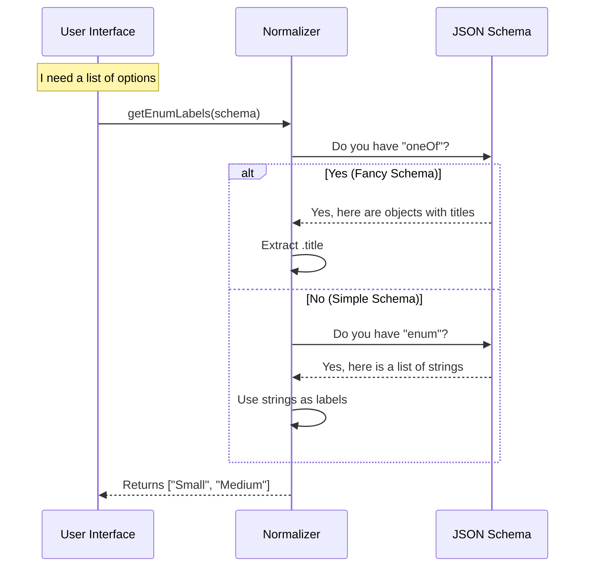

# Chapter 4: Enum and Selection Normalization

Welcome to the final chapter of our tutorial!

In [Chapter 3: Natural Language Date/Time Parsing](03_natural_language_date_time_parsing.md), we learned how to interpret messy human inputs like "next Friday."

Now, we face a different challenge. Sometimes, you don't want the user to type just *anything*. You want them to pick from a list.
*   **T-Shirt Size:** Small, Medium, Large.
*   **Mode:** Dark, Light.
*   **Toppings:** Pepperoni, Mushroom, Onions.

This sounds simple, but in the world of data schemas, describing a "list of choices" can be surprisingly complicated. This chapter explains how we build a **Universal Adapter** to handle choices consistently.

---

## The Motivation: The "Menu" Problem

Imagine you are building a dropdown menu for your application.

**The "Simple" Schema:**
Sometimes, a schema looks like this (the old way):
```json
{
  "type": "string",
  "enum": ["S", "M", "L"]
}
```
This is easy. You just show "S", "M", "L".

**The "Fancy" Schema:**
Modern schemas often use a different format to provide "Human" labels versus "Computer" values:
```json
{
  "oneOf": [
    { "const": "S", "title": "Small (Child)" },
    { "const": "M", "title": "Medium (Standard)" },
    { "const": "L", "title": "Large (Family)" }
  ]
}
```

**The Problem:**
If your UI code tries to read `.enum`, it crashes on the Fancy Schema. If it tries to read `.oneOf`, it crashes on the Simple Schema.

**The Solution:**
We create **Normalization Functions**. These are helpers that look at the schema, figure out which format it uses, and return a standardized list of options. Your UI doesn't need to know the difference.

---

## How to Use It

We have created helper functions in `elicitationValidation.ts` to extract values and labels.

### Scenario A: Getting Values for Validation

Let's say we want to know what values are allowed so we can validate input. We use `getEnumValues`.

```typescript
import { getEnumValues } from './elicitationValidation.js'

// A "Fancy" Schema
const sizeSchema = {
  oneOf: [
    { const: "S", title: "Small" },
    { const: "M", title: "Medium" }
  ]
}

// Extract valid IDs
const allowed = getEnumValues(sizeSchema)
console.log(allowed) // Output: ["S", "M"]
```
*Explanation:* The function ignored the titles ("Small") and gave us the raw data values ("S", "M").

### Scenario B: Getting Labels for Display

Now you want to show a dropdown to the user. You don't want to show "S"; you want to show "Small". We use `getEnumLabels`.

```typescript
import { getEnumLabels } from './elicitationValidation.js'

// The same schema from above
const labels = getEnumLabels(sizeSchema)

console.log(labels) // Output: ["Small", "Medium"]
```
*Explanation:* Now we have the human-readable text to put in our UI buttons.

### Scenario C: The "Simple" Fallback

What if we use the old-style schema?

```typescript
const legacySchema = { 
  type: 'string', 
  enum: ["RED", "BLUE"] 
}

console.log(getEnumValues(legacySchema)) // ["RED", "BLUE"]
console.log(getEnumLabels(legacySchema)) // ["RED", "BLUE"]
```
*Explanation:* Since there are no separate titles, the labels are the same as the values. The abstraction handles this automatically!

---

## Under the Hood: The Flow

How does the system decide which list to return? It acts like a smart translator.

### The Sequence Diagram



---

## Under the Hood: Implementation

Let's look at the code in `elicitationValidation.ts`. It's a series of checks.

### 1. Extracting Values

This function normalizes the *computer-readable* IDs.

```typescript
export function getEnumValues(schema: EnumSchema): string[] {
  // 1. Check for the "Fancy" format first
  if ('oneOf' in schema) {
    // Map over the list and grab the 'const' value
    return schema.oneOf.map(item => item.const)
  }
  
  // 2. Fallback to the "Simple" format
  if ('enum' in schema) {
    return schema.enum
  }
  
  return []
}
```
*Explanation:* We prioritize `oneOf` because it's more specific. If that doesn't exist, we look for `enum`.

### 2. Extracting Labels

This function normalizes the *human-readable* text.

```typescript
export function getEnumLabels(schema: EnumSchema): string[] {
  // 1. Check for "Fancy" titles
  if ('oneOf' in schema) {
    return schema.oneOf.map(item => item.title)
  }
  
  // 2. Fallback to "Simple" values
  if ('enum' in schema) {
    // Some legacy schemas have a separate 'enumNames' list
    return ('enumNames' in schema ? schema.enumNames : undefined) 
      ?? schema.enum
  }
  return []
}
```
*Explanation:* If `oneOf` exists, we grab the `.title`. If not, we usually just return the values themselves (e.g., "RED").

### 3. Validation Logic (Zod Integration)

Remember `getZodSchema` from [Chapter 2: Schema-Based Input Validation](02_schema_based_input_validation.md)? We use these normalization functions there too!

We don't want to write separate validation logic for every type of schema. We normalize the values *first*, then tell Zod to validate against that list.

```typescript
// Inside getZodSchema...

if (isEnumSchema(schema)) {
  // 1. Use our helper to get the list of allowed strings ("S", "M", "L")
  const [first, ...rest] = getEnumValues(schema)
  
  // 2. Create a Zod Validator that enforces this list
  if (!first) return z.never()
  
  return z.enum([first, ...rest])
}
```
*Explanation:* By using `getEnumValues` here, the validation logic supports both simple and fancy schemas automatically.

### 4. Multi-Select (Arrays)

Sometimes users can pick more than one option (like Pizza Toppings). The concept is exactly the same, but the schema keywords change slightly (`items.anyOf` instead of `oneOf`).

```typescript
export function getMultiSelectValues(schema: MultiSelectEnumSchema): string[] {
  // Check the 'items' definition inside the array
  if ('anyOf' in schema.items) {
    return schema.items.anyOf.map(item => item.const)
  }
  // ... fallback to enum
  return []
}
```

---

## Conclusion

**Enum and Selection Normalization** is the final piece of our validation puzzle.

1.  **Uniformity:** It hides the complexity of different JSON Schema versions from your UI.
2.  **Flexibility:** It allows us to upgrade our schemas (adding titles and descriptions) without breaking the code that validates user input.
3.  **Simplicity:** Your application only needs to ask "What choices are there?" and "What are they called?" without worrying about the underlying data structure.

### Tutorial Summary

Congratulations! You have completed the **mcp** validation tutorial.

*   **Chapter 1:** We built a **Hybrid** system that is fast for computers but smart for humans.
*   **Chapter 2:** We learned how **Schema Validation** keeps data safe and structured.
*   **Chapter 3:** We taught the system to understand **Natural Language** ("tomorrow") using AI.
*   **Chapter 4:** We standardized **Selection** to make menus and choices easy to handle.

You now have a robust, user-friendly input system ready for the real world!

---

Generated by [Code IQ](https://github.com/adityasoni99/Code-IQ)