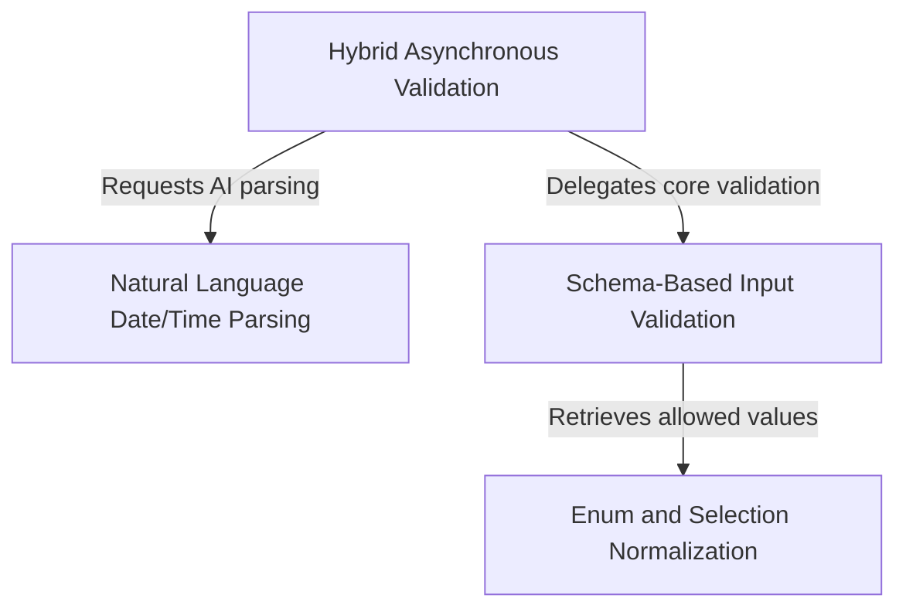

# Tutorial: mcp

This project provides a robust **input validation system** designed to bridge the gap between strict technical schemas and messy human input. It features a *smart validation pipeline* that can verify standard data types while also using **AI-powered parsing** to convert natural language (like "next Monday") into precise machine-readable formats.

## Chapters

1. [Hybrid Asynchronous Validation](01_hybrid_asynchronous_validation.md)
2. [Schema-Based Input Validation](02_schema_based_input_validation.md)
3. [Natural Language Date/Time Parsing](03_natural_language_date_time_parsing.md)
4. [Enum and Selection Normalization](04_enum_and_selection_normalization.md)

---

Generated by [Code IQ](https://github.com/adityasoni99/Code-IQ)