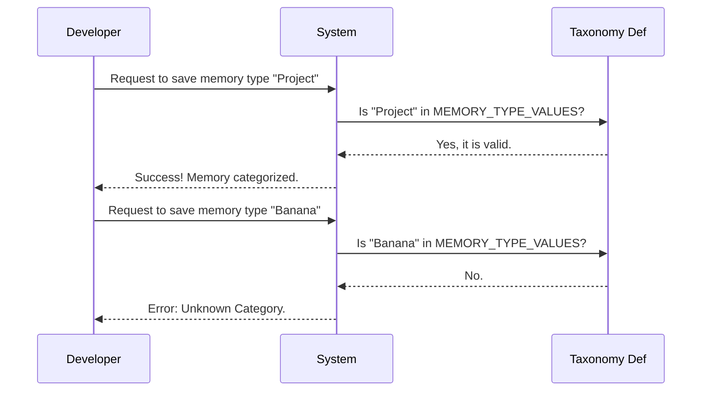

# Chapter 1: Memory Taxonomy

Welcome to the first chapter of the **memory** project! 

Before we start building complex systems, we need to solve a very fundamental problem: **organization**. Imagine an office where every document—personal notes, client contracts, and system manuals—is thrown into one giant pile on the floor. It would be impossible to find anything!

**The Goal:** We want to create a structured "filing system" so that when we save information, we know exactly what *kind* of information it is and who should see it.

**The Use Case:**
We are building a function to save a note. We need to distinguish between a **personal note** (like "Buy milk") and a **project note** (like "Fix bug #123").

---

## The Filing Cabinet System

To solve this, we use **Memory Taxonomy**. This is just a fancy way of saying "categories" or "buckets." 

Think of our system as a filing cabinet with specific drawers. We don't allow just any random label; we have a standard set of drawers to keep things tidy.

### Key Categories

1.  **User**: This is your personal drawer. Information here is specific to you (e.g., your preferences or personal to-do list).
2.  **Project**: This is a shared team drawer. Information here relates to the specific work you are doing (e.g., source code analysis or documentation).
3.  **Local**: This is like a sticky note on your desk. It keeps track of things specific to your current computer or environment.
4.  **Managed**: This is the boss's drawer. It contains read-only policies or instructions set by administrators.
5.  **AutoMem**: This is the robotic inbox. The system automatically puts generated reports and summaries here.

---

## How to Use It

In our code, we don't guess the category names. We use a predefined set of types. This ensures that a developer doesn't accidentally save something as `"Usr"` instead of `"User"`.

Here is how we verify if a category is valid using our taxonomy.

### Step 1: Define the buckets

First, we need to import our list of allowed categories.

```typescript
import { MEMORY_TYPE_VALUES, MemoryType } from './types'

// Let's look at what is available
console.log(MEMORY_TYPE_VALUES);
// Output: ['User', 'Project', 'Local', 'Managed', 'AutoMem', ...]
```

### Step 2: Categorizing a Note

Now, let's write a simple check to see if we are putting our note in a valid drawer.

```typescript
function isValidCategory(category: string): boolean {
  // We check if the input matches one of our known types
  // This acts like a security guard for our filing cabinet
  return MEMORY_TYPE_VALUES.includes(category as any);
}

// Example Usage:
const category1 = "Project"; 
const category2 = "RandomStuff";

console.log(isValidCategory(category1)); // Output: true
console.log(isValidCategory(category2)); // Output: false
```
*Note: We cast to `any` here just to allow the check, but TypeScript usually prevents this mistake before code even runs!*

---

## Under the Hood

How does the system define these types permanently? Let's look at the implementation.

### The Validation Flow

When you try to save a memory, the system consults the Taxonomy definition to ensure the label exists.



### Internal Implementation

Let's look at `types.ts`. This is the single source of truth for our taxonomy.

```typescript
// --- File: types.ts ---
import { feature } from 'bun:bundle'

// We define the list as a constant array
export const MEMORY_TYPE_VALUES = [
  'User',
  'Project',
  'Local',
  'Managed',
  'AutoMem',
  // ... extra logic for TeamMem
] as const
```

**Why `as const`?**
In TypeScript, `as const` freezes the array. It tells the compiler: "These values will never change." This allows us to use the values inside the array as strict Types.

### Dynamic Categories

You might notice a piece of code that looks a bit different at the end of the array:

```typescript
  // If the 'TEAMMEM' feature is turned on, add 'TeamMem' to the list
  ...(feature('TEAMMEM') ? (['TeamMem'] as const) : []),
] as const
```

This is an advanced concept called **Feature Gating**. It allows us to hide or show the "TeamMem" drawer depending on whether the system configuration allows it. You can learn more about how we toggle these features in [Feature Gating](03_feature_gating.md).

Finally, we derive the Type from the array:

```typescript
// This creates a Type that acts like: "User" | "Project" | "Local" ...
export type MemoryType = (typeof MEMORY_TYPE_VALUES)[number]
```

This line is magic. It means you don't have to manually update your `type` definition if you add a new string to the `MEMORY_TYPE_VALUES` array. They stay in sync automatically.

---

## Conclusion

In this chapter, we established the **Memory Taxonomy**. We learned that organizing data into standard "buckets" (like User, Project, and AutoMem) is essential for a clean system. We also saw how TypeScript helps us enforce these categories so mistakes are caught early.

But knowing *what* type a memory is doesn't tell us *where* it physically lives on the disk. For that, we need to understand how the system locates storage paths.

👉 [Next Chapter: Repository Awareness](02_repository_awareness.md)

---

Generated by [Code IQ](https://github.com/adityasoni99/Code-IQ)