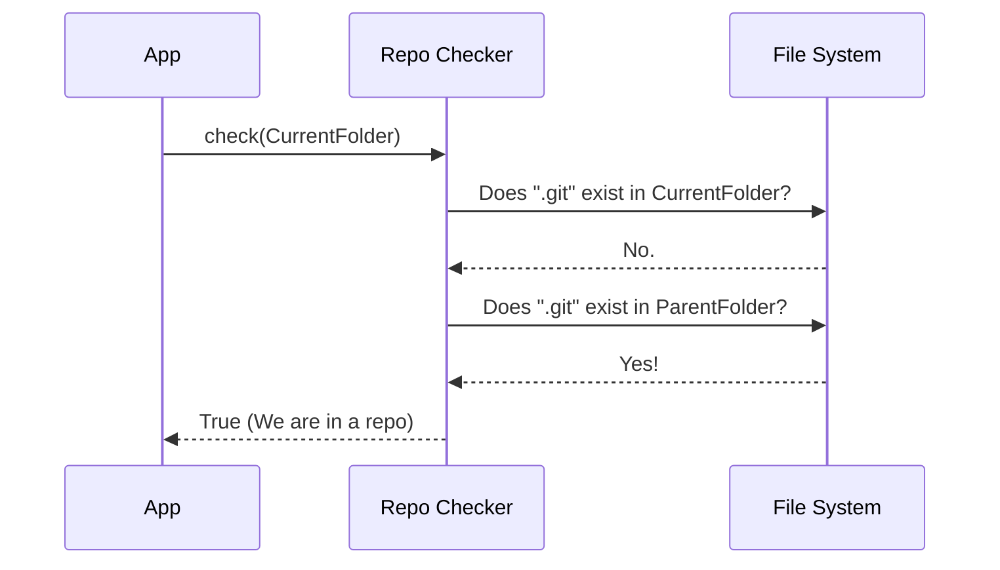

# Chapter 2: Repository Awareness

Welcome to the second chapter of the **memory** project!

In the previous chapter, [Memory Taxonomy](01_memory_taxonomy.md), we learned how to label our notes using categories like "User" or "Project".

However, having a label isn't enough. If you try to save a **Project** note, but you aren't actually inside a project folder on your computer, where should that note go?

**The Goal:** We need a way to check if the user is currently working inside a valid project (specifically, a Git repository) before we attempt to save project-specific data.

**The Use Case:**
Imagine you are building a tool that tracks bugs in your code. You type `save bug-report`.
1.  If you are in a valid coding project, the system saves the report.
2.  If you are just in your `Downloads` folder, the system should say, "Wait, you aren't in a project right now."

---

## The Construction Site Analogy

Think of your application as a **Construction Crew**.

Before the crew starts pouring concrete (saving data), they need to check the survey markers to ensure they are on the correct property.
*   **The Property:** A folder tracked by Git (a repository).
*   **The Empty Lot:** A random folder on your computer (like Desktop).

If the crew builds on an empty lot that they don't own, the building (your data) gets lost or misplaced. **Repository Awareness** is the foreman checking the map before work begins.

---

## How to Use It

We use a specific function to answer the question: *"Am I inside a Git repository right now?"*

This check is **synchronous**, meaning the code stops and looks immediately before doing anything else. It is quick and doesn't require running complex external commands.

### Step 1: Check the Current Location

In Node.js applications, we find out where we are using `process.cwd()` (Current Working Directory). We pass this location to our checker.

```typescript
import { projectIsInGitRepo } from './versions'

// 1. Get our current location on the disk
const myLocation = process.cwd(); 

// 2. Ask: Is this a valid project site?
const isSafeToBuild = projectIsInGitRepo(myLocation);
```

### Step 2: Making Decisions

Now we can use that simple `true` or `false` result to control our application flow.

```typescript
if (isSafeToBuild) {
  console.log("Found a Git repo! Saving project memory...");
  // Proceed to save the note
} else {
  console.log("Not in a repo. Cannot save project memory.");
  // Stop or save to 'Local' storage instead
}
```

**Example Output:**
*   If you run this inside `C:/Users/You/MyProject` (which has git): **Output: true**
*   If you run this inside `C:/` (root drive): **Output: false**

---

## Under the Hood

How does the system actually know? It doesn't use magic; it acts like a detective looking for clues.

### The Detective Work

Every Git repository has a hidden folder named `.git`.
When we ask `projectIsInGitRepo`, the system looks at your current folder. If it doesn't see `.git`, it steps back to the parent folder and looks again. It keeps going up until it hits the top of your drive.



### Internal Implementation

Let's look at `versions.ts`. This file contains the logic for our awareness check.

```typescript
// --- File: versions.ts ---
import { findGitRoot } from '../git.js'

// This function takes a path (cwd) and returns true/false
export function projectIsInGitRepo(cwd: string): boolean {
  // findGitRoot walks up the folder tree looking for .git
  // If it finds it, it returns the path. If not, it returns null.
  return findGitRoot(cwd) !== null
}
```

**Key Takeaway:**
We rely on a helper `findGitRoot`. We don't need to know exactly *where* the root is right now (e.g., `/Users/dev/projects/myapp`), we just need to know that it is **not null**.

If it is not null, it means we are standing on valid "construction property."

### Synchronous vs. Asynchronous

You might notice the comments in the source code mention `dirIsInGitRepo()` for async checks.

```typescript
// Uses findGitRoot which walks the filesystem (no subprocess)
// Prefer `dirIsInGitRepo()` for async checks
```

*   **Synchronous (What we used here):** "Stop everything! I need to know right now." This is good for startup checks.
*   **Asynchronous:** "Go check in the background and tell me later." This is better if the check might take a long time and we don't want to freeze the app.

For our Repository Awareness logic, we stick to the synchronous `projectIsInGitRepo` because we usually need to know this immediately before defining where to save a file.

---

## Conclusion

In this chapter, we added **Repository Awareness** to our toolkit.
1.  We learned that not all folders are valid places for project data.
2.  We used the "Construction Site" analogy to understand why we check our environment.
3.  We implemented `projectIsInGitRepo` to validate our current location by hunting for that hidden `.git` folder.

Now that we know *what* type of data we have (Taxonomy) and *where* we are allowed to save it (Repository Awareness), we might want to turn certain capabilities on or off based on sophisticated configuration rules.

👉 [Next Chapter: Feature Gating](03_feature_gating.md)

---

Generated by [Code IQ](https://github.com/adityasoni99/Code-IQ)