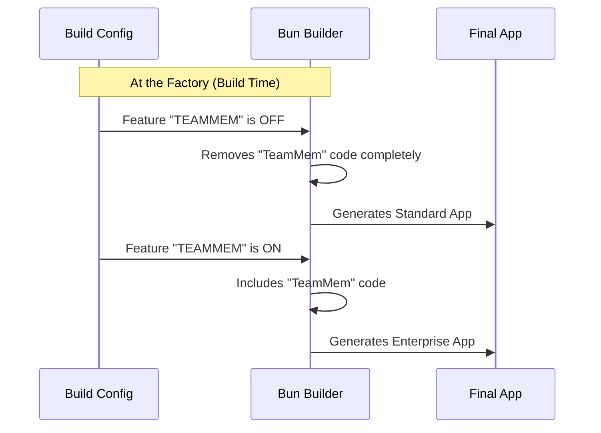

# Chapter 3: Feature Gating

Welcome to the third chapter of the **memory** project!

In the previous chapter, [Repository Awareness](02_repository_awareness.md), we learned how to check our physical location (the folder path) to ensure we are in a safe place to save data.

Now, we need to decide **what capabilities** our application actually has.

**The Goal:** We want to keep our application lightweight. Not every user needs every advanced feature. We want a way to include specific features (like "Team Memory") only when they are specifically requested during the creation of the app.

**The Use Case:**
We have a powerful module called **TeamMem**. It allows complex sharing of data.
1.  **Standard User:** Should get a fast, simple version of the app without the extra "TeamMem" code bloating the file size.
2.  **Enterprise User:** Needs the "TeamMem" module enabled.

---

## The Car Factory Analogy

Think of building software like buying a car from a factory.

*   **The Base Model:** This is the standard car. It has wheels, seats, and an engine. It works for everyone.
*   **The Optional Package:** This is the "Sport Package" (our TeamMem feature).

**Feature Gating** is the decision made **at the factory**.
If you don't order the Sport Package, the factory doesn't just hide the spoiler in the trunk; they **don't install it at all**. The car is lighter and simpler because the extra parts physically aren't there.

In our code, we do the same. If the "TeamMem" feature is turned off, the code for it is removed before the application is even finished building.

---

## How to Use It

We rely on a "Build Flag." This is a switch we flip when we compile our TypeScript code into a runnable application.

We don't need to write complex `if/else` statements everywhere in our logic. Instead, we configure our **Memory Taxonomy** (from [Chapter 1](01_memory_taxonomy.md)) to dynamically change based on this flag.

### Step 1: Checking the Feature

Imagine we want to see if our application supports Team Memory. We check our list of allowed types.

```typescript
import { MEMORY_TYPE_VALUES } from './types'

// We check if 'TeamMem' exists in our allowed categories
const hasTeamSupport = MEMORY_TYPE_VALUES.includes('TeamMem' as any);

if (hasTeamSupport) {
  console.log("Enterprise features are active!");
} else {
  console.log("Running in standard mode.");
}
```

### Step 2: The Result

*   **If built with `TEAMMEM=false`:** The output is "Running in standard mode." The string 'TeamMem' literally does not exist in the system.
*   **If built with `TEAMMEM=true`:** The output is "Enterprise features are active!"

---

## Under the Hood

How does the code vanish? We use a feature called **Dead Code Elimination** provided by our bundler (Bun).

### The Assembly Line

When Bun builds our project, it looks at `feature()` flags. If a flag is false, Bun sees that the code inside that block will *never* run, so it deletes it to save space.



### Internal Implementation

Let's revisit `types.ts`. This is where the magic logic lives. We use a special function from Bun called `feature`.

```typescript
// --- File: types.ts ---
import { feature } from 'bun:bundle'

// The spread operator (...) merges arrays together
export const MEMORY_TYPE_VALUES = [
  'User', 
  'Project',
  // ... other standard types
  
  // The Logic Gate:
  ...(feature('TEAMMEM') ? (['TeamMem'] as const) : []),
] as const
```

### Breaking Down the Logic Gate

This line is dense, so let's break it down into small pieces.

**1. The Switch:** `feature('TEAMMEM')`
This asks the builder: "Did the user enable TEAMMEM in the configuration?"

**2. The Decision (Ternary Operator):** `? ... : ...`
*   **If Yes:** We provide an array with the value: `['TeamMem']`.
*   **If No:** We provide an empty array: `[]`.

**3. The Merge (Spread Syntax):** `...`
The `...` takes the result (either the Team array or the Empty array) and dumps its contents into the main list.
*   Dumping `['TeamMem']` adds the item.
*   Dumping `[]` adds nothing.

This ensures that if the feature is off, the `'TeamMem'` string is not just hidden—it is completely absent from the array definition.

---

## Conclusion

In this chapter, we explored **Feature Gating**.

1.  We learned that we can modify our application's capabilities at **Build Time** (at the factory) rather than just at Runtime.
2.  We used the **Car Factory** analogy to understand why removing unused features keeps the system lean.
3.  We saw how Bun's `feature()` function allows us to conditionally inject the `"TeamMem"` category into our [Memory Taxonomy](01_memory_taxonomy.md).

You have now completed the core architectural tour of the **memory** project!
*   You know how to categorize data (**Taxonomy**).
*   You know how to check your environment (**Repository Awareness**).
*   You know how to toggle advanced features (**Feature Gating**).

You are now ready to start building robust memory systems. Happy coding!

---

Generated by [Code IQ](https://github.com/adityasoni99/Code-IQ)