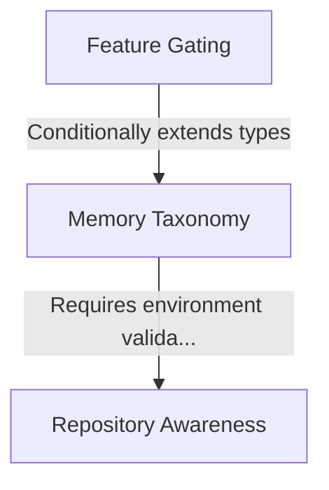

# Tutorial: memory

This project functions as a smart **memory management system** that categorizes data into specific buckets like *User*, *Project*, or *Local* based on the context. It intelligently validates whether it is running inside a **Git repository** to allow project-specific storage and uses build-time configuration to dynamically enable advanced features like **Team Memory**.

## Chapters

1. [Memory Taxonomy](01_memory_taxonomy.md)
2. [Repository Awareness](02_repository_awareness.md)
3. [Feature Gating](03_feature_gating.md)

---

Generated by [Code IQ](https://github.com/adityasoni99/Code-IQ)