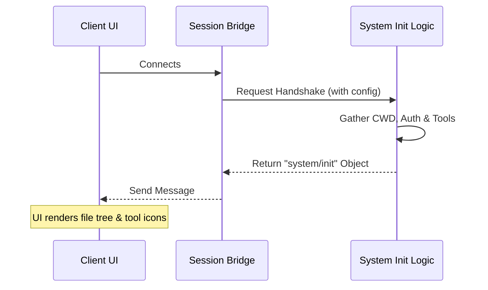

# Chapter 1: System Initialization Handshake

Welcome to the `messages` project! We are starting our journey at the very beginning of a conversation between a user (the Client) and the AI Assistant.

## The Motivation: The "Pilot's Announcement"

Imagine you just boarded a plane. You sit down, buckle up, and wait. Before the plane moves, the pilot comes over the intercom:

> "Ladies and gentlemen, welcome aboard. We are currently at **JFK Airport**, the weather is **sunny**, and our flight time will be **4 hours**."

Without this announcement, you wouldn't know where you are or what to expect.

In our system, the **System Initialization Handshake** is exactly like that pilot's announcement. When a user interface (UI) connects to our backend, it starts "blind." It doesn't know:
1.  **Where** it is (Current Working Directory).
2.  **What** tools are available (Can I edit files? Can I run terminal commands?).
3.  **Which** AI model is being used.

The `system/init` message solves this by gathering all this critical context into a single "Hello" packet sent immediately when the session begins.

## How to Use It

The core of this logic lives in `src/messages/systemInit.ts`. The main function we care about is `buildSystemInitMessage`.

### Step 1: Gather Your Inputs
First, we need to collect the state of the world. In the actual application, these values come from live configuration settings.

```typescript
// Define the state of our environment
const inputs = {
  tools: [{ name: 'repl' }, { name: 'sticker_maker' }],
  model: 'claude-3-opus',
  permissionMode: 'ask', // We ask before running commands
  commands: [{ name: '/help' }, { name: '/clear' }],
  // ... other settings like agents, skills, etc.
  fastMode: false
};
```
*Here, we define what the "plane" is carrying: specific tools, a specific model, and specific commands.*

### Step 2: Build the Message
We pass these inputs into our builder function. This function acts as the "packer," organizing everything into a standard format the client understands.

```typescript
import { buildSystemInitMessage } from './systemInit';

// Generate the handshake message
const handshake = buildSystemInitMessage(inputs);
```

### Step 3: The Result (Output)
The function returns an `SDKMessage` object. This is what gets sent over the wire to the UI.

```json
{
  "type": "system",
  "subtype": "init",
  "cwd": "/Users/developer/project",
  "tools": ["repl", "sticker_maker"],
  "model": "claude-3-opus",
  "permissionMode": "ask",
  "slash_commands": ["/help", "/clear"]
}
```
*The UI receives this JSON. Now it knows to display the file tree for `/Users/developer/project` and enable the "Sticker Maker" button.*

## Internal Implementation: Under the Hood

How does the system actually construct this? It's essentially a large data aggregation exercise.

1.  **Trigger:** A session starts (or a REPL connects).
2.  **Gather:** The system queries various modules (Auth, CWD, Settings).
3.  **Normalize:** It ensures names are compatible with older clients (more on this below).
4.  **Package:** It wraps everything in a JSON object with a unique UUID.

### The Flow

Here is a simplified view of how the handshake is created:



### Code Deep Dive

Let's look at `src/messages/systemInit.ts` to see how it handles specific challenges.

#### Handling Legacy Clients
Sometimes, we rename tools in the backend, but older UIs still expect the old names. The initialization layer handles this translation so the UI doesn't crash.

```typescript
// src/messages/systemInit.ts

// Wire name was renamed from 'Task' to 'Agent', 
// but we keep emitting 'Task' for compatibility.
export function sdkCompatToolName(name: string): string {
  return name === 'Agent' ? 'LegacyTaskName' : name
}
```
*This is like a translator ensuring that if the pilot says "Flight Attendant," older passengers who know them as "Stewards" still understand.*

#### Constructing the Object
The `buildSystemInitMessage` function pulls data from global state helpers (like `getCwd`) to fill in the blanks that weren't passed in the inputs.

```typescript
// src/messages/systemInit.ts

export function buildSystemInitMessage(inputs: SystemInitInputs): SDKMessage {
  // ... settings logic ...
  return {
    type: 'system',
    subtype: 'init',
    cwd: getCwd(), // Get the real directory from the OS
    session_id: getSessionId(),
    // Map tools using the compatibility translator we saw above
    tools: inputs.tools.map(tool => sdkCompatToolName(tool.name)), 
    model: inputs.model,
    // ... rest of the properties
  }
}
```
*Notice how `getCwd()` is called directly here. The handshake ensures the directory path is fresh at the exact moment the session initializes.*

## Summary

The **System Initialization Handshake** is the polite introduction that synchronizes the Client UI with the Backend's reality. By sending a snapshot of the environment (CWD, tools, permissions) right at the start, we ensure the user sees the correct interface immediately.

Now that the system is initialized and the client knows *who* we are, we need to handle the messages flowing back and forth. In the next chapter, we will look at how we translate raw data into structured messages.

[Next Chapter: SDK Message Translation Layer](02_sdk_message_translation_layer.md)

---

Generated by [Code IQ](https://github.com/adityasoni99/Code-IQ)