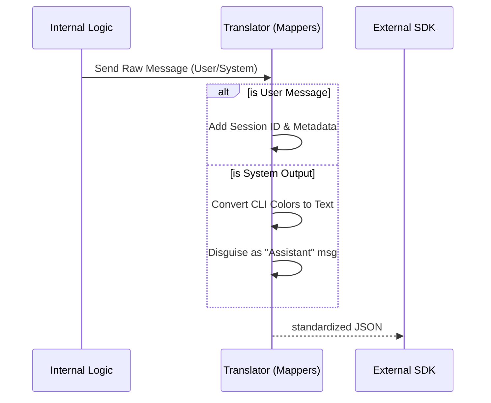

# Chapter 2: SDK Message Translation Layer

In the previous chapter, [System Initialization Handshake](01_system_initialization_handshake.md), we established a connection and introduced the system to the client. Now that the "Pilot" has made the announcement, the passengers (Users) and the Crew (Assistant) start talking.

However, the way our backend "thinks" isn't exactly how the User Interface "speaks."

## The Motivation: The Diplomatic Translator

Imagine a United Nations meeting.
*   **The Internal System** speaks a complex, technical dialect full of database IDs, hidden flags, and raw error codes.
*   **The SDK Client** (like an iPhone app or a Web UI) speaks a formal, polite language. It expects clean JSON, specific fields, and no "internal secrets."

If the Internal System spoke directly to the Client, misunderstandings (or crashes) would happen immediately.

The **SDK Message Translation Layer** acts as the **Diplomatic Translator**. It stands in the middle, rewriting messages so both sides understand each other perfectly without leaking sensitive details.

## Key Concepts

1.  **Internal Messages:** The raw data objects used inside the backend logic. They contain everything (timers, hidden metadata).
2.  **SDK Messages:** The polished objects sent over the wire (API). These are strict, standard, and safe for public consumption.
3.  **Mappers:** The functions that convert Type A to Type B.

## How to Use It

The core functionality resides in `src/mappers.ts`. The most common operation is sending a message *out* to the user.

### Converting Internal to External (`toSDKMessages`)

Let's say the user just typed "Hello". Internally, we store this simply. But before sending it back to the UI to confirm receipt, we need to dress it up.

```typescript
import { toSDKMessages } from './mappers';
import { getSessionId } from 'src/bootstrap/state';

// 1. A raw internal message
const internalMsg = [{
  type: 'user',
  message: 'Hello World',
  uuid: 'abc-123',
  timestamp: '2023-10-27T10:00:00Z'
}];

// 2. Translate it
const externalMsgs = toSDKMessages(internalMsg);
```

### The Result (Output)

The translator adds context, like the `session_id`, which the internal message didn't even know about, but the UI absolutely needs.

```json
[
  {
    "type": "user",
    "message": "Hello World",
    "uuid": "abc-123",
    "timestamp": "2023-10-27T10:00:00Z",
    "session_id": "session_xyz_789", 
    "parent_tool_use_id": null
  }
]
```
*The translator ensured the message is now valid for the specific API protocol used by the mobile app.*

## Internal Implementation: Under the Hood

How does the translator decide what to keep, what to change, and what to hide?

### The Translation Flow

The translator looks at the `type` of the message (`user`, `assistant`, or `system`) and routes it to the correct formatting logic.



### Code Deep Dive

Let's look at `src/mappers.ts` to see how this routing works.

#### The Main Switch
The function `toSDKMessages` is a loop that transforms every message in the list.

```typescript
// src/mappers.ts

export function toSDKMessages(messages: Message[]): SDKMessage[] {
  return messages.flatMap((message): SDKMessage[] => {
    switch (message.type) {
      case 'assistant':
        // Handle AI responses
        return [ /* ... formatted assistant msg ... */ ]
      case 'user':
        // Handle User inputs
        return [ /* ... formatted user msg ... */ ]
      case 'system':
        // Handle special system events (more on this below)
        return handleSystemMessage(message)
      default:
        return [] // Unknown types are dropped!
    }
  })
}
```
*Note: We use `flatMap`. This allows one internal message to potentially turn into zero SDK messages (if hidden) or multiple SDK messages.*

#### Handling User Messages
When mapping a User message, we determine if it's "Synthetic". A synthetic message is one that exists in the system but wasn't typed by a human (like a programmatic trigger).

```typescript
// src/mappers.ts (Inside the switch case 'user')

return [{
  type: 'user',
  message: message.message,
  session_id: getSessionId(), // Inject global session ID
  uuid: message.uuid,
  // If it's a meta message, mark it as synthetic for the UI
  isSynthetic: message.isMeta || message.isVisibleInTranscriptOnly,
  // Attach tool results if they exist
  ...(message.toolUseResult ? { tool_use_result: message.toolUseResult } : {}),
}]
```
*The translator ensures that the UI knows if a message is "real" or "synthetic" so it can render it differently (e.g., greyed out).*

#### The "Local Command" Trick
Sometimes, the internal system runs a local command (like `/cost` to check API usage). The output comes from the *System*, usually with ugly color codes (ANSI) for the terminal.

Mobile apps don't understand ANSI colors or "System" messages. So, our translator performs a trick: **It disguises the System message as an Assistant message.**

```typescript
// src/mappers.ts

export function localCommandOutputToSDKAssistantMessage(
  rawContent: string,
  uuid: UUID,
): SDKAssistantMessage {
  // 1. Remove ugly terminal colors
  const cleanContent = stripAnsi(rawContent).trim()

  // 2. Wrap it as if the AI Assistant said it
  const synthetic = createAssistantMessage({ content: cleanContent })
  
  return {
    type: 'assistant', // <-- The disguise!
    message: synthetic.message,
    session_id: getSessionId(),
    uuid,
  }
}
```
*This is the "Diplomatic" part. The translator knows the Mobile App (the foreign delegate) doesn't have a protocol for "Local Command Output," so it translates it into "Assistant Speech" so the app can display it gracefully.*

## Summary

The **SDK Message Translation Layer** is the bridge that keeps the internal system decoupled from external clients.
1.  It **standardizes** data (adding Session IDs).
2.  It **filters** data (dropping unknown types).
3.  It **translates** formats (converting System outputs to Assistant messages).

However, translating *Assistant* messages is particularly complex. Sometimes the Assistant wants to use tools, but the data format for tools changes between versions. We need a specialized way to handle that.

[Next Chapter: Assistant Message Normalization](03_assistant_message_normalization.md)

---

Generated by [Code IQ](https://github.com/adityasoni99/Code-IQ)