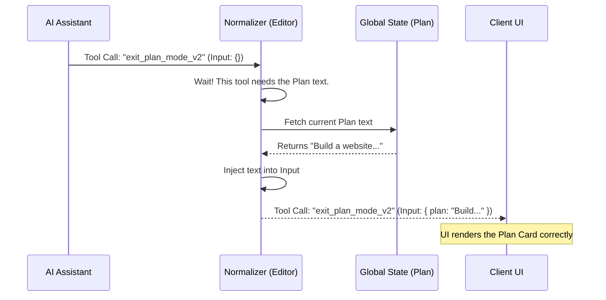

# Chapter 3: Assistant Message Normalization

In the previous chapter, [SDK Message Translation Layer](02_sdk_message_translation_layer.md), we learned how to wrap internal data into polite JSON objects for the client. That process focused on **format**.

Now, we need to focus on **content**. Sometimes, the AI Assistant produces a message that is technically correct for the backend but "incomplete" for the user interface. We need a way to patch this data before it leaves the system.

## The Motivation: The "Newspaper Editor"

Imagine the AI is a journalist writing a story about a "Plan" currently written on a whiteboard in the office.

The journalist writes: *"I have finished the plan."*

*   **The Backend (The Office):** Understands perfectly. The plan is right there on the whiteboard (in a file).
*   **The User ( The Reader):** Is confused. *"What plan? I can't see your whiteboard!"*

If we send the raw message to the user, the UI will try to render a "Plan Completion" box, but it will be empty because the AI didn't repeat the text of the plan in the message (to save space and time).

**Assistant Message Normalization** acts as the **Newspaper Editor**. Before the story goes to print, the Editor looks at the article, notices the context is missing, walks to the whiteboard, copies the text, and inserts it into the article.

## The Use Case: The "Exit Plan" Tool

In our system, when the AI finishes a task, it calls a tool named `exit_plan_mode_v2`.

1.  **Internal Logic:** The AI simply says, "Call exit tool." The backend code reads the current plan from `src/plans.ts` and saves it.
2.  **The Problem:** The SDK (User Interface) expects the tool input to contain the *full text* of the plan so it can display a nice summary card. The AI didn't provide it.
3.  **The Fix:** We must inject the current plan into the tool call payload manually.

## Internal Implementation: Under the Hood

This process happens inside the translation layer we saw in Chapter 2, specifically for messages of type `assistant`.

### The Workflow

The normalizer acts as a filter. It lets most content pass through unchanged, but watches closely for specific tool names.



### Code Deep Dive

The logic is contained within `src/mappers.ts`. Let's walk through the function `normalizeAssistantMessageForSDK`.

#### Step 1: Inspect the Content
First, we look at the message content. If it's just a string, we leave it alone. We are looking for an array of blocks (which is how Anthropic represents tool usage).

```typescript
// src/mappers.ts

function normalizeAssistantMessageForSDK(message: AssistantMessage) {
  const content = message.message.content

  // If it's simple text, return as-is
  if (!Array.isArray(content)) {
    return message.message
  }
  
  // ... continue to mapping
}
```
*If the AI is just talking ("Hello there"), the Editor does nothing.*

#### Step 2: Scan for the Target Tool
We loop through every block in the content. We are hunting for `tool_use` blocks specifically named `EXIT_PLAN_MODE_V2_TOOL_NAME`.

```typescript
// map() allows us to modify specific items in the list
const normalizedContent = content.map((block) => {
  // Pass through anything that isn't a tool use
  if (block.type !== 'tool_use') {
    return block
  }

  // Check if this is the "Exit Plan" tool
  if (block.name === EXIT_PLAN_MODE_V2_TOOL_NAME) {
     // ... logic to inject plan ...
  }
  
  return block
})
```
*This is the "Editor" scanning the page for the specific headline that needs clarification.*

#### Step 3: Inject the Missing Data
If we find the tool, we fetch the plan from our global state helpers and merge it into the existing input.

```typescript
import { getPlan } from '../plans.js'

// Inside the if (block.name === ...) check:

const plan = getPlan() // Fetch the "whiteboard" content

if (plan) {
  return {
    ...block, // Keep the ID, Name, etc.
    input: { 
      ...(block.input as Record<string, unknown>), 
      plan // <-- INJECTED!
    },
  }
}
```
*We didn't delete the AI's original input; we just added the `plan` property to it. Now the object is "valid" for the SDK.*

#### Step 4: Reassemble
Finally, we return a new message object containing our modified content.

```typescript
return {
  ...message.message,
  content: normalizedContent, // The edited list of blocks
}
```

## Summary

**Assistant Message Normalization** ensures that the data sent to the UI is complete, even if the AI took a shortcut for efficiency.

By acting as an "Editor" that injects global state (like the Plan) into specific tool calls, we ensure the Client UI always has the data it needs to render rich components, without requiring the AI model to redundantly generate that text every time.

Now that the Assistant's speech is polished, what about the messy output from terminal commands?
In the next chapter, we'll see how to clean up raw system logs.

[Next Chapter: Local Command Output Sanitization](04_local_command_output_sanitization.md)

---

Generated by [Code IQ](https://github.com/adityasoni99/Code-IQ)