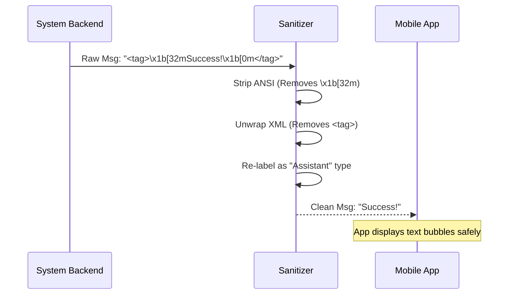

# Chapter 4: Local Command Output Sanitization

In the previous chapter, [Assistant Message Normalization](03_assistant_message_normalization.md), we acted as a "Newspaper Editor," ensuring the AI's stories (Assistant Messages) were complete and readable.

Now, we turn our attention to the **System itself**.

## The Motivation: The "Food Processor"

Imagine you are running a restaurant.
*   **The Raw Ingredients:** Vegetables straight from the farm. They are covered in dirt, have inedible stems, and come in weird shapes.
*   **The Customer:** A delicate diner (the User Interface) who expects a perfectly chopped, clean salad.

If you serve the raw vegetables (dirt and all) to the customer, they will leave (or the App will crash).

**Local Command Output Sanitization** is your **Food Processor**. It takes the raw, dirty output from terminal commands, washes off the "dirt" (computer color codes), peels off the "skin" (internal XML tags), and chops it into a format the customer recognizes.

## The Use Case: The `/cost` Command

In our system, a user can type `/cost` to see how much money the AI has spent.

1.  **The Terminal's Reality:** The backend calculates the cost and wants to make it look pretty for a developer using a CLI. It adds **ANSI Color Codes** (to make the text green) and wraps it in **XML tags** for internal tracking.
2.  **The Mobile App's Reality:** The iPhone app doesn't know what ANSI colors are. If it receives `<green>$0.05</green>`, it might literally display those weird characters, or worse, treat it as a broken file.

We need to sanitize this text before sending it over the wire.

## How to Use It

The logic for this lives in `src/mappers.ts`. The main function is `localCommandOutputToSDKAssistantMessage`.

### Step 1: The Raw Input
This is what the system generates internally. To a human eye, it looks like mess.

```typescript
// A raw string with invisible escape codes and XML tags
const rawInput = `
<local-command-stdout>
  \u001b[32mTotal Cost: $0.15\u001b[39m
</local-command-stdout>
`;
```
*The `\u001b[32m` is code for "Start Green Color" and `\u001b[39m` is "End Color".*

### Step 2: Running the Sanitizer
We pass this raw mess into our sanitizer function.

```typescript
import { localCommandOutputToSDKAssistantMessage } from './mappers';

const cleanMessage = localCommandOutputToSDKAssistantMessage(
  rawInput, 
  'uuid-123'
);
```

### Step 3: The Result (Output)
The function returns a clean, standard object.

```json
{
  "type": "assistant",
  "message": {
    "content": "Total Cost: $0.15"
  }
}
```
*The dirt (ANSI) and skin (XML) are gone. The text is plain and readable.*

## Internal Implementation: Under the Hood

How does the processor actually work? It follows a three-step cleaning cycle.

1.  **Detect:** Is this a local command output?
2.  **Scrub:** Remove formatting characters.
3.  **Disguise:** Pretend the AI said it.

### The Flow



### Code Deep Dive

Let's look at `src/mappers.ts` to see the cleaning process.

#### 1. The Detection Logic
First, inside the main mapping loop, we check if the message is the specific type we need to clean.

```typescript
// src/mappers.ts inside toSDKMessages

// We check if the message contains stdout (output) or stderr (errors) tags
if (
  message.subtype === 'local_command' &&
  (message.content.includes(`<${LOCAL_COMMAND_STDOUT_TAG}>`) ||
   message.content.includes(`<${LOCAL_COMMAND_STDERR_TAG}>`))
) {
  // If yes, send it to the food processor!
  return [localCommandOutputToSDKAssistantMessage(message.content, message.uuid)]
}
```
*We only run the sanitizer on messages that actually contain command output.*

#### 2. The Scrubbing (Removing Artifacts)
Inside the function, we use regex (pattern matching) and a helper library to clean the string.

```typescript
// src/mappers.ts

export function localCommandOutputToSDKAssistantMessage(
  rawContent: string,
  uuid: UUID,
) {
  // 1. stripAnsi removes the color codes
  // 2. .replace removes the <local-command-stdout> wrapper tags
  const cleanContent = stripAnsi(rawContent)
    .replace(/<local-command-stdout>([\s\S]*?)<\/local-command-stdout>/, '$1')
    .replace(/<local-command-stderr>([\s\S]*?)<\/local-command-stderr>/, '$1')
    .trim()
    
  // ... continued below
```
*`stripAnsi` is like the water jet washing the dirt. `.replace` is the peeler removing the skin.*

#### 3. The Disguise (The "Assistant" Wrapper)
This is a critical trick. Mobile apps know how to display "User" messages and "Assistant" messages. They often *don't* know how to display "System Command" messages.

To prevent the app from crashing or showing an "Unknown Message Type" error, we lie slightly: **We tell the App that the Assistant said this text.**

```typescript
  // Create a standard Assistant message object
  const synthetic = createAssistantMessage({ content: cleanContent })

  return {
    type: 'assistant', // <-- The Disguise!
    message: synthetic.message,
    parent_tool_use_id: null,
    session_id: getSessionId(),
    uuid,
  }
}
```
*By changing the type to `assistant`, we ensure every client (Android, iOS, Web) renders a nice text bubble without needing to update their code.*

## Summary

**Local Command Output Sanitization** ensures that raw, technical system outputs are cleaned up before reaching the user.

1.  It **Strips** ANSI color codes meant for terminals.
2.  It **Unwraps** internal XML tagging.
3.  It **Converts** the type to `assistant` to ensure compatibility with all User Interfaces.

We have now covered how to initialize the system, translate messages, normalize AI logic, and sanitize system commands. But what happens when the conversation gets *too long*?

In the next chapter, we will learn how the system handles memory management.

[Next Chapter: Conversation Compaction Metadata](05_conversation_compaction_metadata.md)

---

Generated by [Code IQ](https://github.com/adityasoni99/Code-IQ)