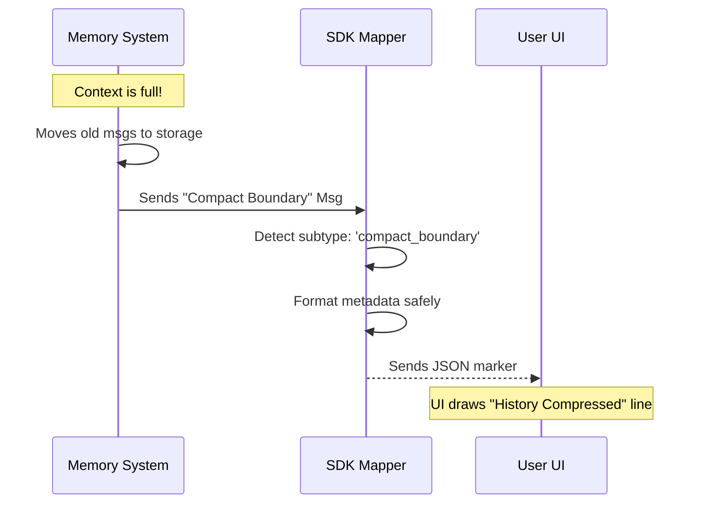

# Chapter 5: Conversation Compaction Metadata

In the previous chapter, [Local Command Output Sanitization](04_local_command_output_sanitization.md), we learned how to clean up messy system logs so they look presentable to the user. We focused on the **quality** of individual messages.

Now, we must address the **quantity** of messages. As conversations get longer, they eventually hit a limit. We need a way to handle this without breaking the user experience.

## The Motivation: The Library Archivist

Imagine a library with a very small display shelf that can only hold 50 books.
As new books arrive, the librarian cannot simply throw the old ones in the trash; that history is important! Instead, they move the old books to the basement archive.

However, if they just took the books away silently, a visitor might look at the shelf and say:
> *"Wait, why does the series start at Volume 51? Where are the first 50 volumes?"*

To solve this, the **Archivist** leaves a small **Index Card** on the shelf that says:
> *"Volumes 1-50 are stored in the archive."*

**Conversation Compaction Metadata** is that Index Card.

When the AI's memory (context window) gets too full, the system removes the oldest messages to make room for new ones. To prevent the Client UI from looking broken or disjointed, we insert a special `compact_boundary` marker. This tells the Client: *"History was removed here to save space."*

## Key Concepts

1.  **Compaction:** The process of removing old messages from the active conversation sent to the AI.
2.  **The Boundary Marker:** A specific system message inserted at the exact point where the cut happened.
3.  **Metadata:** Data attached to the marker explaining *what* was removed (e.g., "removed 5 messages consisting of 4000 tokens").

## How to Use It

This logic handles itself automatically within the system, but as a developer, you need to understand what the data looks like when it passes through our `mappers.ts` layer.

### The Input (Internal System Message)
When the memory system performs a cut, it generates a message like this internally:

```typescript
const internalMsg = {
  type: 'system',
  subtype: 'compact_boundary',
  compactMetadata: {
    preTokens: 4050, // We saved 4050 tokens of space
    trigger: 'context_window' // Why did we cut?
  }
};
```

### The Translation
We pass this to our main translator function, `toSDKMessages`.

```typescript
import { toSDKMessages } from './mappers';

const sdkMessages = toSDKMessages([internalMsg]);
```

### The Result (Output to Client)
The client receives a structured object allowing it to draw a horizontal line or a "History Truncated" badge in the chat window.

```json
[
  {
    "type": "system",
    "subtype": "compact_boundary",
    "compact_metadata": {
      "trigger": "context_window",
      "pre_tokens": 4050
    }
  }
]
```

## Internal Implementation: Under the Hood

How does the system translate this specific message type while ignoring other system messages?

### The Flow

The translator acts as a filter. It ignores most "System" messages (like internal debug logs) but keeps the "Archivist's Index Card."



### Code Deep Dive

Let's look at `src/mappers.ts`. The logic is split into two parts: the detection and the metadata formatting.

#### 1. Detecting the Boundary
Inside `toSDKMessages`, we switch on the message type. We explicitly look for `system` messages that have the `compact_boundary` subtype.

```typescript
// src/mappers.ts

case 'system':
  // Check if this is our special "Archivist Card"
  if (message.subtype === 'compact_boundary' && message.compactMetadata) {
    return [
      {
        type: 'system',
        subtype: 'compact_boundary', // Pass this tag to the UI
        session_id: getSessionId(),
        compact_metadata: toSDKCompactMetadata(message.compactMetadata),
      },
    ]
  }
  return [] // Drop all other system messages!
```
*Notice: If it's a system message but NOT a boundary (and not a command output from Chapter 4), we return `[]`. It vanishes. Only the Index Card is allowed to stay on the shelf.*

#### 2. Formatting the Metadata
We use a helper function `toSDKCompactMetadata` to convert internal variable names (camelCase) to the external API format (snake_case).

```typescript
// src/mappers.ts

export function toSDKCompactMetadata(meta: CompactMetadata) {
  const seg = meta.preservedSegment
  
  return {
    trigger: meta.trigger,      // e.g., 'overflow'
    pre_tokens: meta.preTokens, // How much memory we saved
    // If we kept a summary, pass those details too
    ...(seg && {
      preserved_segment: {
        head_uuid: seg.headUuid,     // The start of the cut
        tail_uuid: seg.tailUuid,     // The end of the cut
      },
    }),
  }
}
```
*This function ensures that even if our internal property names change, the API output remains stable for the Client.*

## Summary

**Conversation Compaction Metadata** is the polite way of forgetting.

By preserving a `compact_boundary` marker when messages are removed, we ensure the Client UI understands gaps in history.
1.  The System inserts a boundary message.
2.  The Mapper detects this specific subtype.
3.  The Mapper formats the metadata (token counts, UUIDs) for the Client.

This ensures that even when the AI "forgets" strict details to save memory, the User (and the UI) knows exactly what happened.

---

### Conclusion

Congratulations! You have completed the **Messages** tutorial series.

You now understand the entire lifecycle of a message in this system:
1.  **[System Initialization](01_system_initialization_handshake.md):** Introducing the environment.
2.  **[Translation](02_sdk_message_translation_layer.md):** Converting internal data to safe API JSON.
3.  **[Normalization](03_assistant_message_normalization.md):** Fixing incomplete AI tool calls.
4.  **[Sanitization](04_local_command_output_sanitization.md):** Cleaning up dirty system logs.
5.  **Compaction:** gracefully handling memory limits.

These five layers work together to create a seamless, robust conversation stream between the complex backend and the user-friendly client. Happy coding!

---

Generated by [Code IQ](https://github.com/adityasoni99/Code-IQ)