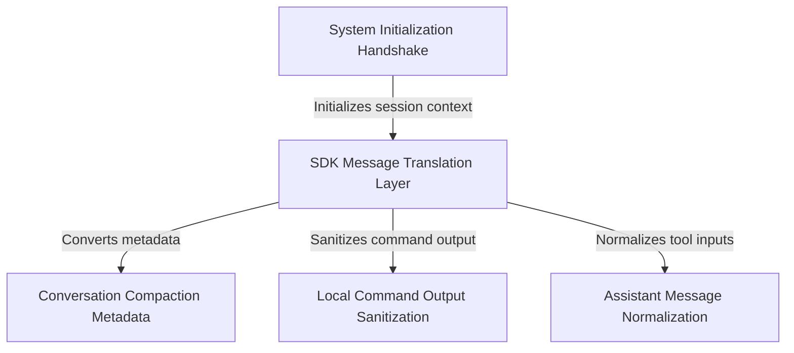

# Tutorial: messages

This project functions as a **diplomatic translator** between the AI agent's internal logic and external clients, ensuring secure and standardized communication. It manages the entire messaging lifecycle: constructing the *initial handshake* to synchronize state, **sanitizing** raw command outputs, and handling **conversation compaction** to efficiently manage context history. By normalizing data before it leaves the system, it ensures the external SDK interface remains stable regardless of internal complexity.

## Chapters

1. [System Initialization Handshake](01_system_initialization_handshake.md)
2. [SDK Message Translation Layer](02_sdk_message_translation_layer.md)
3. [Assistant Message Normalization](03_assistant_message_normalization.md)
4. [Local Command Output Sanitization](04_local_command_output_sanitization.md)
5. [Conversation Compaction Metadata](05_conversation_compaction_metadata.md)

---

Generated by [Code IQ](https://github.com/adityasoni99/Code-IQ)