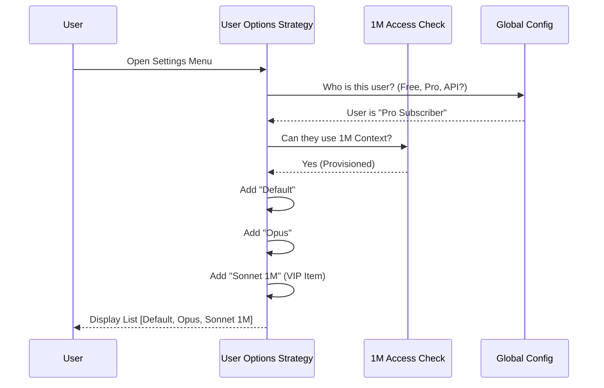

# Chapter 1: User Options Strategy

Welcome to the **User Options Strategy**. If you are building a configurable software system, one of the first challenges you face is: **"What choices should I actually show the user?"**

This chapter explains how the `model` project decides which AI models (like Claude Sonnet, Opus, or Haiku) appear in the settings menu.

## The "Digital Restaurant" Analogy

Imagine a high-end restaurant.
1.  **The Menu:** Lists all the food (Models) the kitchen *can* make.
2.  **The Customer:** You, holding a membership card (User Tier).
3.  **The Waiter:** The **User Options Strategy**.

If a standard guest walks in, the waiter hands them the Standard Menu. If a VIP (Pro Subscriber) walks in, the waiter hands them a menu that includes the "Chef's Specials" (like 1 Million Context models).

The goal of this strategy is to ensure users only see options they are allowed to use, preventing confusion and errors later.

## Key Concept: The `ModelOption`

Before we look at the logic, let's look at the data structure. Every item on our menu is a `ModelOption`. It tells the UI what to display.

```typescript
// modelOptions.ts
export type ModelOption = {
  value: string | null  // The ID sent to the API (e.g., 'opus')
  label: string         // What the user sees (e.g., 'Claude 3 Opus')
  description: string   // Small text below the label
  // ... extra UI hints
}
```

*   **Value:** The internal ID used by the code.
*   **Label:** The pretty name shown to the human.
*   **Description:** Context regarding speed, cost, or usage.

## The Strategy: Building the Menu

The core logic lives in `modelOptions.ts`. Instead of a static list, we use a function called `getModelOptionsBase` that builds the array dynamically.

### Step 1: The Default Option
Every user gets a "Default" option. This is safe, recommended, and changes automatically behind the scenes so the user doesn't have to worry about version numbers.

```typescript
// modelOptions.ts
export function getDefaultOptionForUser(fastMode = false): ModelOption {
  // Check if user is a subscriber
  if (isClaudeAISubscriber()) {
    return {
      value: null, // Null often implies "System Default"
      label: 'Default (recommended)',
      description: 'Intelligent agent that picks the best model.',
    }
  }
  // ... logic for other user types
}
```

### Step 2: The VIP Check (Subscribers)
If the user pays for a subscription, they get access to powerful models like **Opus** or **Sonnet with 1M Context**.

```typescript
// modelOptions.ts - Simplified Logic
if (isClaudeAISubscriber()) {
  const options = [getDefaultOptionForUser()]

  // Check if they have access to special 1M context features
  if (checkSonnet1mAccess()) {
    options.push(getMaxSonnet46_1MOption())
  }
  
  // Add standard models
  options.push(MaxHaiku45Option)
  return options
}
```

*Explanation:* We start with the default. Then, we ask `checkSonnet1mAccess()`: "Is this user allowed to use the huge context window?" If yes, we push that option onto the menu array.

### Step 3: The "Pay-As-You-Go" (PAYG) User
Users who use their own API keys (PAYG) often care deeply about **price**. For them, the description field changes to show costs.

```typescript
// modelOptions.ts
function getHaiku45Option(): ModelOption {
  const is3P = getAPIProvider() !== 'firstParty' // 3rd Party API
  
  return {
    value: 'haiku',
    label: 'Haiku',
    // We dynamically add pricing info for API users!
    description: `Haiku 4.5 · Fastest${is3P ? '' : ` · $0.25/M tokens`}`,
  }
}
```

## Internal Implementation: The Flow

How does the system assemble this? It happens in real-time when the settings menu is requested.



### Checking Capabilities
The `check1mAccess.ts` file is crucial here. It acts as the "Bouncer" for specific high-end features.

```typescript
// check1mAccess.ts
export function checkOpus1mAccess(): boolean {
  // If the system globally disabled 1M context, say no.
  if (is1mContextDisabled()) {
    return false
  }

  // If they are a subscriber, check if their account has extra usage enabled.
  if (isClaudeAISubscriber()) {
    return isExtraUsageEnabled()
  }

  // API users usually have access by default (they pay per token).
  return true
}
```

## Handling Custom Models (The "Secret Menu")
Sometimes, advanced users want to use a specific model version not listed on the standard menu. The strategy handles this by looking at environment variables or cached configurations.

```typescript
// modelOptions.ts (Simplified)
const customOpus = process.env.ANTHROPIC_DEFAULT_OPUS_MODEL

// If a custom model string exists, show it instead of the generic one
if (is3P && customOpus) {
   options.push({
      value: 'opus',
      label: 'Custom Opus', 
      description: `Targeting: ${customOpus}`
   })
}
```
This allows the system to support "Secret Menu" items (new models released by Anthropic) without rewriting the entire UI code, simply by updating a configuration string.

## Summary

The **User Options Strategy** is the first line of defense in user configuration. 

1.  It determines the **User Persona** (Subscriber vs. API).
2.  It checks **Capabilities** (via `check1mAccess`).
3.  It constructs a **`ModelOption` list** tailored specifically to that user.
4.  It decorates options with **Pricing** or **Usage Warnings** relevant to that user.

By filtering options *before* the user sees them, we prevent the user from selecting a model they can't actually pay for or access.

However, displaying the menu is only half the battle. What happens if a user tries to hack the request or use an old config file? We need to validate their choice.

[Next Chapter: Gatekeeping & Validation](02_gatekeeping___validation.md)

---

Generated by [Code IQ](https://github.com/adityasoni99/Code-IQ)