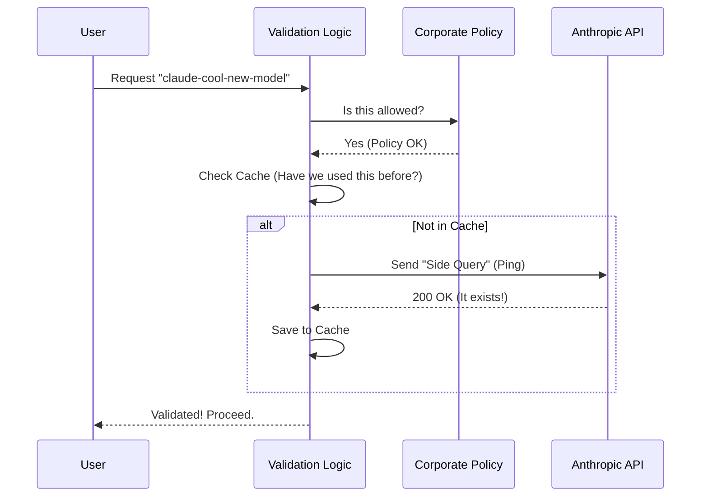

# Chapter 2: Gatekeeping & Validation

In the previous chapter, [User Options Strategy](01_user_options_strategy.md), we learned how to build a nice menu for the user.

But here is the problem: **Users don't always order from the menu.**

Advanced users might edit configuration files directly, or an automated script might try to request a specific model version (like `claude-3-5-sonnet-20240620`) that isn't on your UI list. Even worse, a user might try to use a model that your company has banned or one that was retired years ago.

This chapter is about **Gatekeeping**. It ensures that every request is safe, allowed, and valid before we spend a single penny on API costs.

## The "Airport Security" Analogy

Think of sending a prompt to an AI model like boarding a plane.
1.  **The Ticket Check (Validation):** Does this flight actually exist? You can't board flight "ABC-999" if the airline doesn't fly it.
2.  **The No-Fly List (Allowlist):** Even if the flight exists, are *you* allowed to board it? Maybe your company policy prohibits First Class (expensive models).
3.  **The Expiration Check (Deprecation):** Is the plane retired? You can't fly on a model that was decommissioned yesterday.

## Concept 1: The Corporate Policy (Allowlists)

Large companies often want to restrict which AI models their employees use to control costs or security. This logic lives in `modelAllowlist.ts`.

The system checks a setting called `availableModels`. If this list is empty, everyone can fly anywhere. If it has items, strict rules apply.

### How Logic "Narrows" Permissions

The allowlist is smart. It handles both broad families and specific versions.

```typescript
// modelAllowlist.ts (Simplified Logic)
const allowlist = ['sonnet', 'haiku-3'] // Settings

// 1. Family Match: 'sonnet' acts as a wildcard.
// Allowed: 'claude-3-sonnet', 'claude-3-5-sonnet'

// 2. Specific Match: 'haiku-3' is strict.
// Allowed: 'claude-3-haiku'
// Blocked: 'claude-3-5-haiku' (because it doesn't match 'haiku-3')
```

If you put a specific version in the list (like `opus-4-5`), the system assumes you want to be strict. It stops treating "opus" as a wildcard for that specific version family.

## Concept 2: The Reality Check (Validation)

Just because a model is on the allowlist doesn't mean it works. Maybe the user made a typo (`claud-3-opus`), or maybe the API is down.

In `validateModel.ts`, we perform a "Reality Check".

### The "Side Query" Trick
How do we know if a model string is valid without spending a lot of money? We send a "Side Query"—a tiny, 1-token request (usually just saying "Hi") to the API.

If the API replies "Hello," the model is valid. If the API replies "404 Not Found," the model name is wrong.

```typescript
// validateModel.ts - The "Ping"
await sideQuery({
  model: normalizedModel, // The model we are testing
  max_tokens: 1,          // Keep it tiny and cheap
  messages: [{ 
    role: 'user', 
    content: 'Hi' 
  }]
})
```

## Concept 3: The Expiration Date (Deprecation)

Models have lifespans. Anthropic eventually retires older models. We don't want users building workflows on dying infrastructure.

The file `deprecation.ts` acts as the expiration checker.

```typescript
// deprecation.ts
const DEPRECATED_MODELS = {
  'claude-3-opus': {
    modelName: 'Claude 3 Opus',
    retirementDates: { firstParty: 'January 5, 2026' }
  }
}
```

When a user selects a model, we check this list. If they pick a dying model, we don't stop them (yet), but we attach a warning: *"⚠ Claude 3 Opus will be retired on January 5, 2026."*

## Internal Implementation: The Flow

Here is what happens the moment a request is triggered.



### Deep Dive: The Code

Let's look at how `validateModel.ts` orchestrates this.

#### Step 1: The Fast Checks
Before doing anything slow (network requests), we do the fast checks: Is the string empty? Is it allowed? Is it an alias (like "fastest")?

```typescript
// validateModel.ts
export async function validateModel(model: string) {
  // 1. Check Allowlist
  if (!isModelAllowed(model)) {
    return { valid: false, error: 'Not in allowlist' }
  }

  // 2. Check Cache (Don't spam the API)
  if (validModelCache.has(model)) {
    return { valid: true }
  }
  // ... continue to API check
}
```

#### Step 2: The API Probe
If the model passes the logic checks, we have to talk to the server. We wrap this in a `try/catch` block because this is where things usually break (network errors, bad API keys, or typos).

```typescript
// validateModel.ts
try {
  // Try to say "Hi" to the model
  await sideQuery({ /* ... parameters ... */ })

  // If we reach this line, it worked!
  validModelCache.set(model, true)
  return { valid: true }
} catch (error) {
  return handleValidationError(error, model)
}
```

#### Step 3: Helpful Error Messages
If the validation fails, we try to be helpful. If the user is on a Third Party (3P) provider and requests a model that doesn't exist, we might suggest a fallback.

```typescript
// validateModel.ts - Suggesting Fallbacks
function handleValidationError(error, modelName) {
  if (error instanceof NotFoundError) {
    // Did they ask for "opus-4-6" but it's not out yet?
    const fallback = get3PFallbackSuggestion(modelName)
    // Suggest: "Model not found. Try 'opus-4-1' instead?"
    return { valid: false, error: `Not found. Try ${fallback}` }
  }
  return { valid: false, error: error.message }
}
```

## Summary

In this chapter, we implemented the security guards for our system:

1.  **Allowlist:** Ensures the model complies with enterprise settings.
2.  **Validation:** Pings the API to ensure the model string is technically correct.
3.  **Deprecation:** Warns users if they are using a model that is about to disappear.

Now that we know the model is allowed and valid, we run into a different issue. The user might ask for "Claude Opus", but the API expects a specific string like `claude-3-opus-20240229`. How do we translate human names into machine IDs?

[Next Chapter: Model Resolution & Aliasing](03_model_resolution___aliasing.md)

---

Generated by [Code IQ](https://github.com/adityasoni99/Code-IQ)