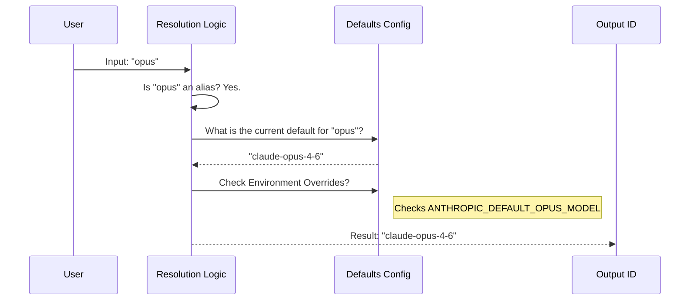

# Chapter 3: Model Resolution & Aliasing

In the previous chapter, [Gatekeeping & Validation](02_gatekeeping___validation.md), we ensured that the user is actually *allowed* to use a specific model.

But there is a practical problem. Users want to type short, easy names like **"opus"** or **"haiku"**. The API, however, demands precise, long, and changing version strings like `claude-3-opus-20240229`.

If we forced users to memorize version dates, they would be frustrated. If we hardcoded version dates in their scripts, their code would break every time a model was updated.

This chapter covers **Model Resolution**: the translation layer that turns human-friendly nicknames into machine-readable IDs.

## The "Phone Contact" Analogy

Think of this system like the contact list on your smartphone.

1.  **The Alias:** You tap "Mom". You don't type her number every time.
2.  **The Resolution:** Your phone looks up "Mom" -> `+1-555-0199`.
3.  **The Update:** If Mom changes her number, you update the contact card *once*. You still tap "Mom", but the phone now dials the new number automatically.

In our system, the user asks for "opus", and we resolve it to the latest supported version of Claude Opus.

## Concept 1: The Alias List

The file `aliases.ts` defines the short names we accept. These are the "Contacts" in our phone book.

```typescript
// aliases.ts
export const MODEL_ALIASES = [
  'sonnet',
  'opus',
  'haiku',
  'best', // A special alias that points to the strongest model
  'sonnet[1m]', // Specific alias for high-context
] as const
```

*   **sonnet/opus/haiku:** Family names.
*   **best:** An abstract alias. Today it might point to Opus 4.6; next year it might point to Opus 5.
*   **[1m]:** A special suffix indicating the user wants a massive context window (1 Million tokens).

## Concept 2: The Resolver Function

The core logic lives in `model.ts`. The function `parseUserSpecifiedModel` acts as the interpreter.

It takes the user's input and runs it through a switch statement to find the current "Phone Number" (Model ID).

```typescript
// model.ts (Simplified)
export function parseUserSpecifiedModel(input: string): string {
  const model = input.toLowerCase().trim()

  if (model === 'opus') {
    // Dynamically get the current default for Opus
    return getDefaultOpusModel() 
  }
  
  if (model === 'best') {
    return getBestModel() // Currently points to Opus
  }

  return model // If not an alias, return input as-is
}
```

### Why use functions like `getDefaultOpusModel()`?
Instead of returning a hardcoded string `'claude-3-opus'`, we call a helper function. This allows us to change the default in *one place* (when a new model is released), and every alias pointing to it updates instantly.

## Concept 3: Handling "1M" Context

Advanced users might want to use a 1 Million token context window. They signify this by adding `[1m]` to the model name.

The API doesn't understand `[1m]`. It's a signal for *our* system.

```typescript
// model.ts
export function parseUserSpecifiedModel(input: string): string {
  // 1. Detect the tag
  const has1mTag = input.includes('[1m]')
  
  // 2. Strip the tag to find the base model ('opus[1m]' -> 'opus')
  const baseModel = input.replace(/\[1m\]/i, '')

  // 3. Resolve 'opus' to the real ID (e.g. 'claude-opus-4-6')
  const resolvedID = resolveAlias(baseModel)

  // 4. Re-attach tag if needed for internal logic
  return has1mTag ? resolvedID + '[1m]' : resolvedID
}
```

Later, just before sending to the API, we strip this tag off in `normalizeModelStringForAPI` so the API doesn't throw an error.

## Internal Implementation: The Flow

Here is what happens when a user runs the command: `claudecode --model opus`



## Deep Dive: The Code

Let's look at the actual implementation details in `model.ts` that make this robust.

### 1. The Dynamic Defaults
We don't just return a string; we check if the environment variables have overridden the defaults. This allows developers to test new models without changing the code.

```typescript
// model.ts
export function getDefaultOpusModel(): string {
  // 1. Check if an environment variable overrides this
  if (process.env.ANTHROPIC_DEFAULT_OPUS_MODEL) {
    return process.env.ANTHROPIC_DEFAULT_OPUS_MODEL
  }
  
  // 2. Return the current hardcoded standard
  return getModelStrings().opus46
}
```

### 2. Legacy Remapping (The Safety Net)
Sometimes, a user might request a specific older version like `claude-opus-4-1`. If Anthropic retires that model, the resolution layer can silently "upgrade" them to `opus-4-6` so their script doesn't fail.

```typescript
// model.ts
if (
  isLegacyOpusFirstParty(modelString) && 
  isLegacyModelRemapEnabled()
) {
  // Remap retired model to the current live version
  return getDefaultOpusModel()
}
```

### 3. Canonical Names
Different providers (like AWS Bedrock or Google Vertex) might add junk to the ID, like `us.anthropic.claude-3...`. We use `getCanonicalName` to clean this up so our logic stays consistent.

```typescript
// model.ts
export function getCanonicalName(fullModelName: string): string {
  // Resolves complex provider strings back to "claude-3-5-sonnet"
  // so we can apply logic consistently.
  return firstPartyNameToCanonical(resolveOverriddenModel(fullModelName))
}
```

## Summary

In this chapter, we built the **Interpreter** for our system.

1.  **Aliases** allow users to use short names (`opus`, `best`).
2.  **Resolution Logic** translates these aliases into precise API versions (`claude-opus-4-6`).
3.  **Dynamic Defaults** allow the system to update model pointers without breaking user workflows.
4.  **Tag Handling** (`[1m]`) captures user intent for specific features while keeping the underlying model ID valid.

We now have a valid, precise model ID. But there is one final complication: **Where** are we sending this request?

Are we sending it to Anthropic directly? Or are we routing it through Amazon Bedrock or Google Vertex? Each provider requires a slightly different configuration string.

[Next Chapter: Multi-Provider Configuration ("The Rosetta Stone")](04_multi_provider_configuration___the_rosetta_stone__.md)

---

Generated by [Code IQ](https://github.com/adityasoni99/Code-IQ)