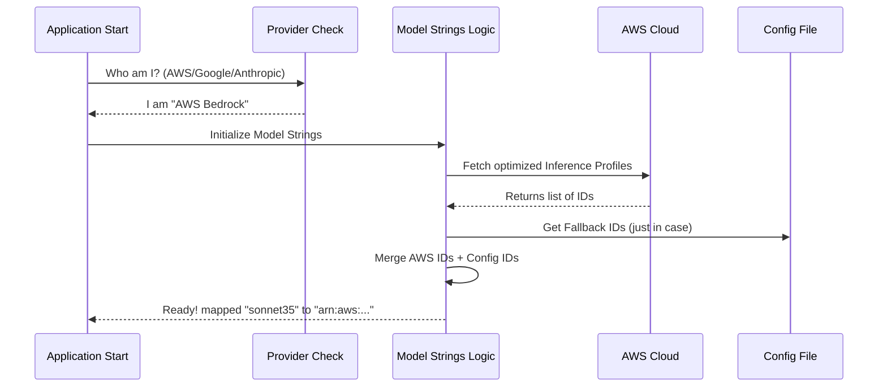

# Chapter 4: Multi-Provider Configuration ("The Rosetta Stone")

In the previous chapter, [Model Resolution & Aliasing](03_model_resolution___aliasing.md), we learned how the system translates a nickname like **"sonnet"** into a precise concept like **"Claude 3.5 Sonnet v2"**.

But we have one final problem. "Claude 3.5 Sonnet v2" is just a name. To actually send data, we need a technical address.

The problem is that every cloud provider has a different address for the *exact same model*:
*   **Anthropic API:** Expects `claude-3-5-sonnet-20241022`
*   **AWS Bedrock:** Expects `us.anthropic.claude-3-5-sonnet-20241022-v2:0`
*   **Google Vertex:** Expects `claude-3-5-sonnet-v2@20241022`

If we sent the AWS address to Google, the system would crash.

This chapter covers **Multi-Provider Configuration**, often called **"The Rosetta Stone"**. It acts as a universal dictionary that translates our internal model concept into the specific dialect required by the cloud you are using.

## The "Universal Travel Adapter" Analogy

Imagine you are traveling with a hairdryer (The Model).
1.  **The Device:** It works the same everywhere. It blows hot air.
2.  **The Wall Socket:** In the US, it's two flat pins. In the UK, it's three distinct rectangular pins.
3.  **The Adapter:** This is our **Multi-Provider Configuration**.

You simply plug your "Sonnet" hairdryer into the code. The code checks which country (Provider) you are in and automatically slides out the correct metal pins to fit the socket.

## Concept 1: Detecting the Provider

First, the system needs to know: "Where are we?"

We don't want to ask the user "Which cloud are you using?" every time they run a command. Instead, we check the Environment Variables. This logic lives in `providers.ts`.

```typescript
// providers.ts
export type APIProvider = 'firstParty' | 'bedrock' | 'vertex' | 'foundry'

export function getAPIProvider(): APIProvider {
  // If the user set this flag, we are in AWS land
  if (process.env.CLAUDE_CODE_USE_BEDROCK) {
    return 'bedrock'
  }
  // If the user set this flag, we are in Google land
  if (process.env.CLAUDE_CODE_USE_VERTEX) {
    return 'vertex'
  }
  // Default: We are talking directly to Anthropic
  return 'firstParty'
}
```

This simple function acts as our compass. It tells the rest of the system which "language" to speak.

## Concept 2: The Master Dictionary (`configs.ts`)

Now that we know *who* we are talking to, we need the dictionary. This is stored in `configs.ts`.

This file contains a massive list of constants. Each constant defines a single model and how to find it on every supported platform.

### The Anatomy of a Config Entry

```typescript
// configs.ts
export const CLAUDE_3_5_V2_SONNET_CONFIG = {
  // Direct API
  firstParty: 'claude-3-5-sonnet-20241022',
  // AWS Bedrock (Note the extra junk in the string)
  bedrock: 'anthropic.claude-3-5-sonnet-20241022-v2:0',
  // Google Cloud Vertex
  vertex: 'claude-3-5-sonnet-v2@20241022',
  // Palantir Foundry
  foundry: 'claude-3-5-sonnet',
}
```

We group all these configs into one master object called `ALL_MODEL_CONFIGS`.

```typescript
// configs.ts
export const ALL_MODEL_CONFIGS = {
  sonnet35: CLAUDE_3_5_V2_SONNET_CONFIG,
  haiku35: CLAUDE_3_5_HAIKU_CONFIG,
  opus45: CLAUDE_OPUS_4_5_CONFIG,
  // ... and many more
}
```

This is our "Rosetta Stone." If we have the key `sonnet35` and the provider `bedrock`, we can look up the exact string we need.

## Concept 3: The Translator (`modelStrings.ts`)

We have the compass (Provider) and the map (Config). Now we need the code that actually performs the lookup.

This happens in `modelStrings.ts`. The main function is `getModelStrings()`. It returns a simple object mapping our internal keys to the active provider's strings.

```typescript
// modelStrings.ts (Simplified)
function getBuiltinModelStrings(provider: APIProvider) {
  const out = {} 
  
  // Loop through every model in our config
  for (const key of MODEL_KEYS) {
    // Pick the string that matches our current provider
    out[key] = ALL_MODEL_CONFIGS[key][provider]
  }
  
  return out
}
```

**Example Output:**
If `getAPIProvider()` returns `'vertex'`, the function above returns:
```json
{
  "sonnet35": "claude-3-5-sonnet-v2@20241022",
  "haiku35": "claude-3-5-haiku@20241022"
}
```

## Advanced Concept: The "Bedrock" Complication

AWS Bedrock is tricky. Sometimes the model ID isn't static. AWS uses "Inference Profiles" (like `us.anthropic.claude...`) that might change depending on which region provides the best speed.

If we just hardcoded the string, it might be slow. So, for Bedrock users, we do something special: we ask AWS for the best ID.

### The "Late Initialization" Pattern

In `modelStrings.ts`, we have a function called `ensureModelStringsInitialized()`.

1.  **Other Providers:** It runs instantly. We know the strings.
2.  **Bedrock:** It pauses. It sends a request to AWS: *"Hey, what are the current model IDs for this region?"*

```typescript
// modelStrings.ts
export async function ensureModelStringsInitialized() {
  // If not Bedrock, we are done instantly.
  if (getAPIProvider() !== 'bedrock') {
    setModelStringsState(getBuiltinModelStrings(getAPIProvider()))
    return
  }

  // If Bedrock, wait for network request to finish
  await updateBedrockModelStrings()
}
```

This ensures that when the user presses "Enter", we have the freshest, fastest IDs from Amazon.

## Internal Implementation: The Flow

Here is the journey of a model string, from startup to API call.



### Deep Dive: Handling User Overrides

Sometimes, a power user wants to force a specific ID (maybe to test a private beta model). We allow this via `applyModelOverrides` in `modelStrings.ts`.

We check the user's `settings.json` file. If they manually defined a string, that wins.

```typescript
// modelStrings.ts
function applyModelOverrides(ms: ModelStrings) {
  // Load settings from file
  const overrides = getInitialSettings().modelOverrides
  
  // If user defined specific IDs, replace the automatic ones
  for (const [canonicalId, override] of Object.entries(overrides)) {
    const key = CANONICAL_ID_TO_KEY[canonicalId]
    if (key) ms[key] = override
  }
  
  return ms
}
```
This is the final layer of flexibility. Even if our Rosetta Stone is outdated, the user can write their own translation entry in their settings.

## Summary

In this chapter, we solved the problem of "different clouds, different languages."

1.  **Provider Detection:** We check environment variables to see which cloud we are using.
2.  **Configuration Dictionary:** We store a massive map (`configs.ts`) linking internal concepts to external technical IDs.
3.  **Dynamic Resolution:** For complex providers like AWS Bedrock, we fetch IDs dynamically to ensure performance.
4.  **Overrides:** We allow users to manually patch the dictionary via settings.

Now we have the correct **Model**, validated it, and translated it into the correct **Provider Address**. We are ready to start the AI agent.

But an AI agent isn't just a model. It has memory, personality, and instructions. How do we pass all that information to the model we just configured?

[Next Chapter: Agent Context & Inheritance](05_agent_context___inheritance.md)

---

Generated by [Code IQ](https://github.com/adityasoni99/Code-IQ)