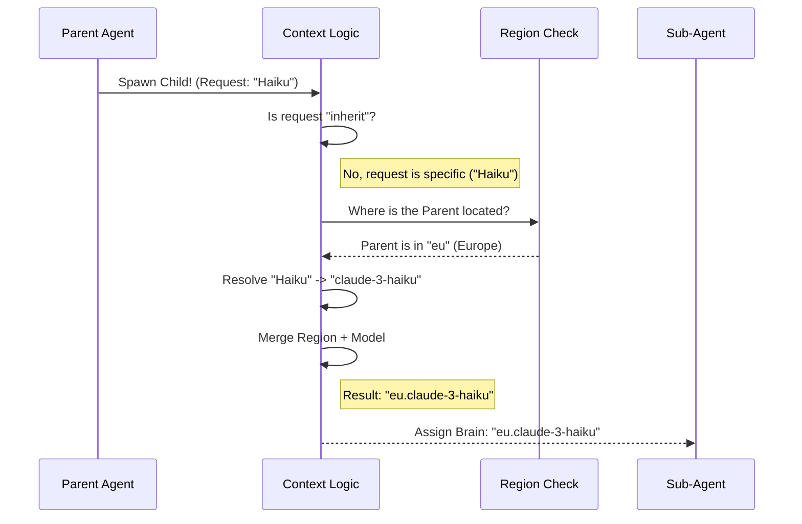

# Chapter 5: Agent Context & Inheritance

Welcome to the final chapter of our model configuration tutorial!

In the previous chapter, [Multi-Provider Configuration ("The Rosetta Stone")](04_multi_provider_configuration___the_rosetta_stone__.md), we learned how to translate a model name into a technical address for clouds like AWS or Google.

Now we face a structural challenge. Modern AI systems don't just run one prompt. They spawn **Agents**.

Imagine you ask the AI: *"Refactor this entire database folder."*
The main AI (The Parent) might say: *"That's a big job. I will spawn three sub-agents to handle the files one by one."*

This chapter covers **Agent Context & Inheritance**. It answers the question: **When a Parent Agent spawns a Child Agent, which brain should the child use?**

## The "Master and Apprentice" Analogy

Think of the main AI as a **Master Artisan** working in a workshop.
1.  **The Master (Parent Agent):** Uses a specific, high-end set of tools (The Model, e.g., Claude Opus).
2.  **The Apprentice (Sub-Agent):** A helper spawned to do a specific job.

Usually, the Apprentice simply borrows the Master's tools (**Inheritance**). If the Master is using "Opus," the Apprentice uses "Opus."

However, sometimes the Master says: *"I will handle the design (Opus), but you just need to hammer these nails quickly. Use the lighter hammer (Haiku)."*

## Concept 1: The Default (Inheritance)

By default, we want continuity. If a user carefully configured the system to use a specific version of Claude, they don't want sub-agents reverting to random defaults.

The default setting for any sub-agent is simply `'inherit'`.

```typescript
// agent.ts
export function getDefaultSubagentModel(): string {
  // Simplicity itself. Do what your parent does.
  return 'inherit'
}
```

When the logic sees `'inherit'`, it simply copies the `parentModel` string to the `agentModel`.

## Concept 2: Tier Matching (Avoiding "The Downgrade")

Here is a tricky edge case.

Suppose you manually configured the system to use a specific, powerful version: `claude-3-opus-20240229` (The Master's Tool).
You tell the sub-agent: *"Use Opus."*

You might expect the sub-agent to use the *same* Opus as the Master. But if we aren't careful, the system might look up "Opus" in the default dictionary and give the sub-agent a *different* (maybe older) version.

We solve this with **Tier Matching**.

```typescript
// agent.ts
function aliasMatchesParentTier(alias: string, parentModel: string): boolean {
  // If parent is "Claude 3 Opus" and child asks for "Opus"...
  if (alias === 'opus' && parentModel.includes('opus')) {
    // ...they are a match!
    return true
  }
  return false
}
```

If they match, we ignore the dictionary and force the child to use the **Parent's Exact ID**. This ensures consistency.

## Concept 3: Region Consistency (The Legal Requirement)

This is the most critical concept for enterprise users.

If you are using **AWS Bedrock**, your data might be legally required to stay in **Europe (Frankfurt)**.
*   **Parent:** `eu.anthropic.claude-3-5-sonnet...` (Running in Europe)
*   **Child (Desired):** "Haiku"

If the system just resolves "Haiku" normally, it might default to `us.anthropic.haiku` (US East). **This causes a data leak.** The European data would be sent to the US for processing.

To fix this, we implement **Region Inheritance**. The child inherits the *location prefix* (`eu.`) from the parent.

## Internal Implementation: The Flow

Here is how the system decides which model a sub-agent gets.



### Deep Dive: The Code

The core logic lives in `getAgentModel` inside `agent.ts`. It orchestrates all the rules we just discussed.

### Step 1: Handling "Inherit"
First, we check if the agent is just supposed to copy the parent.

```typescript
// agent.ts - inside getAgentModel
const agentModelWithExp = agentModel ?? getDefaultSubagentModel() // Defaults to 'inherit'

if (agentModelWithExp === 'inherit') {
  // Just return the parent's model exactly.
  // Note: We run it through a resolver just to be safe.
  return getRuntimeMainLoopModel({ mainLoopModel: parentModel /*...*/ })
}
```

### Step 2: The Region Check (Bedrock)
We look at the parent's ID to see if it has a region prefix like `eu.` or `us.`.

```typescript
// agent.ts
// Extract "eu" or "us" from the parent string
const parentRegionPrefix = getBedrockRegionPrefix(parentModel)

// Helper function to glue the prefix onto the child
const applyParentRegionPrefix = (resolvedModel, originalSpec) => {
  if (parentRegionPrefix && isBedrock()) {
    // Force the child into the same region
    return applyBedrockRegionPrefix(resolvedModel, parentRegionPrefix)
  }
  return resolvedModel
}
```

### Step 3: Resolving the Final Model
Finally, we put it all together. We resolve the name (e.g., "Haiku" -> ID), and then stamp the region onto it.

```typescript
// agent.ts
// 1. Resolve the name "haiku" to a real ID
const model = parseUserSpecifiedModel(agentModelWithExp)

// 2. Stamp it with the parent's region ("eu." + ID)
return applyParentRegionPrefix(model, agentModelWithExp)
```

**Result:**
*   Input Parent: `eu.anthropic.claude-opus-v1`
*   Input Child Request: `haiku`
*   **Output:** `eu.anthropic.claude-haiku-v1`

The child is faster (Haiku), but stays in the same room (Europe) as the parent.

## Conclusion

Congratulations! You have completed the **Model Configuration Tutorial**.

Over these five chapters, we have traced the journey of a simple user setting:

1.  **[User Options Strategy](01_user_options_strategy.md):** We decided what to show on the menu based on who the user is.
2.  **[Gatekeeping & Validation](02_gatekeeping___validation.md):** We ensured the user's choice was allowed and valid.
3.  **[Model Resolution & Aliasing](03_model_resolution___aliasing.md):** We translated nicknames like "Opus" into technical IDs.
4.  **[Multi-Provider Configuration](04_multi_provider_configuration___the_rosetta_stone__.md):** We translated those IDs into cloud-specific addresses (AWS/Google).
5.  **Agent Context (This Chapter):** We ensured that when the AI multiplies, it passes down its tools and security rules to its children.

You now have a robust, secure, and flexible system for managing AI models in complex applications. Happy coding!

---

Generated by [Code IQ](https://github.com/adityasoni99/Code-IQ)