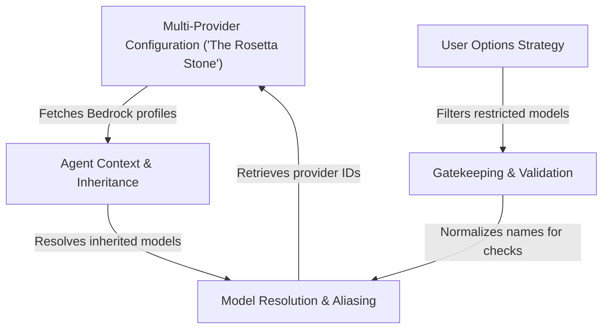

# Tutorial: model

This project serves as a sophisticated **model orchestration layer** that acts as a universal translator between user intent and cloud provider technicalities. It manages **Multi-Provider Configuration** to map abstract aliases (like "Opus") to specific IDs across AWS, Google, and Anthropic, while dynamically tailoring **User Options** based on subscription tiers. Additionally, it handles **Agent Context** to ensure sub-agents inherit the correct region and model settings, strictly enforcing **Gatekeeping & Validation** to prevent the use of unauthorized or deprecated models.

## Chapters

1. [User Options Strategy](01_user_options_strategy.md)
2. [Gatekeeping & Validation](02_gatekeeping___validation.md)
3. [Model Resolution & Aliasing](03_model_resolution___aliasing.md)
4. [Multi-Provider Configuration ("The Rosetta Stone")](04_multi_provider_configuration___the_rosetta_stone__.md)
5. [Agent Context & Inheritance](05_agent_context___inheritance.md)

---

Generated by [Code IQ](https://github.com/adityasoni99/Code-IQ)