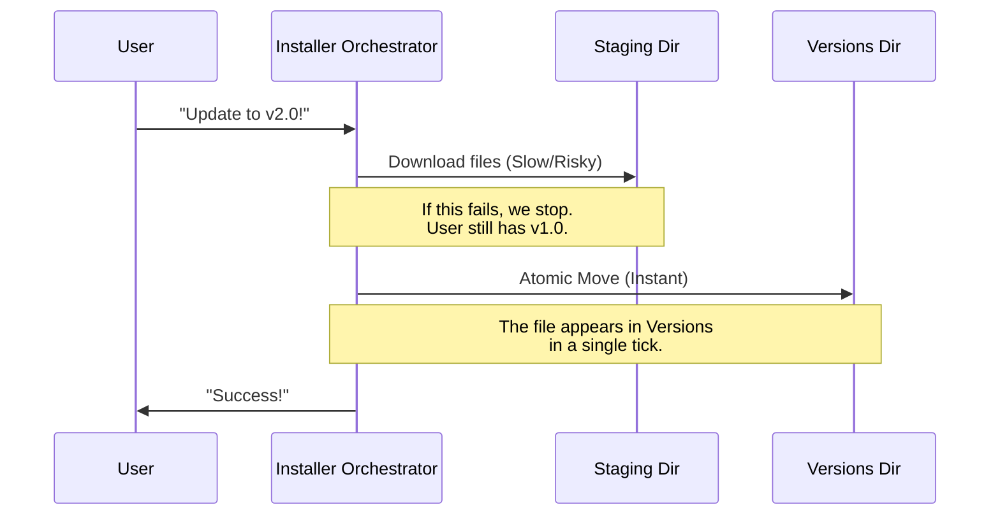

# Chapter 1: Atomic Version Management

Welcome to the **Native Installer** project! In this first chapter, we are going to explore the heart of our system: **Atomic Version Management**.

## The Problem: Updating Without Breaking

Imagine you are watching a Formula 1 race. The car pulls into the pit stop. The crew doesn't take the old tires off, throw them away, and *then* start looking for new tires while the driver waits. 

Instead, they have the new tires ready and waiting. They verify they are good. Then, in one split second, they swap the old for the new.

If they drop a new tire *before* the swap, the car doesn't crash. It just keeps the old tires and keeps driving. The driver is never left with a car that has no wheels.

**Atomic Version Management** is that pit crew.

### The Core Concept
In software installation, "Atomic" means an operation either happens completely or not at all. There is no "half-installed" state.

Our installer follows a strict pipeline to ensure safety:
1.  **Check:** See if an update is needed.
2.  **Stage:** Download the new version to a temporary area (the "pit lane").
3.  **Install:** Move the files to the final location.
4.  **Switch:** Point the system to the new version instantly.

## The Orchestrator

The main function that manages this entire lifecycle is `installLatest`. Think of this as the Pit Crew Chief. It coordinates all the other systems.

Here is a simplified view of how the Chief operates:

```typescript
// index.ts (Simplified)
export async function installLatest(version) {
  // 1. Coordinate the update
  const result = await updateLatest(version);

  // 2. If successful, finalize configuration
  if (result.success) {
    saveGlobalConfig({ installMethod: 'native' });
    
    // Clean up old tires (versions) we don't need
    cleanupOldVersions(); 
  }

  return result;
}
```

**What happens here:**
1.  We call `updateLatest` to do the heavy lifting.
2.  If it works, we confirm the installation is "native".
3.  We clean up the mess afterward (removing old versions).

## Under the Hood: The "Check, Stage, Switch" Flow

Let's look at what happens internally when `updateLatest` is called.

### 1. The Staging Area
Before we touch the user's working application, we download the new version to a **Staging Directory**. This is a safe sandbox. If the internet cuts out here, the user is fine because we haven't touched their running app yet.

This relates to [Dual-Source Artifact Retrieval](03_dual_source_artifact_retrieval.md), which handles *where* we get the files from.

### 2. The Atomic Move
Once the file is safely in the staging area, we need to move it to the final `versions` folder. We use a specific filesystem command called `rename`. On most operating systems, renaming a file is instant and atomic.

Here is how the sequence looks:



### 3. The Implementation

Let's look at the code in `installer.ts` that handles the transition from "Staging" to "Installed".

```typescript
// installer.ts
async function atomicMoveToInstallPath(stagedBinaryPath, installPath) {
  // Create the destination folder if needed
  await mkdir(dirname(installPath), { recursive: true })

  // 1. Copy to a temp file right next to the destination
  const tempInstallPath = `${installPath}.tmp.${Date.now()}`
  await copyFile(stagedBinaryPath, tempInstallPath)

  // 2. The Atomic Move: Rename temp file to final name
  // This is the "magic" moment
  await rename(tempInstallPath, installPath)
}
```

**Explanation:**
1.  **Preparation:** We don't move the file directly from Staging to Install because they might be on different hard drives (which causes errors).
2.  **Temp File:** We copy the file to a temporary name (e.g., `claude.tmp.12345`) inside the final folder.
3.  **Rename:** `rename` is the atomic trigger. The operating system guarantees that the file `installPath` will exist fully formed.

## The Final Switch

Once the file is in the `versions` folder, it is "installed" but not yet "active". The user typically runs the command `claude`. We need that command to point to our new version.

We achieve this using **Symlinks**. A symlink is like a shortcut on your desktop. We just update the shortcut to point to the new folder.

```typescript
// installer.ts
async function performVersionUpdate(version) {
  // 1. Get paths
  const { installPath } = await getVersionPaths(version)

  // 2. Do the heavy lifting (Download & Atomic Move)
  await downloadAndInstall(version, installPath)

  // 3. Update the shortcut (Symlink)
  const executablePath = getBaseDirectories().executable
  await updateSymlink(executablePath, installPath)
}
```

We will cover exactly how the shortcut switching works in [Symlink-Based Activation](04_symlink_based_activation.md).

## Safety First: Concurrency

What if you have two terminal windows open, and *both* try to update at the exact same time? The "Pit Crew" might crash into each other!

To prevent this, we wrap the update process in a **Lock**.

```typescript
// installer.ts (Conceptual)
if (isPidBasedLockingEnabled()) {
  // Try to grab the "Key" to the update room
  const success = await withLock(versionPath, async () => {
      // Only one process enters here at a time
      await performVersionUpdate(version);
  });
}
```

We will dive deep into how we prevent collisions in [PID-Based Concurrency Locking](05_pid_based_concurrency_locking.md).

## Conclusion

Atomic Version Management is the foundation of a reliable installer. By separating the **preparation** (staging) from the **execution** (atomic move/rename), we ensure that the user's system never enters a broken state.

Now that we understand *how* we manage the versions, we need to understand *where* we are installing them and if we are even allowed to run.

[Next Chapter: Installation Origin Detection](02_installation_origin_detection.md)

---

Generated by [Code IQ](https://github.com/adityasoni99/Code-IQ)