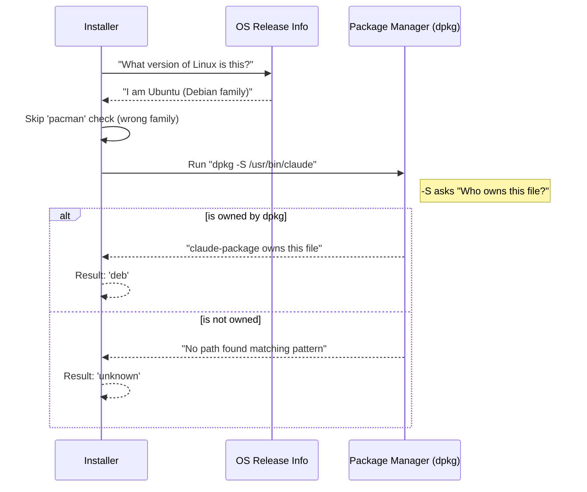

# Chapter 2: Installation Origin Detection

In the previous chapter, [Atomic Version Management](01_atomic_version_management.md), we learned how to safely swap out old versions of an application for new ones.

However, before we attempt an update, we must answer a critical question: **"Did we build this house, or did a contractor build it?"**

## The Problem: Too Many Cooks

Imagine you live in a rented apartment. If the sink breaks, you don't fix it yourself; you call the landlord. If you try to fix it and replace the pipes with different ones, the landlord will be confused and angry next time they inspect the place.

Software is similar. A user can install your application in two main ways:
1.  **Standalone:** They downloaded a generic installer or binary. (You are the owner).
2.  **Package Manager:** They used a tool like **Homebrew** (macOS), **Winget** (Windows), or **apt** (Linux). (The Package Manager is the landlord).

If a user installed via Homebrew, and our app tries to update itself using our internal logic, we might break Homebrew's database. Homebrew won't know we changed the files, leading to version conflicts and corruption.

**Installation Origin Detection** acts as a forensic detective to figure out who "owns" the installation.

## How It Works: The Detective Methodology

Our code needs to look at the environment and deduce the installation method. It looks for two types of clues:

1.  **The Address (File Paths):**
    *   If a house is located on "Homebrew Avenue" (e.g., `/opt/homebrew/Caskroom`), we know Homebrew built it.
    *   If it's on "Winget Way", Winget built it.

2.  **The Registry (System Database):**
    *   Sometimes the address isn't enough. We have to call the city hall (the OS) and ask, "Who holds the deed to this file?"

## The Main Tool: `getPackageManager`

The goal of this chapter is to build a single function that returns one simple answer.

```typescript
// Usage Example
const manager = await getPackageManager();

if (manager === 'homebrew') {
  console.log("Please run 'brew upgrade' to update.");
} else if (manager === 'unknown') {
  console.log("Safe to perform Native Auto-Update!");
}
```

## Strategy 1: Checking the Address (Path Detection)

This is the fastest and safest method. We simply check *where* the currently running executable file is located.

### Example: Detecting Homebrew
Homebrew on macOS puts "Cask" applications in a very specific folder structure.

```typescript
// packageManagers.ts
export function detectHomebrew(): boolean {
  // Get the path of the program running RIGHT NOW
  const execPath = process.execPath; 

  // Check if we are inside the distinctive Homebrew folder
  if (execPath.includes('/Caskroom/')) {
    return true;
  }

  return false;
}
```

**Explanation:**
1.  `process.execPath` gives us the full location of our running app (e.g., `/opt/homebrew/Caskroom/claude/v1/claude`).
2.  We look for the substring `/Caskroom/`.
3.  If found, we know we are managed by Homebrew.

### Example: Detecting Winget (Windows)
Windows has a similar concept with Winget.

```typescript
// packageManagers.ts
export function detectWinget(): boolean {
  if (process.platform !== 'windows') return false;

  const execPath = process.execPath;

  // Winget stores files in a specific Microsoft folder
  // We use regex to match the pattern
  if (/Microsoft[/\\]WinGet[/\\]Packages/i.test(execPath)) {
    return true;
  }
  
  return false;
}
```

## Strategy 2: Checking the Registry (Command Detection)

On Linux, things are trickier. Files usually end up in generic places like `/usr/bin`, regardless of whether `apt`, `yum`, or `pacman` put them there.

To solve this, we have to run a system command to ask the package manager directly.

### The Flow of Inquiry

Before running commands, we check the "Distro Family" (e.g., is this Ubuntu or Arch Linux?) so we don't run the wrong commands.



### Example: Detecting Debian/Ubuntu (`.deb`)
If we are on a Debian-based system, we use `dpkg`.

```typescript
// packageManagers.ts
export const detectDeb = async (): Promise<boolean> => {
  // 1. Verify we are on Linux
  if (getPlatform() !== 'linux') return false;

  // 2. Ask the system: "Who owns this executable?"
  const execPath = process.execPath;
  const result = await execFileNoThrow('dpkg', ['-S', execPath]);

  // 3. If the command succeeded (code 0), a package owns us.
  return result.code === 0;
}
```

## Putting It All Together: The Orchestrator

We combine all these checks into a main function. We prioritize the "Path Checks" (Homebrew, Winget) because they are instant. We do the "Command Checks" (Linux) last because spawning processes is slower.

```typescript
// packageManagers.ts
export const getPackageManager = async (): Promise<PackageManager> => {
  // --- FAST CHECKS (Strings) ---
  if (detectHomebrew()) return 'homebrew';
  if (detectWinget())   return 'winget';
  if (detectMise())     return 'mise';

  // --- SLOW CHECKS (System Commands) ---
  if (await detectPacman()) return 'pacman';
  if (await detectDeb())    return 'deb';
  if (await detectRpm())    return 'rpm';

  // If no one claims us, we are a standalone native install
  return 'unknown';
}
```

## Why Order Matters
Notice the order in the code above.
1.  **Efficiency:** String comparisons (Fast Checks) take microseconds. Spawning a child process (Slow Checks) takes milliseconds.
2.  **Safety:** We don't want to run `rpm` commands on a Windows machine. The individual detect functions handle those safety guards.

## Conclusion

By playing "forensic detective," our application now has self-awareness. It knows if it is a guest in a managed house (Homebrew/Winget) or if it owns the building (Standalone).

If `getPackageManager` returns `'unknown'`, we have the green light to manage our own updates.

But **where** do we get the update files from? Do we download them from a cloud bucket, or is there a local cache?

[Next Chapter: Dual-Source Artifact Retrieval](03_dual_source_artifact_retrieval.md)

---

Generated by [Code IQ](https://github.com/adityasoni99/Code-IQ)