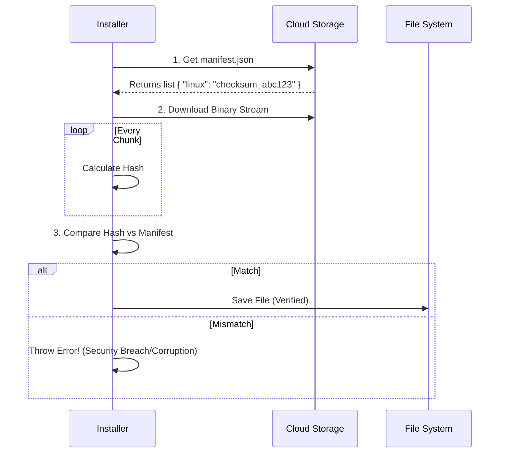

# Chapter 3: Dual-Source Artifact Retrieval

In the previous chapter, [Installation Origin Detection](02_installation_origin_detection.md), we learned how the installer acts like a detective to figure out if it has permission to update itself.

Once we know we are allowed to update, we face the next challenge: **Getting the files.**

## The Problem: Two Worlds, One Installer

Imagine you are running a logistics company.
1.  **Internal Deliveries:** You have a local bike courier service for moving packages between your own office buildings. It requires an employee ID badge to use.
2.  **International Deliveries:** You use a massive cargo ship for sending packages to the general public across the ocean. It's open to everyone.

Your receiving department (the installer) shouldn't care *how* the package arrives. It just needs to know: **"Is the box here, and is it safe to open?"**

In our software:
*   **Internal Users ('Ant' users):** Download via **Artifactory** (an internal NPM registry). This requires authentication and connects to internal networks.
*   **Public Users:** Download via **Google Cloud Storage (GCS)**. This is a public, fast file server.

**Dual-Source Artifact Retrieval** is the abstraction layer that handles this routing automatically.

## The Strategy: The Universal Receiver

We want a single command that works regardless of who the user is.

```typescript
// The goal: One function call
await downloadVersion('1.0.5', '/staging/folder');
```

The installer acts as a "Universal Receiver." It checks the user type, selects the correct carrier (Artifactory or GCS), handles the paperwork (Manifests), and verifies the security seal (Checksums).

### The Routing Logic

This logic lives in `download.ts`. It acts as the traffic cop.

```typescript
// download.ts (Simplified)
export async function downloadVersion(version, path) {
  // Check the environment variable
  if (process.env.USER_TYPE === 'ant') {
    // 1. The Bike Courier Route
    return await downloadVersionFromArtifactory(version, path);
  }

  // 2. The Cargo Ship Route (Default)
  return await downloadVersionFromBinaryRepo(version, path);
}
```

**Explanation:**
1.  We check `USER_TYPE`.
2.  If it's an internal user ('ant'), we route to the Artifactory logic.
3.  Everyone else goes to the public Binary Repo logic.

---

## Route 1: The Public Cargo Ship (GCS)

For public users, we download raw binary files. However, downloading a file over the open internet is risky. Files can get corrupted, or a malicious actor could tamper with them.

To solve this, we use a **Manifest** and a **Checksum**.

### The Manifest
Before we download the heavy binary, we download a small text file called a `manifest.json`. It contains a list of files and their "Fingerprints" (Checksums).

### The Checksum (The Security Seal)
A checksum is a string of characters generated from the file's contents. If a single bit in the file changes, the checksum changes completely.

Here is how the secure download process works:



### The Code: Verifying the Seal

In `download.ts`, we stream the download and calculate the hash on the fly.

```typescript
// download.ts (Simplified Logic)
async function downloadAndVerifyBinary(url, expectedHash, destPath) {
  // 1. Start download
  const response = await axios.get(url, { responseType: 'arraybuffer' });

  // 2. Calculate actual hash of what we received
  const hash = createHash('sha256').update(response.data).digest('hex');

  // 3. Verify the seal
  if (hash !== expectedHash) {
    throw new Error(`Security Alert! Expected ${expectedHash}, got ${hash}`);
  }

  // 4. Safe to write to disk
  await writeFile(destPath, response.data);
}
```

---

## Route 2: The Internal Courier (Artifactory/NPM)

For internal users, we leverage **NPM** (Node Package Manager).

**Why use NPM?**
Internal systems often have complex authentication (passwords, tokens, VPNs). `npm` is already configured on developer machines to handle this authentication. Instead of rewriting complex auth logic, we just ask `npm` to fetch the file for us.

### The "Fake Project" Trick
To use NPM to download a specific version of our binary, we create a temporary "fake" project in our staging folder.

1.  **Create Folder:** We make a temporary folder.
2.  **Write `package.json`:** We create a file saying "I depend on Claude version X".
3.  **Run Install:** We run `npm ci` (Clean Install). NPM handles the login, download, and integrity checks for us.

```typescript
// download.ts (Concept)
async function downloadVersionFromArtifactory(version, stagingPath) {
  // 1. Create a dummy package.json
  const dummyProject = {
    dependencies: {
      'claude-native': version
    }
  };
  
  // 2. Write it to the staging folder
  await writeFile(join(stagingPath, 'package.json'), JSON.stringify(dummyProject));

  // 3. Let NPM do the heavy lifting
  // This handles Auth and Checksums automatically!
  await exec('npm ci', { cwd: stagingPath });
}
```

---

## Handling Bad Connections (Stall Detection)

Whether using a courier or a ship, sometimes things get stuck. The internet connection might drop, leaving the download hanging at 99% forever.

To prevent the installer from freezing specifically during the download, we implement a **Stall Timeout**.

This acts like a "Dead Man's Switch." We start a timer for 60 seconds. Every time we receive a chunk of data, we reset the timer. If we receive *nothing* for 60 seconds, the timer fires and kills the connection so we can try again.

```typescript
// download.ts (Stall Logic)
const controller = new AbortController();
let stallTimer;

// Function to reset the bomb
const resetTimer = () => {
  clearTimeout(stallTimer);
  // If no data for 60s, abort request
  stallTimer = setTimeout(() => controller.abort(), 60000);
}

axios.get(url, {
  signal: controller.signal,
  onDownloadProgress: () => resetTimer() // Every byte received resets the clock
});
```

**Why this matters:** Without this, a user on flaky cafe Wi-Fi might stare at a spinning cursor for hours. With this, we fail fast and retry.

## Conclusion

We have built a robust "Universal Receiver."
1.  It automatically **detects** if the user is internal or public.
2.  It **verifies** the integrity of the files using checksums (or delegates it to NPM).
3.  It handles **network flakiness** with stall detection.

At this point in the pipeline, we have successfully downloaded the new version, verified it is safe, and placed it in the "Staging Area" (as discussed in [Chapter 1](01_atomic_version_management.md)).

But the file is still just sitting in a temporary folder. How do we make the computer actually *use* this new file instead of the old one?

[Next Chapter: Symlink-Based Activation](04_symlink_based_activation.md)

---

Generated by [Code IQ](https://github.com/adityasoni99/Code-IQ)