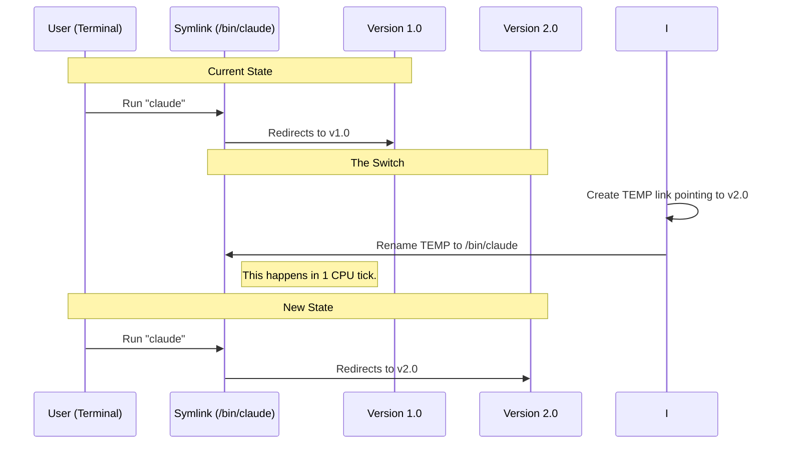

# Chapter 4: Symlink-Based Activation

In the previous chapter, [Dual-Source Artifact Retrieval](03_dual_source_artifact_retrieval.md), we successfully downloaded our new software version and verified its safety.

Currently, our system looks like this:
1.  **Old Version:** Running at `/data/versions/v1.0.0/claude`
2.  **New Version:** Sitting safely at `/data/versions/v2.0.0/claude`

However, when the user types `claude` in their terminal, it still launches the old version. We need to flip the switch.

## The Motivation: The Library Display

Imagine a library with a **"New Arrivals"** display stand.
*   The book on the stand isn't the only copy; it's just the one people grab first.
*   When a new edition comes out, the librarian doesn't rip pages out of the old book on the stand and glue in new pages. That would be messy and slow.
*   Instead, the librarian puts the *new* book on the stand and moves the *old* book to the archives.

In our software:
*   **The Archive** is the `versions` folder (where we keep `v1.0.0`, `v2.0.0`, etc.).
*   **The Display Stand** is the **Symlink**.

## What is a Symlink?

A **Symbolic Link** (symlink) is a special type of file that acts as a signpost. It doesn't contain data itself; it just points to another file.

When the user runs `/usr/bin/claude` (the symlink), the operating system looks at the sign, follows the arrow, and actually runs `/data/versions/v2.0.0/claude`.

This approach allows us to switch versions **instantly** by simply changing the text on the signpost.

## The Strategy: Atomic Switching

We don't just want to switch the version; we want to do it safely.

If we delete the old link and *then* try to create a new one, there is a split second where the link doesn't exist. If a user runs the command at that exact moment, it crashes.

To solve this, we use an **Atomic Rename**.

### The Sequence



## Implementation: The Orchestrator

The function that manages this process is `performVersionUpdate`. It coordinates the download (which we did last chapter) and the switching.

```typescript
// installer.ts
async function performVersionUpdate(version) {
  // 1. Get the paths (Source and Destination)
  const { installPath } = await getVersionPaths(version)
  const { executable } = getBaseDirectories()

  // 2. Download files to the version folder (covered in Ch 3)
  await downloadAndInstall(version, installPath)

  // 3. THE FOCUS OF THIS CHAPTER: Update the link
  await updateSymlink(executable, installPath)
}
```

## Under the Hood: `updateSymlink`

Let's look at how we implement the "Signpost Swap" in `installer.ts`.

### 1. The Standard Way (macOS / Linux)
On Unix-based systems, we use `symlink` and `rename`.

```typescript
// installer.ts (Simplified)
async function updateSymlink(symlinkPath, targetPath) {
  // 1. Create a temporary link pointing to the NEW version
  // We use a random name so we don't collide with anything
  const tempSymlink = `${symlinkPath}.tmp.${Date.now()}`
  
  await symlink(targetPath, tempSymlink)

  // 2. The Atomic Swap
  // "rename" overwrites the destination if it exists.
  // This changes the signpost instantly.
  await rename(tempSymlink, symlinkPath)
}
```

**Explanation:**
1.  We build a new signpost (`tempSymlink`) next to the road.
2.  We plant it directly on top of the old one (`rename`). The OS removes the old one and places the new one in the same operation.

### 2. The Windows Exception
Windows is different. On Windows, if a program is running, the OS **locks** the file. You cannot delete or overwrite a running `.exe` file.

If we tried the Unix method on Windows while the app was running, it would crash with a `EPERM` (Permission Denied) error.

**The Solution:**
Windows *does* allow you to **rename** a running file.
1.  Rename `claude.exe` (running) to `claude.exe.old`.
2.  Copy the new `claude.exe` to the original spot.

```typescript
// installer.ts (Windows Logic Simplified)
if (isWindows) {
  // 1. Move the currently running file out of the way
  const oldFileName = `${symlinkPath}.old.${Date.now()}`
  await rename(symlinkPath, oldFileName)

  // 2. Place the new file
  // We copy instead of symlinking on Windows
  await copyFile(targetPath, symlinkPath)
  
  // 3. Try to delete the old file (it might fail if running, that's okay)
  try { await unlink(oldFileName) } catch {}
}
```

**Why this works:**
The user's running process holds onto the *file handle*. Renaming the file doesn't break that handle; the process keeps running happily using `claude.exe.old`. The next time the user types `claude`, they hit the new file we just copied.

## Verifying the Switch

After switching the symlink, how do we know it worked? We double-check our work.

```typescript
// installer.ts
// Verify the executable was actually created/updated
if (!(await isPossibleClaudeBinary(executablePath))) {
    throw new Error(
      `Failed to create executable at ${executablePath}.`
    )
}
```

We simply check: "Does the signpost exist, and does it point to a valid file?"

## Cleaning Up

You might notice we leave some trash behind:
1.  **Old versions:** We still have `v1.0.0` in the versions folder.
2.  **Windows artifacts:** We might have `claude.exe.old` files that we couldn't delete because they were running.

The `cleanupOldVersions` function runs periodically to sweep the floor.

```typescript
// installer.ts (Concept)
export async function cleanupOldVersions() {
  // 1. Keep the last 2 versions just in case
  const versionsToDelete = allVersions.slice(2);

  // 2. Delete the rest
  for (const v of versionsToDelete) {
    await unlink(v.path);
  }
}
```

## Conclusion

We have now successfully updated the application!
1.  We detected the installation type (Chapter 2).
2.  We downloaded the artifacts (Chapter 3).
3.  We atomically updated the symlink (Chapter 4).

The user can now type `claude` and run the new version.

**But wait.** What happens if you have two terminal windows open and you try to update the application in *both* of them at the exact same time?

Both processes would try to download the file. Both would try to create the symlink. They would fight, race, and likely corrupt the installation.

To prevent this chaos, we need to ensure only **one** update happens at a time.

[Next Chapter: PID-Based Concurrency Locking](05_pid_based_concurrency_locking.md)

---

Generated by [Code IQ](https://github.com/adityasoni99/Code-IQ)