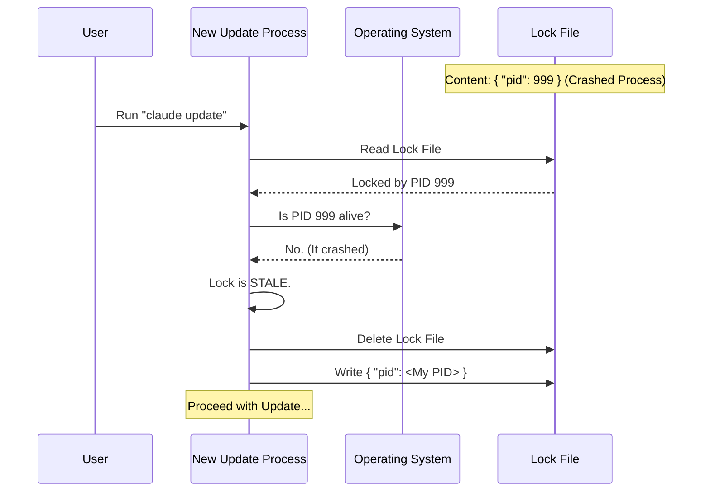

# Chapter 5: PID-Based Concurrency Locking

Welcome to the final chapter of our Native Installer tutorial! 

In the previous chapter, [Symlink-Based Activation](04_symlink_based_activation.md), we learned how to instantly switch between software versions using symlinks. We now have a system that can download, install, and activate updates.

But there is one final danger lurking in the shadows: **Concurrency.**

## The Problem: The "Two Keyboards" Chaos

Imagine you have two terminal windows open.
1.  In Terminal A, you run `claude update`.
2.  One second later, in Terminal B, you run `claude update`.

Both processes wake up. Both see an update is available. Both try to download the *same* file to the *same* folder at the *same* time.

This results in a **Race Condition**. They might overwrite each other's data, corrupt the installation, or crash the application.

To solve this, we need a **Lock**.

## The Concept: The Meeting Room Sign

Think of the installation folder as a private meeting room. Only one person (process) can use it at a time.

To enforce this, we put a "Meeting in Progress" sign on the door.
1.  **Process A** arrives, sees the room is empty, puts up the sign, and enters.
2.  **Process B** arrives, sees the sign, and walks away (or waits).

### The Flaw in Traditional Locks
In standard software, a "Lock" is just a file named `install.lock`. If the file exists, the room is occupied.

**But what if Process A crashes?**
If Process A has a heart attack (crashes) while inside the room, it never takes the sign down. Process B arrives later, sees the sign, and waits... forever. The room is locked by a "ghost."

### The Solution: PID-Based Locking

We improve the sign. Instead of just saying "Occupied," the sign says:
**"Occupied by Employee #12345."**

In computers, every running program has a **Process ID (PID)**.

When Process B arrives:
1.  It reads the sign: "Locked by PID 12345".
2.  It asks the Operating System: "Is PID 12345 still alive?"
3.  **If yes:** Process B waits.
4.  **If no:** Process B knows Process A is dead (a ghost). It tears down the sign, puts up its own, and enters.

This is **PID-Based Concurrency Locking**. It is self-healing.

## Anatomy of the Lock File

In our system, a lock file isn't empty. It contains JSON data describing exactly who is holding the lock.

```typescript
// Example content of a .lock file
{
  "pid": 86753,           // The ID of the process holding the lock
  "version": "1.0.5",     // What version they are working on
  "acquiredAt": 1678888,  // Timestamp
  "execPath": "/usr/bin/node"
}
```

## Step 1: Checking for Life

The core of this system is the ability to check if a specific PID is still running.

Node.js allows us to send a "signal" to a process. Signal `0` is special: it doesn't kill the process; it just checks if it exists.

```typescript
// pidLock.ts
export function isProcessRunning(pid: number): boolean {
  try {
    // process.kill(pid, 0) throws an error if the PID doesn't exist.
    // It does NOT actually kill the process.
    process.kill(pid, 0); 
    return true;
  } catch {
    return false;
  }
}
```

**Explanation:**
1.  We try to "ping" the PID.
2.  If the ping succeeds (`true`), the process is alive. The lock is valid.
3.  If the ping throws an error (`false`), the process is gone. The lock is stale.

## Step 2: Checking the Lock Status

Before we start an update, we look at the lock file. We don't just check if the file *exists*; we check if it is *active*.

```typescript
// pidLock.ts
export function isLockActive(lockFilePath: string): boolean {
  // 1. Read the file
  const content = readLockContent(lockFilePath);
  if (!content) return false;

  // 2. The Critical Check
  // Is the specific PID written in the file still alive?
  return isProcessRunning(content.pid);
}
```

**Analogy:** This is the security guard walking up to the meeting room, reading the name on the door ("Process 86753"), and calling HR to see if that employee still works there.

## Step 3: Acquiring the Lock

If the lock is inactive (or doesn't exist), we claim it. We write our *own* PID into the file.

```typescript
// pidLock.ts
function writeLockFile(lockFilePath, content) {
  const tempPath = `${lockFilePath}.tmp`;

  // Write to a temp file first
  writeFileSync(tempPath, JSON.stringify(content));

  // Atomic rename (Instant switch)
  renameSync(tempPath, lockFilePath);
}
```

## The Workflow: Dealing with Ghosts

Let's visualize exactly what happens when a crash occurs using a diagram.



## Cleaning Up the Mess

Every time our application starts, or before we attempt an update, we run a cleanup crew. This ensures that if the user's laptop battery died in the middle of an update yesterday, we don't block updates today.

```typescript
// pidLock.ts
export function cleanupStaleLocks(locksDir: string) {
  const files = getLockFiles(locksDir);

  for (const file of files) {
    // If the process listed in the file is dead...
    if (!isLockActive(file)) {
      // ...delete the file.
      unlinkSync(file);
      console.log(`Cleaned up stale lock: ${file}`);
    }
  }
}
```

## Integration: The Usage Wrapper

We wrap this entire logic into a simple helper function called `withLock`. This allows other parts of our code (like the Installer from [Chapter 1](01_atomic_version_management.md)) to be safe without worrying about the details.

```typescript
// Usage in installer.ts
await withLock(versionPath, lockFilePath, async () => {
  // This code only runs if we successfully grab the lock!
  console.log("I am the only process running.");
  await downloadAndInstall(version);
});
```

If `withLock` cannot acquire the lock (because a *real* process is currently updating), it returns `false`, and we tell the user: "Update currently in progress in another window."

## Conclusion of the Series

Congratulations! You have navigated the entire architecture of a robust Native Installer.

Let's review the journey:
1.  **[Atomic Version Management](01_atomic_version_management.md):** We learned to prepare updates in a staging area to avoid breaking the active application.
2.  **[Installation Origin Detection](02_installation_origin_detection.md):** We learned to act like a detective to figure out if we are allowed to self-update.
3.  **[Dual-Source Artifact Retrieval](03_dual_source_artifact_retrieval.md):** We built a universal receiver to handle public and internal downloads securely.
4.  **[Symlink-Based Activation](04_symlink_based_activation.md):** We implemented the "Signpost" method to switch versions instantly.
5.  **PID-Based Concurrency Locking:** Finally, we ensured that even if multiple instances run at once or crash unexpectedly, the system self-heals and maintains integrity.

You now possess the knowledge to build a professional-grade, auto-updating installation system that is resilient, secure, and user-friendly.

---

Generated by [Code IQ](https://github.com/adityasoni99/Code-IQ)