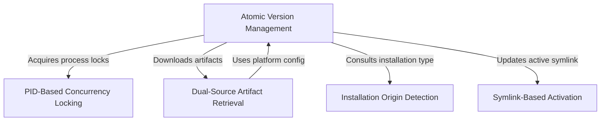

# Tutorial: nativeInstaller

The **nativeInstaller** project manages the lifecycle of the application by coordinating safe, **Atomic Version Management** for updates and installations. It orchestrates the process by fetching binaries via **Dual-Source Artifact Retrieval**, preventing conflicts with **PID-Based Concurrency Locking**, and seamlessly switching versions using **Symlink-Based Activation**. Additionally, it employs **Installation Origin Detection** to ensure it respects existing installations managed by third-party tools like Homebrew or Winget.

## Chapters

1. [Atomic Version Management](01_atomic_version_management.md)
2. [Installation Origin Detection](02_installation_origin_detection.md)
3. [Dual-Source Artifact Retrieval](03_dual_source_artifact_retrieval.md)
4. [Symlink-Based Activation](04_symlink_based_activation.md)
5. [PID-Based Concurrency Locking](05_pid_based_concurrency_locking.md)

---

Generated by [Code IQ](https://github.com/adityasoni99/Code-IQ)