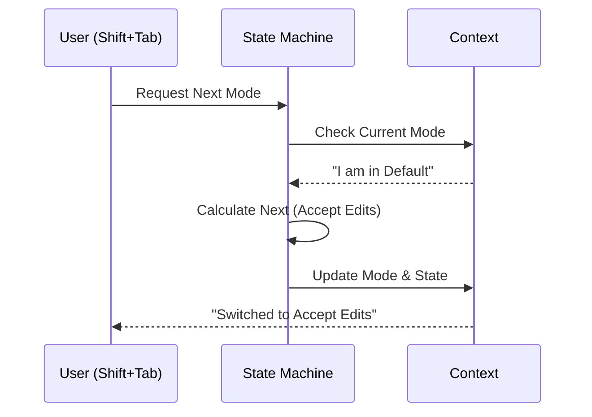

# Chapter 1: Permission Modes & State

Welcome to the `permissions` project tutorial! In this first chapter, we are going to explore the foundation of how the agent behaves: **Permission Modes**.

## The Driving Analogy

Imagine you are driving a modern high-tech car. It likely has different driving modes:
*   **Eco Mode:** Saves fuel, accelerates slowly.
*   **Sport Mode:** Aggressive, fast, responsive.
*   **Off-Road Mode:** changes how the wheels spin to handle rough terrain.

Switching modes changes the *entire behavior* of the car.

The **Permission Modes & State** system works exactly the same way for our AI agent. It defines the agent's "operating posture." Is it cautious? Is it autonomous? Is it just planning?

## The Modes

Let's look at the specific modes available to the agent.

| Mode | Analogy | Description |
| :--- | :--- | :--- |
| **Default** | **The Learner Driver** | The agent is cautious. It asks for permission before executing almost any command or file change. |
| **Plan Mode** | **The Architect** | The agent enters a "read-only" state. It can look at files to create a plan, but it cannot edit code or run commands. |
| **Accept Edits** | **The Intern** | The agent can edit files freely, but it still asks before running shell commands. |
| **Bypass (YOLO)** | **The Stunt Driver** | "You Only Look Once." The agent has full permission to do anything without asking. **Dangerous!** |
| **Auto Mode** | **Self-Driving** | The agent runs autonomously but uses a specialized AI classifier (a safety monitor) to stop dangerous actions. |

## 1. Starting the Engine (Initialization)

When you first start the agent, it needs to decide which mode to be in. It looks at Command Line Interface (CLI) flags and settings.

Here is a simplified look at how the system decides the initial mode inside `initialPermissionModeFromCLI`:

```typescript
// File: permissionSetup.ts (Simplified)

export function initialPermissionModeFromCLI(args: CliArgs) {
  // 1. Did the user specifically ask for "Bypass" (dangerously)?
  if (args.dangerouslySkipPermissions) {
    return { mode: 'bypassPermissions' }
  }

  // 2. Did the user pass a specific mode flag? e.g., --permission-mode=plan
  if (args.permissionModeCli) {
    return { mode: args.permissionModeCli }
  }

  // 3. Fallback to the safe default
  return { mode: 'default' }
}
```

**What happens here:**
The system checks priorities. Explicit dangerous flags override standard flags, which override the default.

## 2. Changing Gears (Cycling Modes)

While the agent is running, the user can press **Shift+Tab** to cycle through modes. This doesn't just change a label; it triggers a state transition.

This logic is handled by a "State Machine." It knows that if you are in `Default`, the next step is `Accept Edits`, and so on.



### The Code: Calculating the Next Mode

The function `getNextPermissionMode` decides where to go next based on where we are now.

```typescript
// File: getNextPermissionMode.ts (Simplified)

export function getNextPermissionMode(ctx: Context): PermissionMode {
  switch (ctx.mode) {
    case 'default':
      // From Default, we usually go to Accept Edits
      return 'acceptEdits'

    case 'acceptEdits':
      // From Accept Edits, we go to Plan
      return 'plan'

    case 'plan':
      // From Plan, we cycle back to Default
      return 'default'

    default:
      return 'default'
  }
}
```

### The Transition: Making it Happen

Calculating the *next* mode is easy. But actually *switching* modes requires cleanup. For example, if we enter **Plan Mode**, we might need to tell the UI to show a "Paused" icon.

```typescript
// File: getNextPermissionMode.ts (Simplified)

export function cyclePermissionMode(ctx: Context) {
  // 1. Figure out where we are going
  const nextMode = getNextPermissionMode(ctx)

  // 2. Perform the transition (side effects)
  const newContext = transitionPermissionMode(
    ctx.mode,
    nextMode,
    ctx
  )

  return { nextMode, context: newContext }
}
```

## 3. Auto Mode & Safety Stripping

**Auto Mode** is unique. It's like a self-driving car that locks the doors so you can't jump out.

If you have "Always Allow" rules set up (e.g., "Always allow `python` commands"), **Auto Mode ignores them**. Why? Because in Auto Mode, we rely on a smart AI Classifier to judge safety. If we let your old "Always Allow" rules persist, the AI might execute dangerous code without the Classifier checking it first.

This is handled by `stripDangerousPermissionsForAutoMode`:

```typescript
// File: permissionSetup.ts (Simplified)

export function stripDangerousPermissionsForAutoMode(ctx: Context) {
  // Find rules that are too broad (like "Allow Bash(*)")
  const dangerous = findDangerousClassifierPermissions(ctx.rules)
  
  // Remove them from the active context
  const cleanContext = removeDangerousPermissions(ctx, dangerous)
  
  // Save them to restore later when we leave Auto Mode
  cleanContext.strippedDangerousRules = dangerous
  
  return cleanContext
}
```

**Example Scenario:**
1.  **User:** "Always allow `bash` commands." (in Default Mode).
2.  **User:** Switches to **Auto Mode**.
3.  **System:** "Wait, `bash` is dangerous for full autonomy. I am temporarily disabling that rule."
4.  **Agent:** Tries to run `rm -rf /`.
5.  **Classifier:** "That looks dangerous. blocked." (Because the "Always Allow" rule was stripped, the classifier got to make the decision).
6.  **User:** Switches back to **Default Mode**.
7.  **System:** Restores the "Always allow `bash`" rule.

## Summary

In this chapter, we learned:
1.  **Permission Modes** act like driving modes (Default, Plan, Auto, etc.).
2.  **State Initialization** sets the starting mode based on CLI flags.
3.  **Cycling** (Shift+Tab) moves the agent through a defined loop of modes.
4.  **Transitions** handle the cleanup and safety checks when switching, especially stripping dangerous permissions when entering Auto Mode.

Now that we understand the "State" the agent is in, we need to understand how the agent decides if a specific *action* is allowed or denied based on that state.

[Next Chapter: The Rule System](02_the_rule_system.md)

---

Generated by [Code IQ](https://github.com/adityasoni99/Code-IQ)