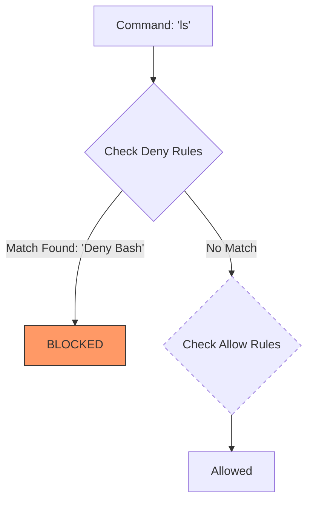
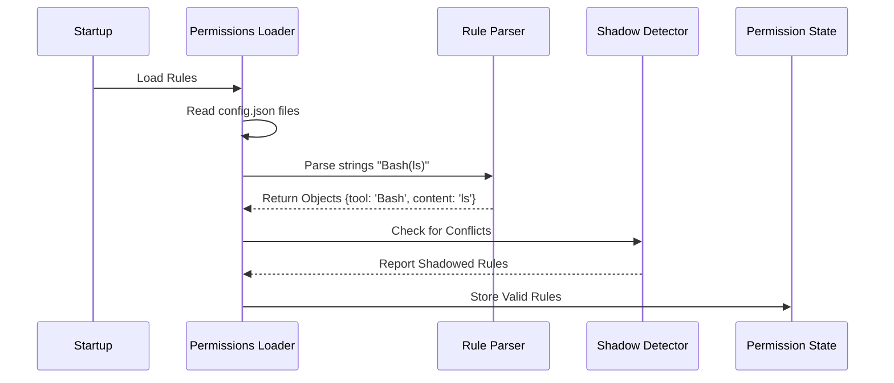

# Chapter 2: The Rule System

In the previous chapter, [Permission Modes & State](01_permission_modes___state.md), we learned how to set the agent's general "attitude" or operating mode (like **Default** vs. **Auto**).

However, an attitude isn't enough. A strict bouncer needs a **Guest List** to know exactly who is allowed in and who isn't.

In this chapter, we will explore **The Rule System**. This is the static machinery that reads configuration files, understands what "Allow `npm install`" actually means, and ensures your security rules make logical sense.

## The Problem: "Allow what, exactly?"

Imagine you want your agent to run `ls` (list files) without asking, but you want it to **always ask** permission before running `rm` (delete files).

You can't achieve this just by switching Modes. Modes are too broad. You need specific instructions. You need a Rule System that can:
1.  **Read** rules from a file (persistence).
2.  **Parse** text like `Bash(npm:*)` into code.
3.  **Validate** that your rules don't contradict each other.

## 1. The Anatomy of a Rule

At its core, a permission rule is a simple instruction. It consists of three parts:

1.  **Tool:** Who is doing the action? (e.g., `Bash`, `FileEditor`).
2.  **Content:** What specific action? (e.g., `npm install`, `/etc/hosts`).
3.  **Behavior:** What should we do? (`allow`, `deny`, or `ask`).

In the configuration file (usually `config.json` or `claude.json`), it looks like this:

```json
{
  "permissions": {
    "allow": ["Bash(ls -la)", "FileEditor"],
    "deny": ["Bash(rm -rf *)"],
    "ask": ["Bash"]
  }
}
```

### Parsing the Syntax
Humans write rules as text strings like `"Bash(ls -la)"`. The computer needs to turn that into a structured object.

We use a specific syntax: **`ToolName(RuleContent)`**.

If you omit the parentheses, like `"Bash"`, it means "Everything involving Bash."

Here is how the system parses that string in `permissionRuleParser.ts`:

```typescript
// File: permissionRuleParser.ts (Simplified)

export function permissionRuleValueFromString(ruleString: string) {
  // 1. Look for the opening parenthesis
  const openParen = ruleString.indexOf('(')

  // 2. If no parens, it's just the tool name (e.g., "Bash")
  if (openParen === -1) {
    return { toolName: ruleString }
  }

  // 3. Otherwise, split it into Name and Content
  const toolName = ruleString.substring(0, openParen)
  const content = ruleString.substring(openParen + 1, ruleString.length - 1)

  return { toolName, ruleContent: content }
}
```
**Explanation:**
The parser acts like a text splitter. It separates the "Who" (`Bash`) from the "What" (`ls -la`).

## 2. Wildcards and Matching

The rule system needs to be flexible. You don't want to write a rule for every single file on your computer.

We use **Wildcards (`*`)**.
*   `Bash(npm:*)` means "Allow Bash to run `npm` followed by *anything*."
*   `FileRead(/tmp/*)` means "Allow reading any file inside the `/tmp` folder."

Under the hood, this is handled by `shellRuleMatching.ts`. It converts your wildcards into Regular Expressions (Regex).

```typescript
// File: shellRuleMatching.ts (Simplified)

export function matchWildcardPattern(pattern: string, command: string) {
  // 1. Convert user's "*" into Regex ".*" (match anything)
  const regexPattern = pattern
    .replace(/\*/g, '.*') 
  
  // 2. Create a RegExp object
  const regex = new RegExp(`^${regexPattern}$`)

  // 3. Test if the command matches
  return regex.test(command)
}
```
**Explanation:**
The system translates user-friendly syntax (`*`) into machine-friendly logic (Regex) to decide if a specific command matches a rule.

## 3. Loading Rules from Disk

Rules aren't just floating in memory; they live in files. The **Permissions Loader** is responsible for gathering all rules from different sources.

You might have:
*   **Global Rules:** Applied to every project you work on.
*   **Project Rules:** Specific to the current folder.

The loader grabs them all and combines them.

```typescript
// File: permissionsLoader.ts (Simplified)

export function loadAllPermissionRulesFromDisk() {
  const allRules = []

  // 1. Load Global User Settings
  const userRules = getPermissionRulesForSource('userSettings')
  allRules.push(...userRules)

  // 2. Load Local Project Settings
  const projectRules = getPermissionRulesForSource('projectSettings')
  allRules.push(...projectRules)

  return allRules
}
```
**Explanation:**
This function acts like a vacuum cleaner. It visits every enabled settings file, sucks up the rules, and dumps them into one big array for the engine to use.

## 4. The Logic Puzzle: Shadowed Rules

This is the most "intelligent" part of the Rule System. It prevents you from writing rules that make no sense.

**The Scenario:**
Imagine you have these two rules:
1.  **Deny** `Bash` (Deny ALL Bash commands).
2.  **Allow** `Bash(ls)` (Allow the `ls` command).

**The Problem:**
The system checks **Deny** rules first for safety. If rule #1 says "No Bash allowed," the agent stops immediately. It never even *sees* rule #2. Rule #2 is "shadowed"—it is logically impossible to reach.

The system detects this and warns you.

### Visualizing the Conflict



Because the "Deny Bash" rule catches everything, the flow never reaches "Check Allow Rules."

### The Code: Detecting Shadows

This logic lives in `shadowedRuleDetection.ts`.

```typescript
// File: shadowedRuleDetection.ts (Simplified)

function isAllowRuleShadowedByDenyRule(allowRule, denyRules) {
  const tool = allowRule.toolName // e.g., "Bash"

  // Look for a "Deny All" rule for this tool
  const broadDeny = denyRules.find(d => 
    d.toolName === tool && d.ruleContent === undefined // undefined content = ALL
  )

  if (broadDeny) {
    return { 
      shadowed: true, 
      reason: `Blocked by broad deny rule for ${tool}` 
    }
  }

  return { shadowed: false }
}
```

**Explanation:**
1.  We look at a specific **Allow** rule (like `Bash(ls)`).
2.  We scan the **Deny** list.
3.  Do we find a rule that says "Deny ALL Bash"?
4.  If yes, the Allow rule is useless. We flag it as a "Shadowed Rule."

## System Walkthrough

Here is how the Rule System initializes when the agent starts up:



## Summary

In this chapter, we established the static definitions of what is allowed and denied.
1.  **Rule Syntax:** We learned how `Bash(npm:*)` is parsed into a Tool and Content.
2.  **Wildcards:** We saw how `*` allows for flexible pattern matching.
3.  **Loading:** We learned that rules are aggregated from User and Project settings.
4.  **Shadow Detection:** We discovered how the system prevents broad Deny rules from hiding specific Allow rules.

Now that we have our Modes (Attitude) and our Rules (Guest List), we need a system to actually **enforce** them in real-time when the agent tries to do something.

[Next Chapter: Permission Enforcement Engine](03_permission_enforcement_engine.md)

---

Generated by [Code IQ](https://github.com/adityasoni99/Code-IQ)