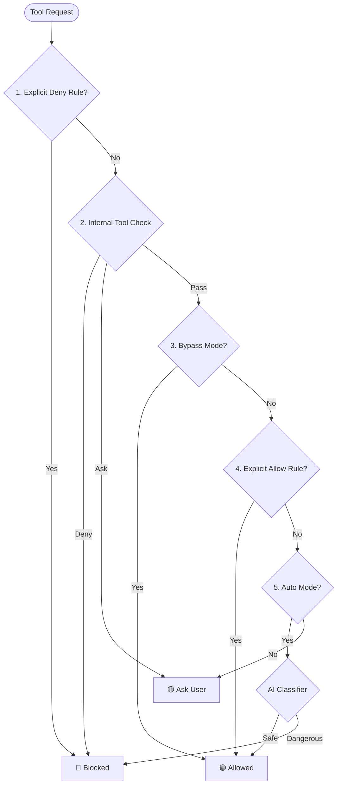

# Chapter 3: Permission Enforcement Engine

Welcome back! In the previous chapters, we set the stage:
1.  [Permission Modes & State](01_permission_modes___state.md) defined the agent's "attitude" (e.g., Cautious vs. Autonomous).
2.  [The Rule System](02_the_rule_system.md) defined the specific "laws" (e.g., "Always allow `ls`").

Now, we need a judge to interpret these inputs and make a final verdict. That judge is the **Permission Enforcement Engine**.

## The Problem: Conflicting Signals

Imagine the following scenario:
*   **Rule:** You have a rule that says "Always Allow `npm test`".
*   **Mode:** You are currently in **Plan Mode** (which is read-only).
*   **Action:** The agent tries to run `npm test`.

What happens? Does the "Allow" rule win? or does the "Read-Only" mode win?

We need a centralized logic pipeline to resolve these conflicts. We need an **Enforcement Engine**.

## The Metaphor: Airport Security

Think of the Permission Engine as a security checkpoint at an airport. It follows a strict sequence of checks before letting you board the plane (execute a tool).

1.  **The No-Fly List (Deny Rules):** First, they check if you are explicitly banned. If yes, you are stopped immediately.
2.  **The Ticket Check (Internal Tool Logic):** They check if your ticket is valid for this flight (e.g., are the arguments valid?).
3.  **VIP Status (Bypass Mode):** If you are a Diplomat (Bypass Mode), you might skip the line.
4.  **Behavioral Analysis (Auto Mode / AI):** If you are in the "Self-Service" lane, an AI camera watches you. If you act suspiciously, it stops you.
5.  **The Manual Search (Ask User):** If none of the above give a clear "Go," the security officer asks you directly.

## The Logic Pipeline

This decision process happens inside the function `hasPermissionsToUseTool`. Let's visualize the flow:



## Implementation Walkthrough

Let's look at how this is implemented in `permissions.ts`. We will break the massive `hasPermissionsToUseTool` function into small, understandable chunks.

### Step 1: The "No-Fly" List (Deny Rules)

The very first thing the engine does is check for **Deny** rules. Safety comes first. If a user explicitly said "Never run `rm`", we stop immediately.

```typescript
// File: permissions.ts (Simplified)

// 1. Check if the tool is listed in the Deny Rules
const denyRule = getDenyRuleForTool(context, tool)

if (denyRule) {
  return {
    behavior: 'deny',
    message: `Permission to use ${tool.name} has been denied.`
  }
}
```

### Step 2: The Ticket Check (Internal Tool Logic)

Next, we ask the tool itself: "Do *you* see any problems with this input?"
For example, the `Bash` tool might see that you are trying to run a command that is syntactically invalid or inherently dangerous inside a specific environment.

```typescript
// 2. Ask the tool implementation 
// (Some tools have built-in safety checks)
const toolResult = await tool.checkPermissions(input, context)

if (toolResult.behavior === 'deny') {
  return toolResult // The tool itself said "No"
}
```

### Step 3: VIP Status (Bypass Mode)

If the tool is not denied, we check the **Permission Mode** (from [Chapter 1](01_permission_modes___state.md)). If the user is in **Bypass (YOLO)** mode, we skip the rest of the checks and allow the action.

*Note: Even in Bypass mode, some "Safety Checks" (like overwriting specific config files) can still force a prompt.*

```typescript
// 3. Check if we are in Bypass Mode
const isBypass = context.mode === 'bypassPermissions'

if (isBypass) {
  return {
    behavior: 'allow',
    decisionReason: { type: 'mode', mode: 'bypassPermissions' }
  }
}
```

### Step 4: Explicit Allow Rules

If we aren't in Bypass mode, we check the **Rule System** (from [Chapter 2](02_the_rule_system.md)). Did the user write a rule like `Bash(ls)`?

```typescript
// 4. Check if there is an Always Allow rule
const allowRule = toolAlwaysAllowedRule(context, tool)

if (allowRule) {
  return {
    behavior: 'allow',
    decisionReason: { type: 'rule', rule: allowRule }
  }
}
```

### Step 5: Auto Mode & The AI Classifier

This is the most advanced part of the engine. If the user is in **Auto Mode**, we don't just "Allow everything." We delegate the decision to a smart **AI Classifier**.

The engine sends the tool use context to a specialized AI model. The AI decides if the action is "Safe" or "Dangerous."

```typescript
// 5. Auto Mode Logic
if (context.mode === 'auto') {
  // Call the AI Classifier (Detailed in Chapter 4)
  const classifierResult = await classifyYoloAction(
    context.messages,
    toolName,
    input
  )

  if (classifierResult.shouldBlock) {
    return { behavior: 'deny', message: 'AI flagged as dangerous' }
  }

  // If AI says it's safe:
  return { behavior: 'allow' }
}
```

### Step 6: The Fallback (Ask the User)

If none of the above checks resulted in an "Allow" or "Deny," the default behavior is to **Ask** the user.

```typescript
// 6. Default Fallback
return {
  behavior: 'ask',
  message: 'Claude requested permissions...'
}
```

## Handling Headless Agents

Sometimes the agent runs in a "Headless" environment (like a background server) where there is no human to click "Approve."

In these cases, `shouldAvoidPermissionPrompts` is set to `true`. If the engine reaches Step 6 (Ask User), it detects that no user is present and automatically **Denies** the action to prevent the agent from hanging forever.

```typescript
if (context.shouldAvoidPermissionPrompts) {
  return {
    behavior: 'deny',
    message: 'Permission prompts are not available in this context'
  }
}
```

## Summary

In this chapter, we learned that the **Permission Enforcement Engine** is a pipeline that filters every action:
1.  **Deny Rules** have the highest priority.
2.  **Tool Internal Logic** validates the command structure.
3.  **Bypass Mode** overrides most checks.
4.  **Allow Rules** permit specific actions.
5.  **Auto Mode** delegates the decision to an AI Classifier.
6.  **Default:** Ask the human.

We briefly touched on the "AI Classifier" in Step 5. This is a fascinating system that uses a Large Language Model (LLM) to judge safety in real-time.

[Next Chapter: Auto Mode Classifier (YOLO)](04_auto_mode_classifier__yolo_.md)

---

Generated by [Code IQ](https://github.com/adityasoni99/Code-IQ)