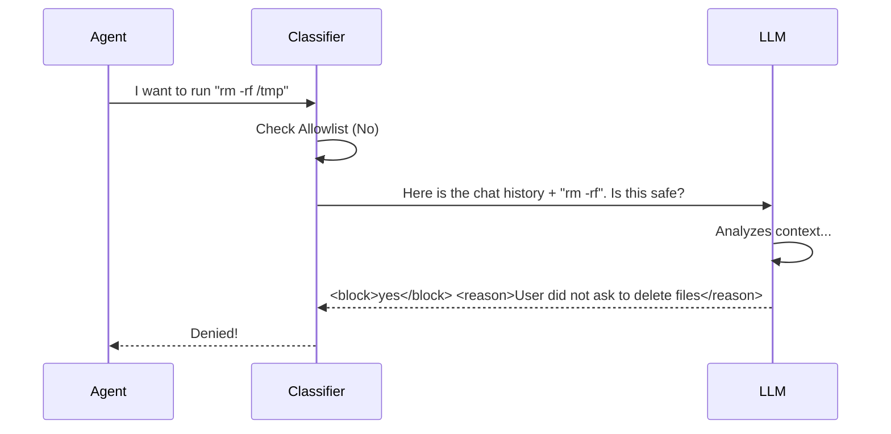

# Chapter 4: Auto Mode Classifier (YOLO)

Welcome back! In the previous chapter, [Permission Enforcement Engine](03_permission_enforcement_engine.md), we looked at the strict pipeline that filters every command the agent tries to run.

We learned that when the agent is in **Auto Mode**, the engine hands off the decision to a mysterious "AI Classifier."

In this chapter, we are going to open up that black box. We will learn about the **Auto Mode Classifier** (sometimes jokingly referred to as **YOLO** in the code—"You Only Look Once").

## The Problem: Context Matters

Why can't we just use static rules like "Allow `python`" or "Deny `rm`"?

Because the *safety* of a command depends on the **context**:

1.  **Scenario A:** You ask the agent: "Please delete the temporary cache folder."
    *   *Action:* `rm -rf ./cache`
    *   *Verdict:* **Safe** (You asked for it).
2.  **Scenario B:** You ask the agent: "Fix the bug in `main.py`."
    *   *Action:* `rm -rf ./cache`
    *   *Verdict:* **Suspicious** (Why is it deleting files when it should be editing code?).

A simple rule engine cannot see the difference. It just sees `rm`. To solve this, we need a "Brain" that reads the conversation and understands your intent.

## The Solution: The AI Security Analyst

The Auto Mode Classifier acts like a human security analyst sitting on the agent's shoulder.

Every time the agent wants to run a potentially dangerous tool (like editing a file or running a shell command), the Classifier freezes time. It looks at:
1.  **The Chat History:** What did the user ask for?
2.  **The Proposed Action:** What does the agent want to do?

Then, it makes a judgment call: **Allow** or **Block**.

## 1. The "Fast Lane" (Allowlisted Tools)

Before we spend money and time asking a smart AI to judge an action, we check if the action is obviously harmless.

Some tools are "Read-Only" or purely informational. We don't need a security guard to watch someone read a library book.

This logic lives in `classifierDecision.ts`:

```typescript
// File: classifierDecision.ts (Simplified)

const SAFE_YOLO_ALLOWLISTED_TOOLS = new Set([
  'FileRead',      // Reading files is safe
  'Grep',          // Searching text is safe
  'LSP',           // Code intelligence is safe
  'AskUserQuestion' // Asking the user is safe
])

export function isAutoModeAllowlistedTool(toolName: string): boolean {
  return SAFE_YOLO_ALLOWLISTED_TOOLS.has(toolName)
}
```

If the tool is on this list, the Classifier approves it instantly (0 cost, 0 latency).

## 2. Constructing the "Trial" (Building the Prompt)

If the tool is *not* allowlisted (e.g., `Bash`, `FileEdit`), we need to put it on trial. We construct a special prompt for a Large Language Model (LLM).

This happens in `yoloClassifier.ts`. We gather the evidence:

```typescript
// File: yoloClassifier.ts (Conceptual)

export async function classifyYoloAction(
  history: Message[], 
  action: ToolCall
) {
  // 1. Create a System Prompt that defines what is "Safe" vs "Dangerous"
  const systemPrompt = await buildYoloSystemPrompt(context)

  // 2. Format the Chat History (The Transcript)
  const transcript = buildTranscriptForClassifier(history)

  // 3. Format the Action (The Defendant)
  const proposedAction = formatActionForClassifier(action)
  
  // ... proceed to call the AI
}
```

The **System Prompt** contains instructions like:
*   "You are a security monitor."
*   "Allow actions that are explicitly requested by the user."
*   "Block actions that destroy data without permission."

## 3. The Verdict (Calling the AI)

Now we send this package to the LLM (usually a fast, smart model like Claude 3.5 Sonnet).

We don't want the AI to chat with us. We want a structured verdict. We ask it to use a specific format (often XML or a specific Tool Call) to say "Yes" or "No".



### The Code: Receiving the Judgment

Here is how the system handles the response from the LLM. It looks for a `shouldBlock` boolean.

```typescript
// File: yoloClassifier.ts (Simplified)

const result = await sideQuery({
  model: 'claude-3-5-sonnet',
  system: systemPrompt,
  messages: transcriptAndAction
})

// Parse the result
if (result.shouldBlock) {
  return {
    behavior: 'deny',
    reason: result.reason // e.g., "High risk action"
  }
}

return { behavior: 'allow' }
```

## 4. Two-Stage Classification (Optimization)

To make this system faster and cheaper, the code actually supports a **Two-Stage** approach.

1.  **Stage 1 (The Gut Check):** We ask a fast/cheap model to give a quick "Yes/No". If it says "Allow," we let it go immediately.
2.  **Stage 2 (The Thinking):** If Stage 1 says "Block" (or is unsure), we ask a smarter model to "Think" step-by-step.

This reduces False Positives (blocking safe things) while keeping the system responsive.

```typescript
// File: yoloClassifier.ts (Simplified Logic)

if (stage1Result === 'allow') {
  return { shouldBlock: false } // Fast path success!
}

// If Stage 1 blocked it, let's double check with a smarter "Thinking" model
const stage2Result = await askThinkingModel(context)

return stage2Result
```

## 5. Handling Errors (Fail Closed)

What happens if the internet goes down or the API fails while checking permissions?

In security, there is a golden rule: **Fail Closed**.

If the Classifier crashes or times out, we **Block** the action. We never assume an action is safe just because we couldn't check it.

```typescript
// File: yoloClassifier.ts (Simplified)

try {
  return await callClassifierAPI()
} catch (error) {
  // If the AI is broken, we must stop the agent for safety.
  return {
    shouldBlock: true,
    reason: 'Classifier unavailable - blocking for safety'
  }
}
```

## Summary

In this chapter, we explored the "Brain" of Auto Mode:
1.  **Context Awareness:** Unlike static rules, the Classifier looks at *why* an action is being taken.
2.  **Allowlist:** Safe tools (like reading files) skip the line.
3.  **Prompt Construction:** We package the chat history and the action into a "Trial" for the AI.
4.  **Fail Closed:** If the AI fails, the action is blocked.

The Classifier ensures that even when the agent is running autonomously, it isn't running wildly. It's constantly being monitored by a security peer.

However, software permissions aren't the only layer of defense. In the next chapter, we will look at how we limit where the agent can physically write files on your disk.

[Next Chapter: Filesystem Security & Sandboxing](05_filesystem_security___sandboxing.md)

---

Generated by [Code IQ](https://github.com/adityasoni99/Code-IQ)