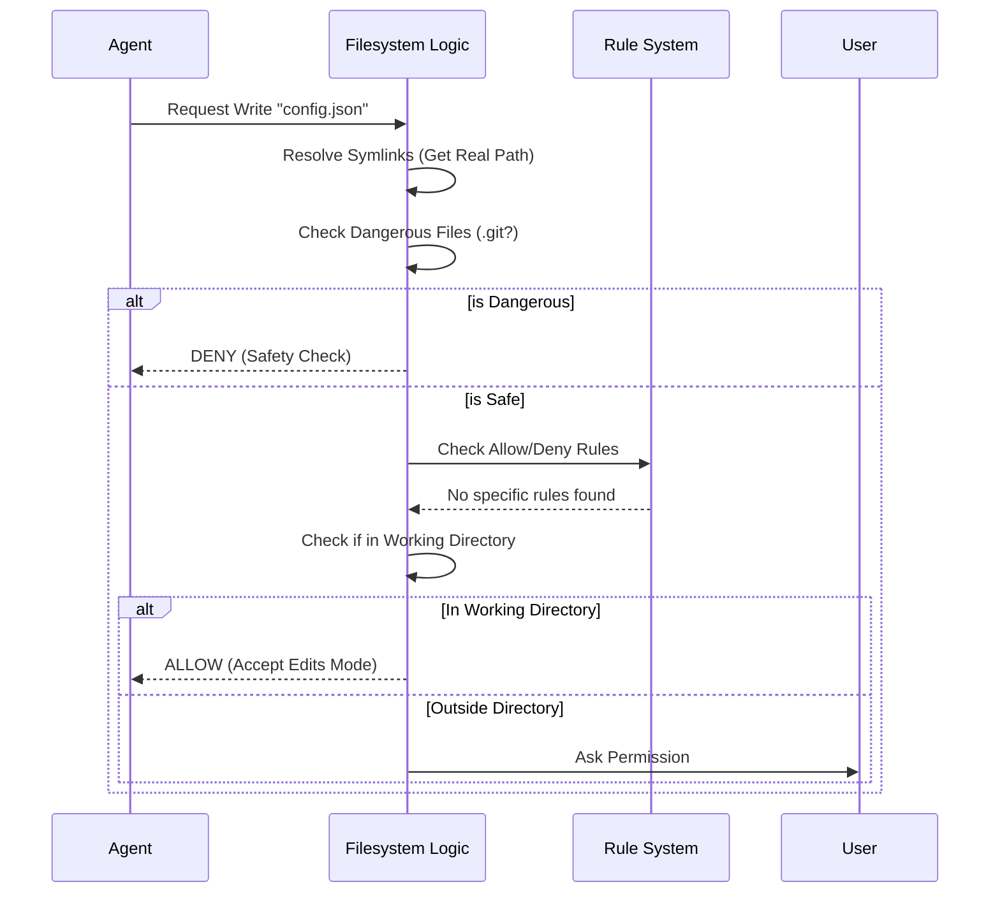

# Chapter 5: Filesystem Security & Sandboxing

Welcome to Chapter 5! In the previous chapter, [Auto Mode Classifier (YOLO)](04_auto_mode_classifier__yolo_.md), we learned how an AI security guard watches the agent's behavior.

But even the best security guard can be tricked if the layout of the building is confusing.

In this chapter, we explore **Filesystem Security & Sandboxing**. This is the layer that handles the "physical" reality of where files live on your computer. It ensures the agent stays within the boundaries you set and doesn't accidentally (or maliciously) modify critical system files.

## The Problem: The "Secret Tunnel"

Imagine you give the agent permission to edit files in `C:\MyProject`.

1.  **The Trick:** The agent tries to write to `C:\MyProject\..\..\Windows\System32`.
    *   Mathematically, that path resolves to the Windows System folder! This is called a **Path Traversal Attack**.
2.  **The Shortcut:** The agent finds a "Symlink" (Shortcut) inside your project that points to your private SSH keys folder.
    *   If the agent follows the link, it leaves the safe zone.

We need a system that normalizes paths and resolves shortcuts to see where they *really* go.

## 1. Path Normalization & Safety

Before the agent is allowed to touch a file, the system "cleans" the path. This happens in `pathValidation.ts` and `filesystem.ts`.

### Normalizing the Case

On Windows and macOS, `file.txt` and `FILE.TXT` are the same file. But on Linux, they are different. To prevents tricks, we normalize everything for comparison.

```typescript
// File: filesystem.ts (Simplified)

export function normalizeCaseForComparison(path: string): string {
  // Always convert to lowercase for security checks
  // This prevents bypassing checks with ".GiT" instead of ".git"
  return path.toLowerCase()
}
```

### Resolving Symlinks (The Reality Check)

When the agent asks to read a file, we don't just look at the name. We ask the Operating System: "Where does this actually live on the hard drive?"

This resolves shortcuts (Symlinks) to their final destination.

```typescript
// File: fsOperations.ts (Conceptual)

export function getPathsForPermissionCheck(path: string) {
  // 1. The path the agent asked for
  const originalPath = path
  
  // 2. The REAL path on disk (resolving symlinks)
  const realPath = fs.realpathSync(path)

  // We must check BOTH to be safe!
  return [originalPath, realPath]
}
```

**Why check both?**
If you block `/etc/passwd`, but the agent tries to read `./shortcut_to_passwd`, the *original* path looks safe, but the *real* path is forbidden. We check both to be sure.

## 2. Blocked "Dangerous" Neighborhoods

Even inside a safe project, there are places the agent should never touch.
*   **`.git` folder:** Corrupting this breaks your version control.
*   **`.vscode` / `.idea`:** Changing editor settings can be annoying or dangerous.
*   **`.bashrc` / `.profile`:** Editing these can break your shell or install malware.

The system uses a "Deny List" for these specific patterns.

```typescript
// File: filesystem.ts (Simplified)

export const DANGEROUS_DIRECTORIES = [
  '.git',
  '.vscode',
  '.idea',
  '.claude', // The agent's own config!
]

function isDangerousFilePathToAutoEdit(path: string) {
  // Check if the path contains any blocked directory
  for (const dir of DANGEROUS_DIRECTORIES) {
    if (path.includes(dir)) {
      return true // STOP!
    }
  }
  return false
}
```

## 3. Allowed Working Directories (The Sandbox)

The most basic rule of sandboxing is: **"Stay in the Project."**

If you launch the agent in `/Users/me/projects/website`, it should default to only working in that folder.

This logic is handled by `pathInAllowedWorkingPath`.

```typescript
// File: filesystem.ts (Simplified)

export function pathInAllowedWorkingPath(path, context) {
  // 1. Get the Current Working Directory (CWD)
  const cwd = getOriginalCwd()

  // 2. Check if the file is inside the CWD
  // (Using strict relative path logic, preventing ../..)
  return !path.startsWith('..') && !posix.isAbsolute(relative(cwd, path))
}
```

## 4. Internal Safe Paths

Sometimes, the agent *needs* to write files that aren't part of your project.
*   **Scratchpads:** Temporary notes the agent writes to itself.
*   **Memory:** Files where the agent stores what it learned.

We don't want to annoy the user by asking permission for these internal operations. The system has a "Passthrough" for these specific paths.

```typescript
// File: filesystem.ts (Simplified)

export function checkEditableInternalPath(path: string) {
  // Is this the agent's scratchpad?
  if (isScratchpadPath(path)) {
    return { behavior: 'allow', reason: 'Internal Scratchpad' }
  }

  // Is this the agent's memory?
  if (isAgentMemoryPath(path)) {
    return { behavior: 'allow', reason: 'Agent Memory' }
  }

  return { behavior: 'passthrough' } // Keep checking other rules
}
```

## System Walkthrough

Let's trace what happens when the agent tries to write to a file using the function `checkWritePermissionForTool`.

### The Sequence Diagram



### The Implementation Code

Here is the simplified logic flow from `filesystem.ts`. This is the heavy lifting of the chapter.

```typescript
// File: filesystem.ts (Simplified Logic of checkWritePermissionForTool)

export function checkWritePermissionForTool(tool, input, context) {
  const path = tool.getPath(input)
  
  // 1. Resolve Symlinks (Get all variations of the path)
  const pathsToCheck = getPathsForPermissionCheck(path)

  // 2. Check for explicit DENY rules (e.g. "Never touch secrets.txt")
  if (hasDenyRule(pathsToCheck)) return { behavior: 'deny' }

  // 3. Allow Internal Paths (Scratchpad/Memory)
  if (checkEditableInternalPath(path).allowed) return { behavior: 'allow' }

  // 4. SAFETY CHECK: Is it a dangerous system file? (.git, .vscode)
  const safety = checkPathSafetyForAutoEdit(path, pathsToCheck)
  if (!safety.safe) {
    return { behavior: 'ask', message: 'Safety check failed: Sensitive file' }
  }

  // 5. Check if we are inside the Allowed Working Directory
  const isInWorkingDir = pathInAllowedWorkingPath(path, context)

  // 6. If in "Accept Edits" mode AND in Working Dir -> ALLOW
  if (context.mode === 'acceptEdits' && isInWorkingDir) {
    return { behavior: 'allow' }
  }

  // 7. Fallback: Ask the User
  return { behavior: 'ask' }
}
```

**Key Takeaway:** Notice that Step 4 (Safety Check) happens *before* Step 6 (Auto-Allow). This means even if you are in "Accept Edits" mode, the agent **cannot** overwrite your `.git` configuration without asking you explicitly.

## Advanced: Windows "Magic" Names

Windows has some quirks. Did you know you cannot name a file `CON` or `PRN` on Windows? These are reserved device names (legacy from MS-DOS).

If an agent tries to create a file named `CON`, it could crash the program or behave unexpectedly.

The security layer also checks for these "Suspicious Windows Patterns" in `hasSuspiciousWindowsPathPattern`.

```typescript
// File: filesystem.ts (Simplified)

function hasSuspiciousWindowsPathPattern(path: string) {
  // Check for reserved device names
  if (/\.(CON|PRN|AUX|NUL)$/i.test(path)) return true
  
  // Check for weird NTFS streams (hidden data)
  if (path.includes('::$DATA')) return true

  return false
}
```

## Summary

In this chapter, we learned that Filesystem Security is about more than just "Allow" or "Deny." It involves:

1.  **Normalization:** Converting paths to a standard format to prevent confusion.
2.  **Resolution:** Following symlinks to find the *real* file location.
3.  **Safety Checks:** Blocking dangerous areas like `.git` regardless of user mode.
4.  **Internal Paths:** Whitelisting scratchpads and memory files for smooth operation.

We have now covered the Modes, the Rules, the Enforcement Engine, the AI Classifier, and the Filesystem Sandbox.

But what happens when you restart the agent? Do you have to teach it all these rules again?

[Next Chapter: Configuration Persistence](06_configuration_persistence.md)

---

Generated by [Code IQ](https://github.com/adityasoni99/Code-IQ)